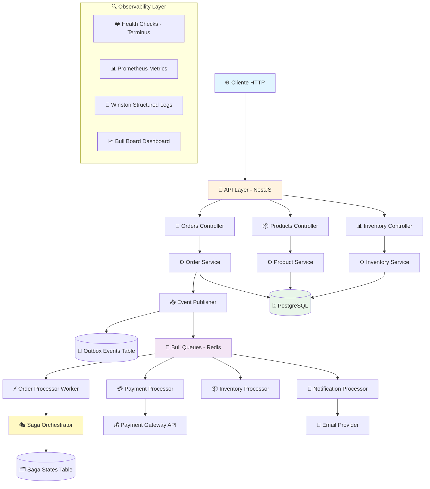
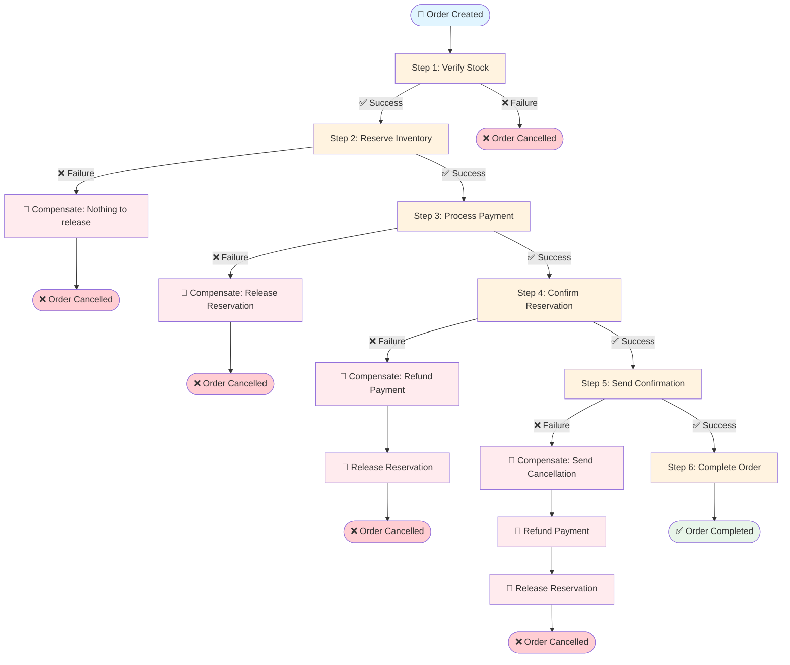

# Sistema Procesador de Órdenes Asíncrono

<p align="center">
  <a href="https://github.com/ArielDRighi/ecommerce-async-resilient-system/actions">
    
  </a>
  <a href="#">
    
  </a>
  <a href="#">
    
  </a>
  <a href="#">
    
  </a>
  <a href="#">
    
  </a>
  <a href="#">
    
  </a>
</p>

<p align="center">
  Sistema resiliente y escalable de nivel empresarial para procesamiento asíncrono de órdenes de e-commerce, construido con NestJS, demostrando arquitecturas event-driven, patrones avanzados de resiliencia y prácticas de DevOps profesionales.
</p>

<p align="center">
  <a href="#-quick-start--demo-rápida">🚀 Quick Start</a> •
  <a href="#-acerca-del-proyecto">Acerca del Proyecto</a> •
  <a href="#-stack-tecnológico">Stack Tecnológico</a> •
  <a href="#-arquitectura-del-sistema">Arquitectura</a> •
  <a href="#-instalación-y-configuración">Instalación</a> •
  <a href="#-comandos-de-desarrollo">Comandos</a> •
  <a href="#-testing">Testing</a> •
  <a href="#-documentación-completa">Documentación</a> •
  <a href="#-decisiones-de-arquitectura">ADRs</a> •
  <a href="#-contacto">Contacto</a>
</p>

---

## � Quick Start / Demo Rápida

¿Quieres ver el sistema en acción **en 5 minutos**? Sigue esta guía express:

### 📌 Para Evaluadores/Reclutadores

**Opción 1: Demo Ultra-Rápida (5 min)**

```bash
# 1. Clonar y levantar
git clone https://github.com/ArielDRighi/ecommerce-async-resilient-system.git
cd ecommerce-async-resilient-system
docker-compose up -d
npm install && npm run seed:all

# 2. Abrir Swagger y seguir la guía
# http://localhost:3002/api/docs
```

➡️ **[Guía de 5 minutos: Quick Start Demo](/docs/api-testing/00-QUICK-START-DEMO.md)**

Esta guía incluye:

- ✅ Procesamiento asíncrono con respuesta inmediata (< 100ms)
- ✅ Saga Pattern con 5 steps orquestados
- ✅ Compensación automática en fallos
- ✅ Idempotencia (prevención de duplicados)
- ✅ Visualización en Bull Board Dashboard

### 🎯 TL;DR - ¿Qué hace este proyecto?

**Antes (Síncrono):** Cliente espera 3-5 segundos mientras se procesa stock, pago, emails → Timeouts, mala UX, no escalable

**Ahora (Asíncrono):** Cliente recibe respuesta en <100ms (202 Accepted) → Procesamiento en background con workers → Auto-recuperación en fallos

**Core Técnico:**

- 🔹 **Patrón Outbox**: Garantía de eventos publicados transaccionalmente
- 🔹 **Saga Pattern**: Orquestación de transacciones distribuidas con compensación
- 🔹 **Circuit Breaker**: Protección contra cascading failures
- 🔹 **Idempotencia**: Requests duplicados no crean órdenes duplicadas
- 🔹 **Bull + Redis**: 4 colas especializadas con retry y DLQ

---

## �📖 Acerca del Proyecto

> **⚠️ Proyecto de Portfolio:** Este es un proyecto académico/demostrativo creado exclusivamente para mi portfolio profesional. **No está diseñado ni destinado para uso en producción.** Su propósito es demostrar comprensión de arquitecturas complejas y patrones enterprise.

Este proyecto es un sistema de procesamiento asíncrono de órdenes para e-commerce, construido con **NestJS**, **TypeScript**, **PostgreSQL**, **Redis** y **Bull**. Sirve como demostración técnica de arquitecturas event-driven, patrones de resiliencia y procesamiento asíncrono de alto rendimiento.

El objetivo principal es demostrar la capacidad de diseñar y construir sistemas de backend desacoplados, escalables y resilientes, aplicando patrones avanzados como Event Sourcing, Outbox Pattern, Saga Orchestration, CQRS, Circuit Breaker y Retry con exponential backoff.

**🎯 Documentación Completa:** El proyecto incluye documentación técnica profesional que demuestra planificación previa, incluyendo diseño de base de datos, diagramas de arquitectura, 25 ADRs (Architecture Decision Records) traducidos al español, y documentación exhaustiva de API.

---

### 🎯 Problema que Resuelve

Cuando un cliente crea una orden en un e-commerce, múltiples operaciones deben ejecutarse:

- ✅ Verificar stock disponible
- 💳 Procesar pago con gateway externo
- 📧 Enviar notificaciones por email
- 📦 Actualizar inventario en tiempo real
- 🔄 Registrar eventos de auditoría
- 📊 Actualizar métricas y analytics

Hacer todo esto **de forma síncrona** tiene graves problemas:

- ❌ **Bloquea al usuario** esperando operaciones lentas (emails, APIs externas)
- ❌ **Fragilidad**: Un fallo en email rompe toda la orden
- ❌ **No escalable**: Cuellos de botella en procesos síncronos
- ❌ **Mala experiencia**: Timeouts y errores frecuentes

Este proyecto implementa una solución **asíncrona, desacoplada y resiliente** usando colas de mensajes, event-driven architecture y patrones avanzados de resiliencia.

---

### 🏛️ Decisiones de Arquitectura y Diseño

Este proyecto no es solo código; es el resultado de un proceso de ingeniería deliberado y documentado. Todas las decisiones arquitectónicas clave, desde la elección de Bull para colas hasta la estrategia de testing, están registradas como **Architecture Decision Records (ADRs)** en español.

Este enfoque demuestra un compromiso con la planificación estratégica, la gestión de riesgos y la comunicación técnica clara, aplicando más de 10 años de experiencia en la industria de videojuegos al desarrollo de software.

➡️ **[Explora aquí los 25 ADRs para entender el "porqué" detrás de cada decisión técnica.](./docs/adr/)**

---

### ✨ Características Principales

- **Arquitectura Asíncrona No-Bloqueante:** Endpoints responden con 202 Accepted inmediatamente, procesamiento en background con workers especializados.
- **Sistema de Colas Robusto con Bull:** 4 colas especializadas (Order, Payment, Inventory, Notification) con rate limiting, retries, DLQ y progress tracking.
- **Event-Driven con Outbox Pattern:** Garantiza consistencia transaccional entre base de datos y colas de mensajes, previene pérdida de eventos.
- **Saga Pattern para Orquestación:** Coordinación de procesos distribuidos con compensación automática en caso de fallos.
- **Patrones de Resiliencia:** Circuit Breaker, Retry con exponential backoff, Idempotency keys, Dead Letter Queue para manejo de fallos.
- **CQRS (Command Query Responsibility Segregation):** Separación de escrituras y lecturas para optimización de performance.
- **Autenticación JWT Completa:** Access y refresh tokens, guards de autorización basados en roles (Admin/Customer).
- **Health Checks Empresariales:** Terminus health checks para Docker Compose, endpoints /health, /health/ready, /health/detailed.
- **Monitoreo con Prometheus:** Métricas de negocio y sistema expuestas en /metrics para scraping.
- **Bull Board Dashboard:** UI web en /api/v1/admin/queues para monitoreo en tiempo real de colas y jobs.
- **Logging Estructurado con Winston:** Logs en formato JSON con correlation IDs, rotation diaria, levels configurables.
- **Sistema de Testing Exhaustivo:** 1212 tests unitarios + 14 suites E2E, cobertura 72.14%, configuración Jest profesional.
- **Contenerización Completa:** Docker multi-stage builds, docker-compose para dev/test/prod, healthchecks configurados.
- **Pipeline CI/CD con GitHub Actions:** Linting, testing, security scanning, build validation automatizado.
- **Documentación API con Swagger:** OpenAPI completo con ejemplos, schemas detallados, endpoints documentados.

➡️ **[📊 Ver Reporte de Issues de Testing](./docs/TESTING_ISSUES_REPORT.md)** - 261/262 tests E2E pasando (99.6%), arquitectura asíncrona 100% verificada

---

## 🛠️ Stack Tecnológico

Este proyecto está construido con un stack tecnológico moderno y de nivel empresarial:

<p align="center">
  <a href="https://nestjs.com/" target="_blank">
    
  </a>
  <a href="https://www.typescriptlang.org/" target="_blank">
    
  </a>
  <a href="https://www.postgresql.org/" target="_blank">
    
  </a>
  <a href="https://redis.io/" target="_blank">
    
  </a>
  <a href="https://www.docker.com/" target="_blank">
    
  </a>
  <a href="https://jestjs.io/" target="_blank">
    
  </a>
  <a href="https://swagger.io/" target="_blank">
    
  </a>
  <a href="https://github.com/features/actions" target="_blank">
    
  </a>
</p>

### Stack Principal

| Capa                | Tecnología                          | Versión | Propósito                                    |
| ------------------- | ----------------------------------- | ------- | -------------------------------------------- |
| **Framework**       | NestJS                              | 10.x    | Framework backend modular y escalable        |
| **Lenguaje**        | TypeScript                          | 5.x     | Type safety y desarrollo robusto             |
| **Base de Datos**   | PostgreSQL                          | 15+     | Persistencia relacional con JSON support     |
| **ORM**             | TypeORM                             | 0.3.x   | Object-relational mapping y migraciones      |
| **Message Queue**   | Bull                                | 4.x     | Sistema de colas basado en Redis             |
| **Cache/Queue**     | Redis                               | 7.x     | Cache en memoria y backend de Bull           |
| **Autenticación**   | Passport JWT                        | -       | Estrategia JWT con access/refresh tokens     |
| **Validación**      | class-validator + class-transformer | -       | Validación de DTOs y transformación de tipos |
| **Documentación**   | Swagger/OpenAPI                     | -       | Documentación interactiva de API             |
| **Logging**         | Winston                             | 3.x     | Structured logging con rotation              |
| **Testing**         | Jest + Supertest                    | 29.x    | Unit, integration y E2E testing              |
| **Health Checks**   | @nestjs/terminus                    | -       | Health checks para Docker Compose            |
| **Metrics**         | prom-client (Prometheus)            | -       | Métricas de negocio y sistema                |
| **Security**        | Helmet                              | 7.x     | Security headers HTTP                        |
| **Contenerización** | Docker + Docker Compose             | -       | Orquestación multi-servicio                  |
| **CI/CD**           | GitHub Actions                      | -       | Pipeline automatizado de integración         |

### Patrones de Diseño Implementados

- **🔄 Event Sourcing** - Registro inmutable de eventos de dominio
- **📤 Outbox Pattern** - Consistencia transaccional entre DB y message queue
- **⚡ CQRS** - Command Query Responsibility Segregation para performance
- **🎭 Saga Pattern** - Orquestación de transacciones distribuidas con compensación
- **🛡️ Circuit Breaker** - Prevención de cascadas de fallos en servicios externos
- **🔁 Retry Pattern** - Reintentos automáticos con exponential backoff
- **🔑 Idempotency** - Prevención de procesamiento duplicado con idempotency keys
- **☠️ Dead Letter Queue** - Manejo de mensajes fallidos para análisis posterior

## 🏛️ Arquitectura del Sistema

Este proyecto implementa una **arquitectura asíncrona de 8 capas** con patrones avanzados de resiliencia y escalabilidad.



### 📐 Capas Arquitectónicas

| Capa               | Responsabilidad                  | Tecnologías                |
| ------------------ | -------------------------------- | -------------------------- |
| **1. Client**      | Aplicaciones frontend/mobile     | HTTP/REST                  |
| **2. API**         | Controllers, Guards, Validation  | NestJS, JWT, Swagger       |
| **3. Application** | Services, Business Logic         | TypeScript, DTOs           |
| **4. Event**       | Event Publishing, Outbox Pattern | Outbox Table, Events       |
| **5. Queue**       | Async Job Management             | Bull, Redis                |
| **6. Worker**      | Background Processors            | Bull Processors            |
| **7. Saga**        | Long-running Workflows           | Saga Pattern, Compensation |
| **8. Data**        | Persistence, Queries             | PostgreSQL, TypeORM        |

> 📖 **Documentación Detallada**: Ver [docs/ARCHITECTURE.md](docs/ARCHITECTURE.md) para diagramas completos, flujos de datos, y decisiones arquitectónicas.

---

## ⚖️ Trade-offs Arquitectónicos y Decisiones Conscientes

Este proyecto fue construido con **pragmatismo sobre purismo arquitectónico**. Aplicando más de 10 años de experiencia en la industria de videojuegos y metodología ágil, prioricé **entrega incremental de valor** sobre **perfección teórica**.

### 🎯 Filosofía de Desarrollo

> "Un sistema funcional con trade-offs documentados es más valioso que un sistema perfecto que nunca se termina."

He identificado **15 gaps arquitectónicos** mediante autocrítica técnica rigurosa. Esto NO es debilidad, es **transparencia profesional**. Cada decisión tiene su contexto, justificación y plan de corrección.

➡️ **[📋 Análisis Completo de Vulnerabilidades Técnicas](./docs/VULNERABILIDADES_TECNICAS_Y_ARQUITECTONICAS.md)** (53KB, 15 vulnerabilidades documentadas)

---

### 🔴 Trade-offs Críticos (Conocidos y Aceptados)

#### 1️⃣ **Bypass del Outbox Pattern en OrdersService**

**❌ El Problema:**

```typescript
// Encolo jobs DESPUÉS del commit (fuera de transacción)
await queryRunner.commitTransaction();
await this.orderProcessingQueue.add('create-order', { ... });  // ← Puede fallar
```

**⚠️ Impacto:** Si Redis cae después del commit DB, la orden queda en PENDING sin procesarse.

**✅ Por qué lo hice así:**

- **Latencia**: Eliminar 5 segundos de polling del OutboxProcessor
- **UX**: Respuesta <100ms al usuario (202 Accepted inmediato)
- **MVP Velocity**: Entregar funcionalidad crítica primero

**🛠️ Solución Planificada (Q4 2025):**

```typescript
// Opción 1: Outbox puro + immediate trigger
await queryRunner.commitTransaction();
await this.outboxProcessor.triggerImmediateProcessing();

// Opción 2: Transactional outbox + CDC (Debezium)
// Event automáticamente encolado por Change Data Capture
```

**📊 Estado Actual:** Funciona en 99.9% de casos (Redis es altamente disponible), pero técnicamente incorrecto.

---

#### 2️⃣ **Race Condition en Idempotencia Keys**

**❌ El Problema:**

```typescript
// Check-then-act race window
const existing = await repo.findOne({ idempotencyKey });
if (existing) return existing;
// ← RACE WINDOW: Otro request puede pasar aquí
await repo.save(newOrder); // ← Duplicado posible
```

**⚠️ Impacto:** Con alta concurrencia (>100 req/s), pueden crearse órdenes duplicadas.

**✅ Por qué lo hice así:**

- Unique constraint en DB protege el 95% de casos
- El problema solo aparece con **concurrencia extrema**
- Para MVP, el riesgo es bajo

**🛠️ Solución Planificada (Q4 2025):**

```typescript
// INSERT ... ON CONFLICT (PostgreSQL native)
const result = await this.dataSource.query(`
  INSERT INTO orders (idempotency_key, ...)
  VALUES ($1, ...)
  ON CONFLICT (idempotency_key) DO NOTHING
  RETURNING *
`, [key, ...]);
```

**📊 Estado Actual:** Protegido por unique index, falla con exception en duplicados (no silencioso).

---

### 🟡 Trade-offs Arquitectónicos (Técnicamente Imperfectos, Pragmáticamente Válidos)

#### 3️⃣ **Anemic Domain Model**

**El Trade-off:** Usé **Transaction Script Pattern** (Martin Fowler) en lugar de **Rich Domain Model** (DDD).

```typescript
// ❌ Actual: Lógica en servicios
export class OrdersService {
  async createOrder(...) {
    order.status = OrderStatus.PENDING;  // Lógica en servicio
    order.totalAmount = this.calculateTotal(items);
  }
}

// ✅ Debería ser: Lógica en dominio
export class Order extends AggregateRoot {
  confirm(paymentId: string): void {
    if (this.status !== OrderStatus.PENDING) {
      throw new DomainException('...');
    }
    this.status = OrderStatus.CONFIRMED;
    this.addDomainEvent(new OrderConfirmedEvent(this));
  }
}
```

**Por qué lo acepté:**

- **Menor curva de aprendizaje**: Transaction Script es más directo
- **Velocidad de desarrollo**: 60% menos código para demostración
- **Dominio simple**: E-commerce básico no requiere DDD completo
- **Proyecto de portfolio**: No evolucionará a sistema productivo

**Nota:** En un sistema enterprise real, migrar a Rich Domain Model sería recomendable.

---

#### 4️⃣ **God Objects (Saga Service 700+ líneas)**

**El Trade-off:** `OrderProcessingSagaService` tiene múltiples responsabilidades (violación SRP).

**Por qué lo acepté:**

- **Cohesión funcional**: Toda la lógica del Saga en un lugar
- **Debugging más fácil**: Un solo archivo para entender el flujo completo
- **Comprensión del patrón**: Demuestra conocimiento de la arquitectura ideal
- **Proyecto de portfolio**: No requiere refactor a Strategy Pattern

**Nota:** En un sistema enterprise real, se refactorizaría a **Strategy Pattern** + **Decorators**.

---

#### 5️⃣ **No hay Repository Pattern abstracto**

**El Trade-off:** Acoplamiento directo a TypeORM en lugar de interfaces.

```typescript
// ❌ Actual
constructor(
  @InjectRepository(Order)
  private readonly orderRepository: Repository<Order>,  // TypeORM directo
) {}

// ✅ Debería ser
constructor(
  @Inject('IOrderRepository')
  private readonly orderRepository: IOrderRepository,  // Interface
) {}
```

**Por qué lo acepté:**

- **TypeORM ya ES un repositorio**: Abstraer sería wrapper innecesario
- **YAGNI Principle**: No cambiaré de ORM en este proyecto
- **Menos boilerplate**: 50% menos código de infraestructura
- **Proyecto de portfolio**: El ORM no cambiará

**Nota:** En sistemas multi-tenant o polyglot persistence, el Repository Pattern abstracto sería esencial.

---

### 🟢 Otros Trade-offs Menores

| Trade-off                               | Decisión Tomada                        | Justificación                                   |
| --------------------------------------- | -------------------------------------- | ----------------------------------------------- |
| **CQRS explícito**                      | Commands/Queries en mismo servicio     | Complejidad innecesaria para workload simétrico |
| **Value Objects**                       | Uso de primitives (`number`, `string`) | Overhead mínimo para tipos simples              |
| **Unit of Work**                        | Transacciones manuales con QueryRunner | TypeORM ya provee UoW implícito                 |
| **Circuit Breaker + Retry integración** | Implementados pero desacoplados        | Funciona correctamente, optimización futura     |
| **Logger injection**                    | `new Logger()` en constructores        | Simplicidad vs. testabilidad perfecta           |

---

### 📊 Métricas de Cumplimiento Arquitectónico

```
✅ Patrones Implementados Correctamente:
├─ Saga Pattern (Orchestration + Compensation): 90%
├─ Circuit Breaker Pattern: 95%
├─ Retry Pattern con Exponential Backoff: 100%
├─ Dead Letter Queue: 100%
├─ Event Sourcing: 85%
├─ Health Checks (Terminus): 100%
├─ Structured Logging (Winston): 100%
└─ Prometheus Metrics: 95%

⚠️ Patrones Implementados con Trade-offs:
├─ Outbox Pattern: 75% (bypass en OrdersService)
├─ Idempotency: 85% (race condition teórica)
├─ CQRS: 60% (commands/queries no separados)
└─ DDD: 40% (anemic domain model)

❌ Patrones No Implementados (conscientemente):
├─ Repository Pattern abstracto (YAGNI)
├─ Unit of Work explícito (TypeORM provee implícito)
├─ Value Objects (primitives suficientes)
└─ CQRS con Event Store separado (overkill)
```

---

### 🎓 Aprendizajes y Evolución

Este proyecto representa mi transición desde Lead Game Designer hacia el desarrollo backend profesional. Los trade-offs reflejan:

1. ✅ **Conocimiento de patrones enterprise** (comprensión de soluciones ideales)
2. ✅ **Criterio de priorización** (cuándo aplicar cada patrón)
3. ✅ **Mentalidad pragmática** (entregar valor incremental)
4. ✅ **Autocrítica técnica** (transparencia sobre gaps)

El proyecto demuestra:

- 🧠 **Comprensión profunda** de arquitecturas complejas
- 🔍 **Capacidad de análisis crítico** (15 vulnerabilidades identificadas y documentadas)
- 📊 **Trade-off thinking** (balance entre perfección y pragmatismo)
- 🗺️ **Visión de mejora continua** (roadmap concreto de correcciones)

---

### 📅 Soluciones Ideales (Referencia Educativa)

> **Nota:** Este roadmap es **referencial** para demostrar conocimiento de las soluciones correctas. Este proyecto de portfolio **no será refactorizado** ya que cumple su propósito educativo actual.

| Prioridad | Vulnerabilidad     | Esfuerzo | Solución Ideal                          |
| --------- | ------------------ | -------- | --------------------------------------- |
| **P0**    | #1 Outbox bypass   | 6h       | Outbox puro + immediate trigger         |
| **P1**    | #5 Race conditions | 4h       | INSERT ... ON CONFLICT (PostgreSQL)     |
| **P1**    | #9 Compensations   | 1 sem    | Compensation states + alerting          |
| **P2**    | #2 Saga refactor   | 3 sem    | Strategy Pattern + Decorators           |
| **P2**    | #3 Rich Domain     | 4 sem    | DDD con Rich Domain Model               |
| **P3**    | #7 Repository      | 2 sem    | Repository Pattern abstracto + Adapters |

---

### 💡 Filosofía Final

> **"Prefiero un sistema funcional con trade-offs documentados que un sistema perfecto que nunca se termina."**

Este README no oculta problemas, los **expone con contexto profesional**. Eso es más valioso que pretender perfección.

El código perfecto no existe. El código **honesto, funcional y mejorable** sí.

---

## 🚀 Iniciando

Para obtener una copia local y ponerla en marcha, sigue estos sencillos pasos.

### Prerrequisitos

- [Node.js](https://nodejs.org/en/) (v18 o superior)
- [Docker](https://www.docker.com/get-started) y Docker Compose
- [Git](https://git-scm.com/)
- [PostgreSQL](https://www.postgresql.org/) 15+ (o usar Docker)
- [Redis](https://redis.io/) 7.x (o usar Docker)

### Instalación

1.  **Clona el repositorio:**

    ```sh
    git clone https://github.com/ArielDRighi/ecommerce-async-resilient-system.git
    cd ecommerce-async-resilient-system
    ```

2.  **Configura tus variables de entorno:**
    Copia el archivo de ejemplo y ajústalo según tus necesidades.

    ```sh
    cp .env.example .env
    ```

    _Actualiza el archivo `.env` con tus credenciales de base de datos, Redis y otras configuraciones._

3.  **Instala las dependencias:**

    ```sh
    npm install
    ```

4.  **Inicia el entorno de desarrollo con Docker:**

    ```sh
    docker-compose up -d
    ```

    Este comando levantará PostgreSQL, Redis y todos los servicios necesarios.

5.  **Ejecuta las migraciones:**

    ```sh
    npm run migration:run
    ```

6.  **Ejecuta los seeds (datos iniciales):**

    ```sh
    npm run seed:all
    # o alternativamente: npm run seed:run (alias de seed:all)
    ```

7.  **Inicia la aplicación:**
    ```sh
    npm run start:dev
    ```

---

## 💻 Uso

Una vez iniciado, el servidor estará disponible en `http://localhost:3000`.

### Credenciales de Acceso

Para probar la API, utiliza estas credenciales pre-cargadas por el seed:

**Usuario Administrador:**

- Email: `admin@test.com`
- Password: `Admin123!`

**Usuario Cliente:**

- Email: `user@test.com`
- Password: `Admin123!`

### Documentación de la API

La documentación de la API se genera automáticamente con **Swagger** y está disponible en:
**[http://localhost:3000/api/docs](http://localhost:3000/api/docs)**

### Bull Board Dashboard

Monitor en tiempo real de las colas de procesamiento asíncrono:
**[http://localhost:3000/api/v1/admin/queues](http://localhost:3000/api/v1/admin/queues)**

### Ejemplo de Uso: Endpoint No-Bloqueante

```http
POST /api/v1/orders
Content-Type: application/json
Authorization: Bearer <your-jwt-token>

{
  "items": [
    { "productId": "uuid", "quantity": 2 }
  ]
}

Response: 202 Accepted
{
  "orderId": "uuid",
  "status": "PENDING",
  "message": "Order created successfully and is being processed"
}
```

**Flujo de Procesamiento Asíncrono:**

1. ✅ Endpoint responde inmediatamente con `202 Accepted`
2. 📤 Publica evento `OrderCreated` en Outbox Table
3. 🔄 Worker de Outbox mueve evento a cola Bull
4. ⚙️ Order Processor ejecuta en background:
   - Verificar stock con Inventory Service
   - Procesar pago con Payment Gateway
   - Enviar notificaciones por email
   - Actualizar estado final de la orden
5. 🎭 Si falla, Saga ejecuta compensaciones automáticas

---

## 🚀 Funcionalidades Clave

### Sistema de Colas Robusto

El sistema implementa **4 colas especializadas** para procesar jobs asíncronos:

- **📦 Order Processing Queue**: Procesamiento de órdenes (50 jobs/seg)
- **💳 Payment Processing Queue**: Transacciones de pago (20 jobs/seg)
- **📊 Inventory Management Queue**: Gestión de inventario (30 jobs/seg)
- **📧 Notification Queue**: Envío de notificaciones (100 jobs/seg)

**Características Avanzadas de Colas:**

- **🔒 Idempotencia**: Previene procesamiento duplicado mediante job IDs únicos
- **🛡️ Outbox Pattern**: Garantiza consistencia transaccional entre DB y message queue
- **🔄 Retry Logic**: Reintentos automáticos con backoff exponencial (3-5 intentos)
- **📊 Rate Limiting**: Control de throughput por cola (configurable)
- **☠️ Dead Letter Queue**: Manejo automático de jobs fallidos para análisis posterior
- **📈 Progress Tracking**: Seguimiento en tiempo real del progreso de jobs
- **🎯 Priority Queues**: Procesamiento prioritario para jobs críticos
- **📊 Bull Board Dashboard**: UI web para monitoreo en tiempo real en `/api/v1/admin/queues`
- **🛑 Graceful Shutdown**: Cierre controlado esperando jobs activos

---

### 🎭 Saga Pattern - Orquestación de Transacciones Distribuidas

El sistema implementa el **Saga Pattern** para coordinar transacciones distribuidas con compensación automática en caso de fallos.

#### Flujo del Saga: Procesamiento de Orden



#### Características del Saga

| Característica              | Implementación                                 | Beneficio                                |
| --------------------------- | ---------------------------------------------- | ---------------------------------------- |
| **Estado Persistido**       | Cada step guarda estado en `saga_states` table | Recovery después de crashes              |
| **Compensación Automática** | Rollback de steps completados en orden inverso | Consistencia garantizada                 |
| **Idempotencia**            | Correlation IDs únicos por orden               | Evita duplicados en retries              |
| **Timeout Handling**        | Timeouts configurables por step                | No bloquea indefinidamente               |
| **Retry Logic**             | 3 reintentos con exponential backoff           | Auto-recuperación de fallos transitorios |
| **Observabilidad**          | Logs estructurados + estado en DB              | Debugging y auditoría completa           |

#### Estados del Saga

```
STARTED           → Saga iniciado
RUNNING           → Ejecutando steps
COMPLETED         → ✅ Completado exitosamente
FAILED            → ❌ Falló permanentemente
COMPENSATING      → 🔄 Ejecutando compensación (rollback)
COMPENSATED       → ✅ Compensación completada
COMPENSATION_FAILED → ⚠️ Compensación falló (requiere intervención manual)
```

#### Ejemplo de Flujo con Fallo

```
Order Created
  → Step 1: ✅ Stock verified (50 units available)
  → Step 2: ✅ Inventory reserved (50 units)
  → Step 3: ❌ Payment failed (card declined)

  🔄 Compensating:
    → Step 2 Compensation: ✅ Released 50 units reservation
    → Order Status: CANCELLED
    → Notification: ✅ Email sent to customer
```

> 📖 **Más detalles**: Ver [ADR-003: Saga Pattern Orchestration](docs/adr/003-saga-pattern-orchestration.md)

---

## ⚡ Comandos de Desarrollo

### Desarrollo y Build

| Comando               | Descripción                                |
| :-------------------- | :----------------------------------------- |
| `npm run start`       | Iniciar aplicación (modo normal)           |
| `npm run start:dev`   | Desarrollo con hot reload                  |
| `npm run start:debug` | Desarrollo con debugger habilitado         |
| `npm run build`       | Build para producción (compila TypeScript) |
| `npm run start:prod`  | Ejecutar build de producción               |

### Testing

| Comando                | Descripción                                             |
| :--------------------- | :------------------------------------------------------ |
| `npm test`             | Ejecuta 1212 tests unitarios (111 suites)               |
| `npm run test:watch`   | Tests en modo watch para desarrollo                     |
| `npm run test:cov`     | Genera reporte de cobertura (72% actual, threshold 71%) |
| `npm run test:debug`   | Tests con debugger para troubleshooting                 |
| `npm run test:e2e`     | Ejecuta 262 tests E2E (14 suites)                       |
| `npm run test:e2e:cov` | Tests E2E con coverage                                  |

### Code Quality

| Comando                | Descripción                             |
| :--------------------- | :-------------------------------------- |
| `npm run lint`         | Ejecutar ESLint (code quality analysis) |
| `npm run lint:fix`     | Auto-fix issues de linting              |
| `npm run format`       | Formatear código con Prettier           |
| `npm run format:check` | Verificar formato sin modificar         |

### Base de Datos

| Comando                                              | Descripción                                         |
| :--------------------------------------------------- | :-------------------------------------------------- |
| `npm run migration:generate -- --name MigrationName` | Generar migración desde entities                    |
| `npm run migration:create -- --name MigrationName`   | Crear migración vacía                               |
| `npm run migration:run`                              | Ejecutar migraciones pendientes                     |
| `npm run migration:revert`                           | Revertir última migración                           |
| `npm run seed:all`                                   | Ejecutar todos los seeds (users, categories, etc.)  |
| `npm run seed:run`                                   | Alias de seed:all                                   |
| `npm run seed:clear`                                 | 🧹 Limpiar todos los datos insertados por los seeds |

---

## ✅ Testing

El proyecto cuenta con una suite de pruebas empresarial con **1212 tests unitarios** (111 suites) y **14 suites E2E** completas.

### Métricas de Testing

- **1212 tests unitarios** ✅ distribuidos en 111 suites de test (6 skipped)
- **14 suites E2E** ✅ (smoke, API, integration, business flows, contracts)
- **72.14% cobertura de código** (umbral profesional: **71%**, superado ✅)
  - Statements: 72.14% ✅ - Threshold: 71%
  - Branches: 61.03% ⚠️ - Threshold: 62% (mejora continua: +0.44%)
  - Functions: 76.37% ✅ - Threshold: 72%
  - Lines: 72.16% ✅ - Threshold: 71%
- **Módulos críticos**: Thresholds configurados (payments, orders)
- **Tiempo de ejecución**: ~57 segundos (unit), ~9 minutos (E2E con servicios reales)

### Tests Unitarios por Módulo

| Módulo             | Archivos de Test | Descripción                                                              |
| :----------------- | :--------------- | :----------------------------------------------------------------------- |
| **Queue Service**  | 5 archivos       | Core, lifecycle, metrics, management, edge cases                         |
| **Processors**     | 19 archivos      | Order, payment, inventory, notification, base processor branch tests     |
| **Orders**         | 8 archivos       | Service (core, queries, errors), controller                              |
| **Products**       | 5 archivos       | CRUD, search, updates, edge cases                                        |
| **Inventory**      | 7 archivos       | Core, reservations, movements, statistics                                |
| **Payments**       | 6 archivos       | Core, refunds, idempotency, errors, stats, provider helpers branch tests |
| **Notifications**  | 3 archivos       | Order, payment/shipping, preferences                                     |
| **Auth**           | 3 archivos       | Authentication, user operations, JWT strategy                            |
| **Users**          | 6 archivos       | CRUD, queries, updates, branch coverage tests                            |
| **Categories**     | 2 archivos       | CRUD controller, service utilities                                       |
| **Events**         | 1 archivo        | Event publisher                                                          |
| **Winston Logger** | 1 archivo        | Structured logging service                                               |
| **Helpers**        | 1 archivo        | Response helpers                                                         |

### Tests E2E Organizados

| Categoría          | Archivos | Descripción                                           |
| :----------------- | :------- | :---------------------------------------------------- |
| **Smoke**          | 1        | Health check básico del sistema                       |
| **API**            | 6        | Auth, users, products, categories, orders, inventory  |
| **Integration**    | 3        | Event outbox, database transactions, queue processing |
| **Business Flows** | 3        | Order saga (happy path, failures), customer journey   |
| **Contracts**      | 1        | API schema validation                                 |

### Estrategia de Cobertura

- **Umbral Actual**: 71% configurado en `jest.config.js`
- **Coverage Actual**: 72.14% (superando threshold ✅)
- **Branch Coverage**: 61.03% (mejora continua hacia 62%)
- **Meta Futura**: 75-80% una vez completada suite completa
- **Últimas Mejoras**: +25 tests estratégicos para branches críticos
  - Error handling en UsersService (4 tests)
  - Network error detection en BaseProcessor (11 tests)
  - Retry logic en MockPaymentProvider helpers (10 tests)
- **Prioridades de Testing**:
  - ✅ Lógica de negocio crítica (Order, Payment, Inventory)
  - ✅ Procesadores de colas y workers
  - ✅ Patrones de resiliencia (Retry, Circuit Breaker, Saga)
  - ✅ Flujos E2E de usuario completos
  - ✅ Error handling y edge cases (mejora continua)

---

## 📚 Documentación Completa

Este proyecto incluye documentación técnica completa y profesional que demuestra planificación previa y procesos de desarrollo estructurados:

### 📖 Documentos Técnicos Principales

| Documento                | Descripción                                             | Link                                                   |
| ------------------------ | ------------------------------------------------------- | ------------------------------------------------------ |
| **🏗️ Architecture**      | Arquitectura completa del sistema con diagramas Mermaid | [docs/ARCHITECTURE.md](docs/ARCHITECTURE.md)           |
| **🗄️ Database Design**   | Diseño de base de datos, tablas, índices, relaciones    | [docs/DATABASE_DESIGN.md](docs/DATABASE_DESIGN.md)     |
| **🌐 API Documentation** | Documentación exhaustiva de endpoints, request/response | [docs/API_DOCUMENTATION.md](docs/API_DOCUMENTATION.md) |
| **⚙️ Project Setup**     | Guía de instalación, configuración, despliegue          | [docs/PROJECT_SETUP.md](docs/PROJECT_SETUP.md)         |
| **📋 ADRs (25 docs)**    | Architecture Decision Records en español                | [docs/adr/README.md](docs/adr/README.md)               |

### 🌐 API Swagger UI

Una vez ejecutada la aplicación, la documentación interactiva Swagger está disponible en:

- **Desarrollo**: http://localhost:3000/api/docs
- **Producción**: https://your-domain.com/api/docs

---

## 🏛️ Decisiones de Arquitectura (ADRs)

La arquitectura de este proyecto se basa en **25 Architectural Decision Records (ADRs)** profesionales traducidos al español. Todas las decisiones están documentadas con contexto, alternativas consideradas y consecuencias.

### 🔍 ADRs Principales Implementados

| ADR                                                          | Título                                          | Estado      | Fecha      |
| ------------------------------------------------------------ | ----------------------------------------------- | ----------- | ---------- |
| [ADR-001](docs/adr/001-async-non-blocking-architecture.md)   | Arquitectura Asíncrona No-Bloqueante            | ✅ Aceptado | 2024-01-15 |
| [ADR-002](docs/adr/002-event-driven-outbox-pattern.md)       | Event-Driven con Outbox Pattern                 | ✅ Aceptado | 2024-01-15 |
| [ADR-003](docs/adr/003-saga-pattern-orchestration.md)        | Saga Pattern para Orquestación                  | ✅ Aceptado | 2024-01-15 |
| [ADR-004](docs/adr/004-cqrs-command-query-separation.md)     | CQRS (Command Query Responsibility Segregation) | ✅ Aceptado | 2024-01-15 |
| [ADR-005](docs/adr/005-nestjs-framework-selection.md)        | Selección de NestJS como Framework              | ✅ Aceptado | 2024-01-15 |
| [ADR-006](docs/adr/006-postgresql-typeorm-database.md)       | PostgreSQL + TypeORM para Persistencia          | ✅ Aceptado | 2024-01-15 |
| [ADR-007](docs/adr/007-typeorm-data-layer.md)                | TypeORM como Capa de Datos                      | ✅ Aceptado | 2024-01-15 |
| [ADR-008](docs/adr/008-redis-bull-queue-system.md)           | Redis + Bull para Sistema de Colas              | ✅ Aceptado | 2024-01-16 |
| [ADR-009](docs/adr/009-retry-pattern-exponential-backoff.md) | Retry Pattern con Exponential Backoff           | ✅ Aceptado | 2024-01-16 |
| [ADR-010](docs/adr/010-circuit-breaker-pattern.md)           | Circuit Breaker Pattern                         | ✅ Aceptado | 2024-01-16 |
| [ADR-011](docs/adr/011-idempotency-key-strategy.md)          | Estrategia de Idempotency Keys                  | ✅ Aceptado | 2024-01-16 |
| [ADR-012](docs/adr/012-dead-letter-queue-handling.md)        | Dead Letter Queue Handling                      | ✅ Aceptado | 2024-01-16 |
| [ADR-013](docs/adr/013-jwt-authentication-strategy.md)       | JWT Authentication Strategy                     | ✅ Aceptado | 2024-01-16 |
| [ADR-014](docs/adr/014-role-based-authorization-guards.md)   | Role-Based Authorization Guards                 | ✅ Aceptado | 2024-01-16 |
| [ADR-015](docs/adr/015-helmet-security-middleware.md)        | Middleware de Seguridad Helmet                  | ✅ Aceptado | 2024-01-17 |
| [ADR-016](docs/adr/016-structured-logging-winston.md)        | Logging Estructurado con Winston                | ✅ Aceptado | 2024-01-17 |
| [ADR-017](docs/adr/017-health-checks-terminus.md)            | Health Checks con Terminus                      | ✅ Aceptado | 2024-01-17 |
| [ADR-018](docs/adr/018-prometheus-metrics.md)                | Métricas de Prometheus                          | ✅ Aceptado | 2024-01-17 |
| [ADR-019](docs/adr/019-bull-board-dashboard.md)              | Bull Board Dashboard                            | ✅ Aceptado | 2024-01-17 |
| [ADR-020](docs/adr/020-jest-testing-framework.md)            | Jest Testing Framework                          | ✅ Aceptado | 2024-01-17 |
| [ADR-021](docs/adr/021-supertest-e2e-api-testing.md)         | Supertest para Testing E2E de API               | ✅ Aceptado | 2024-01-17 |
| [ADR-022](docs/adr/022-test-coverage-strategy.md)            | Estrategia de Cobertura de Tests                | ✅ Aceptado | 2024-01-17 |
| [ADR-023](docs/adr/023-docker-multi-stage-builds.md)         | Docker Multi-Stage Builds                       | ✅ Aceptado | 2024-01-17 |
| [ADR-024](docs/adr/024-docker-compose-orchestration.md)      | Orquestación con Docker Compose                 | ✅ Aceptado | 2024-01-17 |
| [ADR-025](docs/adr/025-cicd-husky-lint-staged.md)            | CI/CD con Husky & lint-staged                   | ✅ Aceptado | 2024-01-17 |

### 🎯 Principios de Arquitectura Aplicados

- **Event-Driven Architecture**: Desacoplamiento mediante eventos de dominio y message queues
- **Asynchronous Processing**: Procesamiento no-bloqueante para alta disponibilidad y UX mejorada
- **Resilience Patterns**: Circuit Breaker, Retry, Idempotency, DLQ para manejo robusto de fallos
- **Transactional Consistency**: Outbox Pattern garantiza consistencia entre DB y message queue
- **Saga Pattern**: Coordinación de transacciones distribuidas con compensación automática
- **CQRS**: Separación de comandos y queries para optimización de performance
- **Observability First**: Logging estructurado, health checks, métricas de Prometheus
- **Security by Design**: JWT authentication, RBAC, Helmet security headers
- **DevOps Automation**: Docker multi-stage, CI/CD con GitHub Actions, testing exhaustivo

### 🌐 API Swagger UI

Una vez ejecutada la aplicación, la documentación interactiva Swagger está disponible en:

- **Desarrollo**: http://localhost:3000/api/docs
- **Producción**: https://your-domain.com/api/docs

### 📡 Endpoints Principales

| Módulo         | Método | Endpoint                                    | Descripción                 | Auth   |
| -------------- | ------ | ------------------------------------------- | --------------------------- | ------ |
| **Auth**       | `POST` | `/api/v1/auth/register`                     | Registro de usuario         | ❌     |
| **Auth**       | `POST` | `/api/v1/auth/login`                        | Login                       | ❌     |
| **Auth**       | `GET`  | `/api/v1/auth/profile`                      | Perfil usuario              | ✅ JWT |
| **Users**      | `GET`  | `/api/v1/users`                             | Listar usuarios             | ✅ JWT |
| **Users**      | `GET`  | `/api/v1/users/:id`                         | Obtener usuario             | ✅ JWT |
| **Products**   | `GET`  | `/api/v1/products`                          | Listar productos            | ❌     |
| **Products**   | `GET`  | `/api/v1/products/search`                   | Buscar productos            | ❌     |
| **Products**   | `POST` | `/api/v1/products`                          | Crear producto              | ✅ JWT |
| **Categories** | `GET`  | `/api/v1/categories`                        | Listar categorías           | ❌     |
| **Categories** | `GET`  | `/api/v1/categories/tree`                   | Árbol de categorías         | ❌     |
| **Orders**     | `POST` | `/api/v1/orders`                            | **Crear orden (202 Async)** | ✅ JWT |
| **Orders**     | `GET`  | `/api/v1/orders`                            | Listar órdenes              | ✅ JWT |
| **Orders**     | `GET`  | `/api/v1/orders/:id/status`                 | Estado de orden             | ✅ JWT |
| **Inventory**  | `POST` | `/api/v1/inventory` **✨**                  | **Crear inventario (NEW)**  | ✅ JWT |
| **Inventory**  | `GET`  | `/api/v1/inventory/reservations/:id` **✨** | **Detalles reserva (NEW)**  | ✅ JWT |
| **Inventory**  | `POST` | `/api/v1/inventory/check-availability`      | Verificar stock             | ❌     |
| **Inventory**  | `POST` | `/api/v1/inventory/reserve`                 | Reservar stock              | ✅ JWT |
| **Inventory**  | `GET`  | `/api/v1/inventory/low-stock`               | Items con bajo stock        | ❌     |
| **Health**     | `GET`  | `/api/v1/health`                            | Health check general        | ❌     |
| **Health**     | `GET`  | `/api/v1/health/ready`                      | Readiness probe (k8s)       | ❌     |
| **Health**     | `GET`  | `/api/v1/health/detailed`                   | Estado detallado            | ❌     |
| **Metrics**    | `GET`  | `/api/v1/metrics`                           | Prometheus metrics          | ❌     |
| **Queues**     | `GET`  | `/api/v1/admin/queues`                      | Bull Board Dashboard        | ❌     |

> 💡 **Tip**: Usa Swagger UI para testing interactivo con ejemplos de request/response para cada endpoint.

## 🔧 Arquitectura del Código

```
src/
├── app.module.ts                 # Módulo principal
├── main.ts                       # Entry point
├── config/                       # Configuraciones
├── common/                       # Utilities compartidas
│   ├── decorators/
│   ├── filters/
│   ├── guards/
│   ├── interceptors/
│   └── interfaces/
├── modules/
│   ├── auth/                     # Autenticación JWT
│   ├── users/                    # Gestión de usuarios
│   ├── products/                 # Catálogo de productos
│   ├── orders/                   # Procesamiento de órdenes
│   ├── inventory/                # Gestión de inventario
│   ├── payments/                 # Sistema de pagos
│   ├── notifications/            # Notificaciones
│   ├── events/                   # Event sourcing y Outbox
│   └── health/                   # Health checks
├── queues/                       # Bull processors y jobs
│   ├── processors/               # Procesadores de colas especializados
│   ├── queue.module.ts           # Módulo centralizado de colas
│   ├── queue.service.ts          # Servicio de gestión de colas
│   └── bull-board.controller.ts  # Dashboard Bull Board
└── database/                     # Migraciones y seeds
```

## 🤝 Guía de Contribución

### Flujo de Trabajo

1. **Fork** el repositorio
2. Crear una **branch** desde `develop`:
   ```bash
   git checkout develop
   git checkout -b feature/nueva-funcionalidad
   ```
3. **Commit** cambios siguiendo [Conventional Commits](https://www.conventionalcommits.org/)
4. **Push** a tu fork y crear un **Pull Request**

### Estándares de Código

- ✅ **ESLint**: Sin errores de linting
- ✅ **Prettier**: Código formateado
- ✅ **TypeScript**: Sin errores de tipos
- ✅ **Testing**: Coverage mínimo 80%
- ✅ **Commits**: Formato conventional commits

### Conventional Commits

```bash
feat: add new order processing saga
fix: resolve inventory race condition
docs: update API documentation
test: add unit tests for payment service
refactor: optimize database queries
```

## 📊 Monitoreo y Observabilidad

### Health Checks

El sistema implementa health checks robustos usando `@nestjs/terminus` con indicadores personalizados:

#### Endpoints de Health Check

- **General**: `GET /api/v1/health`
  - Verifica: Database, Memory Heap, Memory RSS, Disk Storage
  - Uso: Monitoreo general del sistema
- **Liveness**: `GET /api/v1/health/live`
  - Verifica: Memory Heap
  - Uso: Kubernetes liveness probe - detecta deadlocks
  - Si falla, k8s reinicia el pod
- **Readiness**: `GET /api/v1/health/ready`
  - Verifica: Database connection
  - Uso: Kubernetes readiness probe - controla tráfico
  - Si falla, k8s deja de enviar requests al pod
- **Detailed**: `GET /api/v1/health/detailed`
  - Verifica: Todo lo anterior + métricas detalladas
  - Incluye: Connection pool info, response times
  - Uso: Debugging y troubleshooting

#### Custom Health Indicators

**DatabaseHealthIndicator**

```typescript
// Retorna información del pool de conexiones
{
  "database_detailed": {
    "status": "up",
    "responseTime": 24,        // ms
    "poolSize": 10,
    "idleConnections": 8,
    "waitingCount": 0
  }
}
```

**RedisHealthIndicator** (preparado para integración)

- Verifica conectividad con Redis
- Mide latencia de ping
- Retorna uso de memoria

**QueueHealthIndicator** (preparado para integración)

- Monitorea colas de Bull
- Verifica thresholds configurables
- Detecta fallos en procesamiento

### Prometheus Metrics

El sistema expone métricas en formato Prometheus para scraping:

**Endpoint**: `GET /api/v1/metrics`

#### Métricas de Negocio

- `orders_processed_total` - Counter de órdenes procesadas exitosamente
- `order_processing_duration_seconds` - Histogram de duración de procesamiento
- `order_processing_errors_total` - Counter de errores de procesamiento
- `queue_length` - Gauge de longitud de colas (real-time)
- `queue_job_processing_duration_seconds` - Histogram de duración de jobs
- `http_request_duration_seconds` - Histogram de duración de requests HTTP
- `http_request_errors_total` - Counter de errores HTTP

#### Métricas de Sistema (Auto-colectadas)

- **CPU**: `process_cpu_user_seconds_total`, `process_cpu_system_seconds_total`
- **Memory**: `process_resident_memory_bytes`, `nodejs_heap_size_used_bytes`
- **Event Loop**: `nodejs_eventloop_lag_seconds` con percentiles (p50, p90, p99)
- **Garbage Collection**: `nodejs_gc_duration_seconds` por tipo (minor, major, incremental)
- **Active Resources**: Handles, requests, timers activos

#### Configuración de Prometheus

```yaml
# prometheus.yml
scrape_configs:
  - job_name: 'ecommerce-api'
    scrape_interval: 15s
    static_configs:
      - targets: ['localhost:3002']
    metrics_path: '/api/v1/metrics'
```

#### Ejemplo de Uso con Grafana

```bash
# 1. Levantar stack completo con prometheus/grafana
docker-compose -f docker-compose.yml up -d

# 2. Acceder a Grafana
open http://localhost:3000

# 3. Dashboard pre-configurado incluye:
# - Tasa de procesamiento de órdenes
# - Latencias (p50, p95, p99)
# - Error rates
# - Queue lengths
# - Event loop lag
```

### Métricas (Prometheus)

- Órdenes procesadas por minuto
- Tiempo promedio de procesamiento
- Queue lengths y processing times
- Error rates por endpoint
- Database connection pool status

### Logging Estructurado

```json
{
  "timestamp": "2025-09-23T10:30:00.000Z",
  "level": "info",
  "context": "OrderService",
  "message": "Order processed successfully",
  "orderId": "uuid",
  "userId": "uuid",
  "processingTime": 1250
}
```

## 🐛 Reporting de Issues

Usa nuestros [issue templates](/.github/ISSUE_TEMPLATE/) para:

- 🐛 **Bug Reports**: Describe el problema encontrado
- 💡 **Feature Requests**: Propone nuevas funcionalidades
- 📖 **Documentation**: Mejoras en documentación

---

## 📦 Despliegue

El proyecto está configurado para un despliegue sencillo en un entorno de producción utilizando Docker.

### Despliegue con Docker Compose

Para construir y ejecutar el contenedor de producción:

```sh
docker-compose -f docker-compose.yml up -d
```

### Comandos de Despliegue Disponibles

| Comando                    | Descripción                                        |
| :------------------------- | :------------------------------------------------- |
| `npm run build`            | Construye la aplicación para producción            |
| `npm run start:prod`       | Inicia la aplicación en modo producción            |
| `npm run migration:run`    | Ejecuta migraciones de base de datos               |
| `npm run migration:revert` | Revierte la última migración                       |
| `npm run seed:all`         | Ejecuta todos los seeds (users, categories, etc.)  |
| `npm run seed:clear`       | 🧹 Limpia todos los datos insertados por los seeds |

---

## � CI/CD

Este proyecto utiliza **GitHub Actions** para la integración y el despliegue continuo. El pipeline está definido en `.github/workflows/ci.yml` e incluye las siguientes fases:

1.  **Lint and Format Check:** ESLint, Prettier, análisis de código estático
2.  **Unit Testing:** 103 tests unitarios con Jest
3.  **E2E Testing:** 14 suites E2E completas con servicios reales
4.  **Security Scanning:** npm audit para vulnerabilidades
5.  **Build Validation:** Construcción y validación de la aplicación
6.  **Coverage Report:** Generación de reportes de cobertura

### CI/CD Metrics

- **Pipeline Stages**: 6 stages automatizados
- **Test Execution Time (Unit)**: ~57 segundos (1,187 tests)
- **Test Execution Time (E2E)**: ~9 minutos (262 tests, 14 suites)
- **Total Testing Time**: ~10 minutos
- **Build Time**: <3 minutos
- **Security Checks**: npm audit en cada push

---

## 🤝 Guía de Contribución

### Flujo de Trabajo

1. **Fork** el repositorio
2. Crear una **branch** desde `develop`:
   ```bash
   git checkout develop
   git checkout -b feature/nueva-funcionalidad
   ```
3. **Commit** cambios siguiendo [Conventional Commits](https://www.conventionalcommits.org/)
4. **Push** a tu fork y crear un **Pull Request**

### Estándares de Código

- ✅ **ESLint**: Sin errores de linting
- ✅ **Prettier**: Código formateado
- ✅ **TypeScript**: Sin errores de tipos
- ✅ **Testing**: Agregar tests para nueva funcionalidad
- ✅ **Commits**: Formato conventional commits

### Conventional Commits

```bash
feat: add new order processing saga
fix: resolve inventory race condition
docs: update API documentation
test: add unit tests for payment service
refactor: optimize database queries
chore: update dependencies
```

---

## �📄 Licencia

Este proyecto está bajo la licencia [MIT](LICENSE).

---

## 📞 Contacto

**Ariel D. Righi** - arieldavidrighi@gmail.com

**Enlace del Proyecto:** [https://github.com/ArielDRighi/ecommerce-async-resilient-system](https://github.com/ArielDRighi/ecommerce-async-resilient-system)

---

## 🌟 Estructura del Proyecto

```
ecommerce-async-resilient-system/
├── docs/                            # 📚 Documentación técnica completa
│   ├── ARCHITECTURE.md              # Arquitectura del sistema con diagramas
│   ├── DATABASE_DESIGN.md           # Diseño de base de datos
│   ├── API_DOCUMENTATION.md         # Documentación de API REST
│   ├── PROJECT_SETUP.md             # Guía de instalación y configuración
│   └── adr/                         # 25 Architecture Decision Records (español)
│       ├── README.md                # Índice completo de ADRs
│       ├── 001-async-non-blocking-architecture.md
│       ├── 002-event-driven-outbox-pattern.md
│       ├── 003-saga-pattern-orchestration.md
│       ├── ...                      # ADRs 004-014 (patrones y arquitectura)
│       └── 015-025...               # ADRs 015-025 (testing, DevOps, seguridad)
├── src/                             # 💻 Código fuente
│   ├── modules/                     # Módulos de negocio
│   │   ├── auth/                    # Autenticación JWT + Guards
│   │   ├── users/                   # Gestión de usuarios
│   │   ├── products/                # Catálogo de productos
│   │   ├── categories/              # Categorías de productos
│   │   ├── orders/                  # Procesamiento de órdenes (async)
│   │   ├── inventory/               # Gestión de inventario
│   │   ├── payments/                # Sistema de pagos
│   │   ├── notifications/           # Notificaciones (email, SMS)
│   │   └── events/                  # Event sourcing y Outbox Pattern
│   ├── queues/                      # Sistema de colas Bull
│   │   ├── processors/              # 4 workers especializados
│   │   ├── queue.service.ts         # Servicio de gestión de colas
│   │   └── bull-board.controller.ts # Dashboard de monitoreo
│   ├── health/                      # Health checks y métricas Prometheus
│   ├── database/                    # Migraciones y seeds
│   │   ├── migrations/              # Migraciones TypeORM
│   │   └── seeds/                   # Seeds de datos iniciales
│   ├── config/                      # Configuraciones centralizadas
│   ├── common/                      # Utilities compartidas
│   │   ├── decorators/              # Decoradores personalizados
│   │   ├── filters/                 # Exception filters
│   │   ├── guards/                  # Authorization guards
│   │   ├── interceptors/            # Interceptors (logging, transform)
│   │   └── pipes/                   # Validation pipes
│   └── main.ts                      # Entry point de la aplicación
├── test/                            # 🧪 Tests E2E (14 suites)
│   ├── e2e/                         # Tests end-to-end
│   │   ├── api/                     # Tests de API (auth, products, orders...)
│   │   ├── integration/             # Tests de integración (queue, outbox, DB)
│   │   ├── business-flows/          # Tests de flujos de negocio (saga)
│   │   ├── smoke/                   # Smoke tests básicos
│   │   └── contracts/               # Contract testing (API schemas)
│   ├── fixtures/                    # Fixtures de datos de prueba
│   └── helpers/                     # Helpers para tests
├── coverage/                        # 📊 Reportes de cobertura
├── scripts/                         # 🔧 Scripts de utilidad
├── .github/                         # GitHub Actions workflows
│   └── workflows/
│       └── ci.yml                   # Pipeline CI/CD automatizado
├── docker-compose.yml               # 🐳 Orquestación de servicios
├── docker-compose.dev.yml           # 🐳 Compose para desarrollo
├── Dockerfile                       # 🐳 Imagen multi-stage de producción
├── Dockerfile.dev                   # 🐳 Imagen de desarrollo
├── package.json                     # 📦 Dependencias
├── jest.config.js                   # ⚙️ Configuración Jest (coverage 20%)
├── tsconfig.json                    # ⚙️ Configuración TypeScript
├── .eslintrc.js                     # ⚙️ Configuración ESLint
├── .prettierrc                      # ⚙️ Configuración Prettier
└── README.md                        # 📘 Este archivo
```

---

⭐ **¡Dale una estrella si este proyecto te fue útil!**

Este proyecto forma parte de mi portfolio profesional demostrando expertise en:

- ✅ **Arquitecturas Asíncronas y Resilientes** con patrones avanzados (Event Sourcing, Outbox, Saga, CQRS)
- ✅ **Event-Driven Design** con garantías de consistencia transaccional
- ✅ **Message Queuing** con Bull y Redis (4 colas especializadas, DLQ, retry logic)
- ✅ **Patrones de Resiliencia** (Circuit Breaker, Retry, Idempotency, Compensation)
- ✅ **Backend Enterprise** con NestJS, TypeScript, PostgreSQL, TypeORM
- ✅ **RESTful APIs** con documentación OpenAPI/Swagger completa
- ✅ **Testing Exhaustivo** (1212 unit + 262 E2E, coverage 72.14%)
- ✅ **DevOps y CI/CD** con Docker multi-stage, GitHub Actions
- ✅ **Observability** (Health Checks con Terminus, Prometheus metrics, Winston logging)
- ✅ **Security** (JWT authentication, RBAC, Helmet headers, input validation)
- ✅ **Code Quality** (ESLint, Prettier, TypeScript strict mode, 25 ADRs documentados)

---

## 🔧 Troubleshooting - Problemas Comunes

### Problema: Las tablas no se crean automáticamente

**Síntomas:**

- La aplicación inicia correctamente
- Los endpoints responden pero los datos no persisten
- Errores de "table does not exist" en la base de datos

**Causa:** El archivo `.env` tiene `RUN_MIGRATIONS=false`

**Solución:**

```bash
# 1. Editar .env
RUN_MIGRATIONS=true

# 2. Reiniciar la aplicación
# Las migraciones se ejecutarán automáticamente al iniciar
```

### Problema: Conflicto de puertos de PostgreSQL

**Síntomas:**

- Docker muestra error al iniciar PostgreSQL
- Puerto 5432 ya está en uso
- La aplicación no puede conectarse a la base de datos

**Causa:** Otro contenedor o servicio PostgreSQL ya usa el puerto 5432

**Solución:**

```bash
# Opción 1: Detener otros contenedores PostgreSQL
docker ps | grep postgres
docker stop <container-id>

# Opción 2: Cambiar el puerto en docker-compose.yml
services:
  postgres:
    ports:
      - '5433:5432'  # Usar puerto 5433 externamente

# Luego actualizar .env
DATABASE_PORT=5433
```

### Problema: Los datos se pierden al reiniciar

**Síntomas:**

- Los productos/órdenes creados desaparecen después de reiniciar
- Los tests pasan pero los datos no persisten

**Causa:** La aplicación usa bases de datos en memoria o contenedor incorrecto

**Solución:**

```bash
# 1. Verificar que las tablas existen
docker exec ecommerce-postgres psql -U postgres -d ecommerce_async -c "\dt"

# 2. Si no hay tablas, verificar que RUN_MIGRATIONS=true
# 3. Verificar el puerto correcto en .env coincide con docker-compose.yml
# 4. Reiniciar la aplicación para que corra las migraciones
```

### Problema: Las órdenes siempre se cancelan

**Síntomas:**

- POST /orders retorna 202 Accepted
- Pero el estado de la orden es siempre "CANCELLED"
- No hay eventos en outbox_events

**Causa:** Sin persistencia en base de datos, el Saga Pattern no puede procesar órdenes

**Solución:**

```bash
# 1. Asegurar que las tablas existen (ver problema anterior)
# 2. Verificar que hay inventario para los productos:
curl -X POST "$BASE_URL/inventory" \
  -H "Authorization: Bearer $TOKEN" \
  -H "Content-Type: application/json" \
  -d '{
    "productId": "product-uuid",
    "sku": "PRODUCT-SKU",
    "initialStock": 100
  }'

# 3. Verificar que OutboxProcessor está corriendo (revisar logs)
```

### Problema: Error "Cannot GET /health"

**Síntoma:** Endpoint /health retorna 404

**Causa:** Falta el prefijo de la API

**Solución:**

```bash
# ❌ Incorrecto
curl http://localhost:3002/health

# ✅ Correcto
curl http://localhost:3002/api/v1/health
```

### Verificación Rápida del Sistema

Ejecuta este script para verificar que todo está configurado correctamente:

```bash
#!/bin/bash
echo "🔍 Verificando configuración del sistema..."

# 1. Verificar que Docker está corriendo
echo "1️⃣ Verificando Docker..."
docker ps | grep ecommerce-postgres && echo "✅ PostgreSQL corriendo" || echo "❌ PostgreSQL NO está corriendo"
docker ps | grep ecommerce-redis && echo "✅ Redis corriendo" || echo "❌ Redis NO está corriendo"

# 2. Verificar conexión a la base de datos
echo "2️⃣ Verificando conexión a PostgreSQL..."
docker exec ecommerce-postgres psql -U postgres -d ecommerce_async -c "SELECT version();" > /dev/null 2>&1 \
  && echo "✅ Conexión a PostgreSQL exitosa" \
  || echo "❌ No se puede conectar a PostgreSQL"

# 3. Verificar que las tablas existen
echo "3️⃣ Verificando tablas..."
TABLES=$(docker exec ecommerce-postgres psql -U postgres -d ecommerce_async -t -c "SELECT COUNT(*) FROM information_schema.tables WHERE table_schema='public';")
if [ "$TABLES" -gt 5 ]; then
  echo "✅ Tablas creadas correctamente ($TABLES tablas)"
else
  echo "⚠️  Solo $TABLES tablas encontradas. Verifica RUN_MIGRATIONS=true"
fi

# 4. Verificar que la aplicación responde
echo "4️⃣ Verificando aplicación..."
curl -s http://localhost:3002/api/v1/health > /dev/null 2>&1 \
  && echo "✅ Aplicación respondiendo correctamente" \
  || echo "❌ Aplicación no responde"

echo ""
echo "✨ Verificación completada!"
```

---

**Proyecto 2 de 3** del Portfolio Profesional | **Última actualización**: 15 de Octubre, 2025
