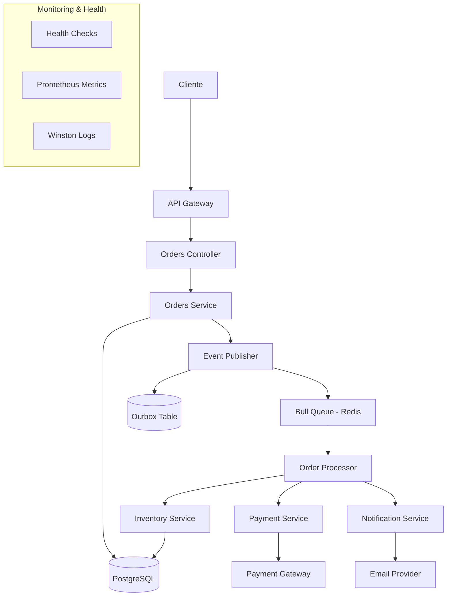

# Sistema Procesador de Órdenes Asíncrono

🚀 **Proyecto de Portfolio Profesional** - Sistema resiliente y escalable para procesamiento asíncrono de órdenes de e-commerce

## 📖 Descripción del Proyecto

Este proyecto demuestra la implementación de un **Sistema Desacoplado y Resiliente** que maneja el procesamiento de órdenes de e-commerce de forma asíncrona. El concepto clave es saber cuándo una tarea NO debe ejecutarse de forma inmediata (síncrona) y cómo construir un sistema que procese trabajos en segundo plano de manera confiable y escalable.

### 🎯 Problema que Resuelve

Cuando un cliente crea una orden en un e-commerce, múltiples operaciones deben ejecutarse:

- ✅ Verificar stock disponible
- 💳 Procesar pago
- 📧 Enviar email de confirmación
- 📦 Actualizar inventario
- 🔄 Registrar eventos de auditoría

Hacer todo esto **de forma síncrona** bloquea al usuario y hace el sistema frágil. Este proyecto implementa una solución **asíncrona y resiliente**.

## 🏗️ Arquitectura y Stack Tecnológico

### Stack Principal

- **Framework**: NestJS 10.x con TypeScript 5.x
- **Base de Datos**: PostgreSQL 15+ con TypeORM 0.3.x
- **Message Queue**: Bull (Redis-based) para manejo de colas
- **Cache**: Redis 7.x
- **Autenticación**: JWT con Passport
- **Documentación**: Swagger/OpenAPI
- **Logging**: Winston con structured logging
- **Testing**: Jest con supertest
- **Monitoring**: Terminus Health Checks

### Patrones de Diseño Implementados

- **🔄 Event Sourcing** (básico)
- **📤 Outbox Pattern** para confiabilidad transaccional
- **⚡ CQRS** (Command Query Responsibility Segregation)
- **🎭 Saga Pattern** para orquestación de procesos
- **🛡️ Circuit Breaker** para resilencia
- **🔁 Retry Pattern** con exponential backoff

## 🏛️ Diagrama de Arquitectura



## 🚀 Funcionalidades Clave

### 1. **Endpoint No-Bloqueante**

```http
POST /orders
Content-Type: application/json

{
  "items": [
    { "productId": "uuid", "quantity": 2 }
  ]
}

Response: 202 Accepted
{
  "orderId": "uuid",
  "status": "PENDING",
  "message": "Order created successfully and is being processed"
}
```

### 2. **Procesamiento Asíncrono**

- El endpoint responde inmediatamente con `202 Accepted`
- Publica evento `OrderCreated` en cola de mensajes
- Worker procesa orden en background:
  - Verificar stock
  - Procesar pago
  - Enviar notificaciones
  - Actualizar estado final

### 3. **Características Avanzadas**

- **🔒 Idempotencia**: Previene procesamiento duplicado
- **🛡️ Outbox Pattern**: Garantiza consistencia transaccional
- **🔄 Retry Logic**: Reintentos automáticos con backoff exponencial
- **☠️ Dead Letter Queue**: Manejo de órdenes no procesables
- **📊 Monitoring**: Health checks y métricas detalladas

## 🛠️ Instalación y Configuración

### Prerrequisitos

- **Node.js** 18+ y npm
- **Docker** y Docker Compose
- **PostgreSQL** 15+
- **Redis** 7.x

### 1. Clonar el Repositorio

```bash
git clone https://github.com/tu-usuario/ecommerce-async-resilient-system.git
cd ecommerce-async-resilient-system
```

### 2. Instalar Dependencias

```bash
npm install
```

### 3. Configurar Variables de Entorno

```bash
cp .env.example .env
# Editar .env con tus configuraciones
```

### 4. Iniciar Servicios con Docker

```bash
docker-compose up -d postgres redis
```

### 5. Ejecutar Migraciones

```bash
npm run migration:run
```

### 6. Iniciar la Aplicación

```bash
# Desarrollo
npm run start:dev

# Producción
npm run build
npm run start:prod
```

## ⚡ Comandos de Desarrollo

### Desarrollo y Build

```bash
npm run start          # Iniciar aplicación
npm run start:dev      # Desarrollo con hot reload
npm run start:debug    # Desarrollo con debug
npm run build          # Build para producción
npm run start:prod     # Ejecutar build de producción
```

### Testing

```bash
npm run test           # Tests unitarios
npm run test:watch     # Tests en modo watch
npm run test:cov       # Tests con coverage
npm run test:debug     # Tests con debugger
npm run test:e2e       # Tests end-to-end
```

### Code Quality

```bash
npm run lint           # Ejecutar ESLint
npm run lint:fix       # Auto-fix issues de linting
npm run format         # Formatear código con Prettier
npm run type-check     # Verificar tipos TypeScript
```

### Base de Datos

```bash
npm run migration:generate -- --name MigrationName
npm run migration:run
npm run migration:revert
npm run seed:run
```

## 🌐 Variables de Entorno Necesarias

```env
# Application
NODE_ENV=development
PORT=3000
API_PREFIX=api/v1

# Database
DB_HOST=localhost
DB_PORT=5432
DB_USERNAME=postgres
DB_PASSWORD=password
DB_NAME=ecommerce_async

# Redis
REDIS_HOST=localhost
REDIS_PORT=6379
REDIS_PASSWORD=

# JWT
JWT_SECRET=your-super-secret-jwt-key
JWT_EXPIRES_IN=1h
JWT_REFRESH_SECRET=your-refresh-secret
JWT_REFRESH_EXPIRES_IN=7d

# Bull Queue
QUEUE_PREFIX=ecommerce
QUEUE_DEFAULT_JOB_OPTIONS='{"removeOnComplete": 100, "removeOnFail": 50}'

# External Services
PAYMENT_GATEWAY_URL=https://api.mockpayment.com
EMAIL_PROVIDER_API_KEY=your-email-api-key

# Monitoring
LOG_LEVEL=info
ENABLE_PROMETHEUS=true
HEALTH_CHECK_TIMEOUT=5000
```

## 📚 Documentación API

Una vez ejecutada la aplicación, la documentación Swagger estará disponible en:

- **Desarrollo**: http://localhost:3000/api/docs
- **Producción**: https://your-domain.com/api/docs

### Endpoints Principales

| Método | Endpoint                    | Descripción                |
| ------ | --------------------------- | -------------------------- |
| `POST` | `/api/v1/orders`            | Crear nueva orden          |
| `GET`  | `/api/v1/orders`            | Listar órdenes del usuario |
| `GET`  | `/api/v1/orders/:id`        | Obtener orden específica   |
| `GET`  | `/api/v1/orders/:id/status` | Estado de la orden         |
| `GET`  | `/api/v1/health`            | Health check general       |
| `GET`  | `/api/v1/health/ready`      | Readiness probe            |

## 🔧 Arquitectura del Código

```
src/
├── app.module.ts                 # Módulo principal
├── main.ts                       # Entry point
├── config/                       # Configuraciones
├── common/                       # Utilities compartidas
│   ├── decorators/
│   ├── filters/
│   ├── guards/
│   ├── interceptors/
│   └── interfaces/
├── modules/
│   ├── auth/                     # Autenticación JWT
│   ├── users/                    # Gestión de usuarios
│   ├── products/                 # Catálogo de productos
│   ├── orders/                   # Procesamiento de órdenes
│   ├── inventory/                # Gestión de inventario
│   ├── payments/                 # Sistema de pagos
│   ├── notifications/            # Notificaciones
│   ├── events/                   # Event sourcing y Outbox
│   └── health/                   # Health checks
├── queues/                       # Bull processors y jobs
└── database/                     # Migraciones y seeds
```

## 🤝 Guía de Contribución

### Flujo de Trabajo

1. **Fork** el repositorio
2. Crear una **branch** desde `develop`:
   ```bash
   git checkout develop
   git checkout -b feature/nueva-funcionalidad
   ```
3. **Commit** cambios siguiendo [Conventional Commits](https://www.conventionalcommits.org/)
4. **Push** a tu fork y crear un **Pull Request**

### Estándares de Código

- ✅ **ESLint**: Sin errores de linting
- ✅ **Prettier**: Código formateado
- ✅ **TypeScript**: Sin errores de tipos
- ✅ **Testing**: Coverage mínimo 80%
- ✅ **Commits**: Formato conventional commits

### Conventional Commits

```bash
feat: add new order processing saga
fix: resolve inventory race condition
docs: update API documentation
test: add unit tests for payment service
refactor: optimize database queries
```

## 📊 Monitoreo y Observabilidad

### Health Checks

- **Liveness**: `/health/live` - App está ejecutándose
- **Readiness**: `/health/ready` - App lista para recibir tráfico
- **Detailed**: `/health/detailed` - Estado detallado de dependencias

### Métricas (Prometheus)

- Órdenes procesadas por minuto
- Tiempo promedio de procesamiento
- Queue lengths y processing times
- Error rates por endpoint
- Database connection pool status

### Logging Estructurado

```json
{
  "timestamp": "2025-09-23T10:30:00.000Z",
  "level": "info",
  "context": "OrderService",
  "message": "Order processed successfully",
  "orderId": "uuid",
  "userId": "uuid",
  "processingTime": 1250
}
```

## 🐛 Reporting de Issues

Usa nuestros [issue templates](/.github/ISSUE_TEMPLATE/) para:

- 🐛 **Bug Reports**: Describe el problema encontrado
- 💡 **Feature Requests**: Propone nuevas funcionalidades
- 📖 **Documentation**: Mejoras en documentación

## 📄 Licencia

Este proyecto está bajo la licencia [MIT](LICENSE).

## 👨‍💻 Autor

**Tu Nombre**

- GitHub: [@tu-usuario](https://github.com/tu-usuario)
- LinkedIn: [tu-perfil](https://linkedin.com/in/tu-perfil)
- Email: tu-email@domain.com

---

⭐ **¡Dale una estrella si este proyecto te fue útil!**

Este proyecto forma parte de mi portfolio profesional demostrando expertise en:

- **Arquitecturas Asíncronas y Resilientes**
- **Event-Driven Design**
- **Microservicios con NestJS**
- **DevOps y CI/CD**
- **Testing y Code Quality**
