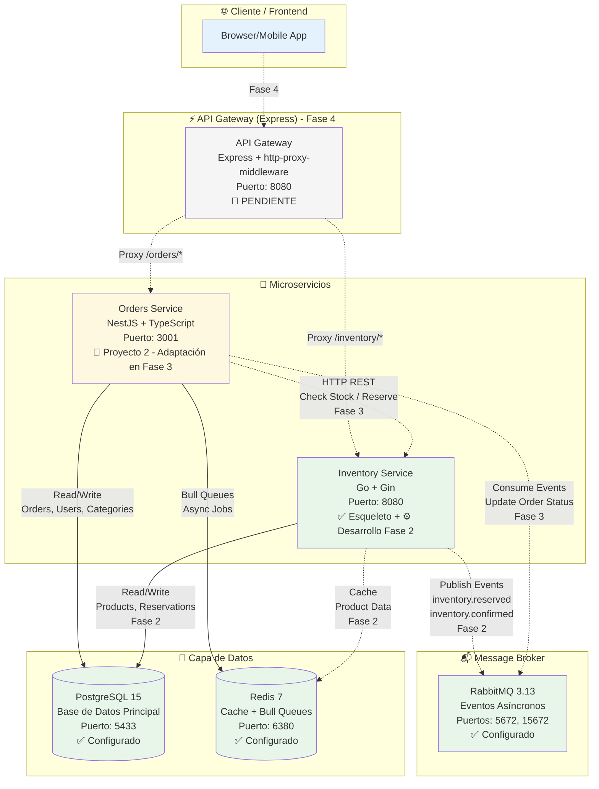

# 🛒 Ecosistema de Microservicios E-commerce

<p align="center">
  <a href="https://github.com/ArielDRighi/microservices-ecommerce-system/actions/workflows/ci-basic.yml">
    
  </a>
  <a href="https://github.com/ArielDRighi/microservices-ecommerce-system/actions/workflows/inventory-service-ci.yml">
    
  </a>
  <a href="https://github.com/ArielDRighi/microservices-ecommerce-system/actions/workflows/orders-service-ci.yml">
    
  </a>
  <a href="#">
    
  </a>
  <a href="#">
    
  </a>
  <a href="#">
    
  </a>
  <a href="#">
    
  </a>
  <a href="https://github.com/ArielDRighi/microservices-ecommerce-system/tree/develop/docs/adr">
    
  </a>
  <a href="#">
    
  </a>
</p>

<p align="center">
  Sistema distribuido de e-commerce con arquitectura de microservicios poliglota, implementando comunicación síncrona (REST) y asíncrona (RabbitMQ), patrones de resiliencia avanzados, y testing integral con Testcontainers.
</p>

<p align="center">
  <a href="#-quick-start">🚀 Quick Start</a> •
  <a href="#-arquitectura">Arquitectura</a> •
  <a href="#-servicios">Servicios</a> •
  <a href="#-stack-tecnológico">Stack</a> •
  <a href="#-estructura-del-monorepo">Estructura</a> •
  <a href="#-testing">Testing</a> •
  <a href="#-documentación">Documentación</a> •
  <a href="#-adrs">ADRs</a> •
  <a href="#-para-entrevistas">Para Entrevistas</a>
</p>

---

## 📌 Estado del Proyecto

> **Fase actual:** ✅ Fase 1 completada (Setup e Infraestructura) | ⚙️ Fase 2 en desarrollo (Domain Layer Inventory)

| Fase                                     | Estado         | Progreso |
| ---------------------------------------- | -------------- | -------- |
| **Fase 0:** Technical Spikes             | ✅ Completado  | 100%     |
| **Fase 1:** Setup e Infraestructura      | ✅ Completado  | 100%     |
| **Fase 2:** Inventory Service (Go)       | ⚙️ En Progreso | 20%      |
| **Fase 3:** Integración Orders↔Inventory | 🔄 Pendiente   | 0%       |
| **Fase 4:** API Gateway (Express)        | 🔄 Pendiente   | 0%       |

**Última actualización:** 17 de Octubre, 2025

---

## 🚀 Quick Start

```bash
# 1. Clonar repositorio
git clone https://github.com/ArielDRighi/microservices-ecommerce-system.git
cd microservices-ecommerce-system

# 2. Levantar infraestructura (PostgreSQL, Redis, RabbitMQ)
docker-compose up -d

# 3. Verificar servicios
docker-compose ps

# 4. Acceder a las interfaces
# - RabbitMQ Management: http://localhost:15672
#   Usuario: microservices / Contraseña: microservices_pass_2024
# - PostgreSQL (PgAdmin): http://localhost:5050
# - Redis Commander: http://localhost:8082
```

**Servicios disponibles:**

| Servicio                 | Puerto | Estado         |
| ------------------------ | ------ | -------------- |
| 📦 Orders Service        | 3001   | 🔄 En Fase 3   |
| 📊 Inventory Service     | 8080   | ⚙️ Desarrollo  |
| 🐰 RabbitMQ (AMQP)       | 5672   | ✅ Operacional |
| 🐰 RabbitMQ (Management) | 15672  | ✅ Operacional |
| 🐘 PostgreSQL            | 5433   | ✅ Operacional |
| 🔴 Redis                 | 6380   | ✅ Operacional |
| 🛠️ PgAdmin               | 5050   | ✅ Operacional |
| 🛠️ Redis Commander       | 8082   | ✅ Operacional |

> **📖 Ver más:** [INFRASTRUCTURE_REFERENCE.md](docs/INFRASTRUCTURE_REFERENCE.md) | [QUICK_REFERENCE.md](docs/QUICK_REFERENCE.md)

---

## 🏗️ Arquitectura

> **Estado actual:** Fase 1 completada (infraestructura). En desarrollo de Fase 2 (Domain Layer de Inventory Service).

### Diagrama de Alto Nivel (Arquitectura Final)



**Leyenda:**

- ✅ **Línea sólida:** Implementado y funcional
- ⚙️ **Línea punteada:** En desarrollo o planificado
- 🔄 **PENDIENTE:** Fase futura

### Comunicación entre Servicios (Planificada)

#### 🔵 Síncrona (REST) - Fase 3

- **Orders → Inventory**: Check stock, Reserve, Confirm, Release
- **API Gateway → Orders/Inventory**: Proxy HTTP requests
- **Implementación**: `@nestjs/axios` + `axios-retry` + `opossum` (circuit breaker)
- **Timeouts**: 5s (read), 10s (write), 15s (critical)
- **Referencia**: [ADR-028: REST Synchronous Communication](docs/adr/028-rest-synchronous-communication-strategy.md)

#### 🟠 Asíncrona (RabbitMQ) - Fase 2-3

- **Inventory → Orders**: `inventory.reserved`, `inventory.confirmed`, `inventory.released`
- **Orders → Inventory**: `order.created`, `order.cancelled`, `order.completed`
- **Exchanges**: `inventory.events` (topic), `orders.events` (topic)
- **Queues**: `orders.inventory_events`, `inventory.order_events` + DLQs
- **Garantías**: At-least-once delivery, Dead Letter Queue, Idempotency
- **Referencia**: [ADR-029: Message Broker RabbitMQ](docs/adr/029-message-broker-rabbitmq-vs-redis-pubsub.md)

---

## 🎯 ¿Qué Resuelve Este Proyecto?

### Problema

Sistemas de e-commerce tradicionales con arquitectura monolítica enfrentan:

- ❌ **Acoplamiento**: Cambios en inventario requieren redeploy completo
- ❌ **Escalabilidad limitada**: No se puede escalar inventario independiente de órdenes
- ❌ **Tecnologías fijas**: Stack único (ej: solo Node.js o solo Java)
- ❌ **Resiliencia pobre**: Fallo en un módulo afecta todo el sistema

### Solución: Arquitectura de Microservicios

Este proyecto demuestra:

- ✅ **Desacoplamiento**: Servicios independientes con contratos API claros
- ✅ **Escalabilidad horizontal**: Escalar Orders e Inventory por separado
- ✅ **Tecnología apropiada**: Go para performance (Inventory), NestJS para DX (Orders)
- ✅ **Resiliencia**: Circuit breakers, retries, Dead Letter Queues
- ✅ **Event-Driven**: Comunicación asíncrona con RabbitMQ

### Evolución del Proyecto

Este proyecto es la **evolución** del [Sistema Procesador de Órdenes Asíncrono](https://github.com/ArielDRighi/ecommerce-async-resilient-system) (Proyecto 2), transformado en arquitectura de microservicios:

| Aspecto           | Proyecto 2 (Monolito)   | Proyecto 3 (Microservicios)                               |
| ----------------- | ----------------------- | --------------------------------------------------------- |
| **Arquitectura**  | Monolito NestJS         | 2 microservicios (NestJS + Go) + API Gateway (futuro)     |
| **Lenguajes**     | Solo TypeScript         | TypeScript + Go (poliglota)                               |
| **Base de Datos** | PostgreSQL compartida   | PostgreSQL con esquemas separados por servicio            |
| **Comunicación**  | Interna (módulos)       | REST (síncrono) + RabbitMQ (asíncrono)                    |
| **Inventario**    | Lógica interna simulada | Servicio independiente en Go con concurrencia real        |
| **Testing**       | Jest + Supertest        | Jest + Supertest + Testcontainers (Go + NestJS)           |
| **Deployment**    | Single container        | Multi-container (Docker Compose) + hot-reload development |

---

## 🔷 Servicios

### 1. Orders Service (NestJS + TypeScript)

> **Estado actual:** ✅ Código base del Proyecto 2 | 🔄 Refactoring en Fase 3

**Descripción**: Gestiona órdenes de compra, usuarios, categorías y procesamiento asíncrono.

**Stack**:

- Framework: NestJS 10.x
- ORM: TypeORM
- Queue: Bull + Redis
- Testing: Jest + Supertest

**Responsabilidades actuales** (Proyecto 2):

- CRUD de órdenes, usuarios, categorías
- Procesamiento asíncrono con Bull queues
- Saga Pattern para transacciones distribuidas
- Lógica de inventario interna (será eliminada en Fase 3)

**Responsabilidades futuras** (Fase 3):

- Consumidor de eventos de Inventory (RabbitMQ)
- Cliente HTTP para Inventory Service
- Delegación completa de stock management

**Puerto:** 3001 | **Documentación**: [services/orders-service/README.md](services/orders-service/README.md)

---

### 2. Inventory Service (Go + Gin)

> **Estado actual:** ✅ Esqueleto básico (Fase 1) | ⚙️ Domain Layer en desarrollo (Fase 2)

**Descripción**: Gestiona inventario de productos y reservas con locking optimista.

**Stack**:

- Framework: Gin (Go 1.23)
- ORM: GORM (en implementación)
- Cache: Redis (planificado)
- Testing: Testcontainers + go-sqlmock

**Implementado (Fase 1):**

- ✅ Estructura hexagonal (domain, application, infrastructure, interfaces)
- ✅ Health check endpoint (`/health`)
- ✅ Graceful shutdown
- ✅ Hot-reload development con Air
- ✅ CI/CD pipeline con GitHub Actions

**En desarrollo (Fase 2):**

- ⚙️ Domain entities (InventoryItem, Reservation)
- ⚙️ CRUD de productos
- ⚙️ Reservas de stock con locking optimista
- ⚙️ Publicación de eventos a RabbitMQ
- ⚙️ Cache con Redis

**Puerto:** 8080 | **Documentación**: [services/inventory-service/README.md](services/inventory-service/README.md)

---

### 3. API Gateway (Express + TypeScript)

> **Estado actual:** 🔄 Planificado para Fase 4

**Descripción**: Punto de entrada único para clientes, proxy a microservicios.

**Stack planificado**:

- Framework: Express.js
- Proxy: http-proxy-middleware
- Auth: JWT (jsonwebtoken)
- Rate Limiting: express-rate-limit + Redis
- Circuit Breaker: opossum

**Responsabilidades**:

- Routing a servicios
- Autenticación JWT centralizada
- Rate limiting
- Circuit breaker por servicio
- Logging y métricas

**Puerto:** 8080 (planificado) | **Referencia**: [ADR-026: API Gateway Express Custom](docs/adr/026-api-gateway-express-custom.md)

---

## 🛠️ Stack Tecnológico

### Backend Services

| Tecnología      | Uso                                   | Versión | Estado         |
| --------------- | ------------------------------------- | ------- | -------------- |
| **NestJS**      | Orders Service framework              | 10.x    | ✅ Configurado |
| **Go (Golang)** | Inventory Service                     | 1.23    | ✅ Configurado |
| **Gin**         | Go web framework                      | 1.10+   | ✅ Instalado   |
| **Express.js**  | API Gateway (futuro)                  | 4.x     | 🔄 Fase 4      |
| **TypeScript**  | Lenguaje principal (Orders + Gateway) | 5.x     | ✅ Configurado |

### Databases & Storage

| Tecnología     | Uso                                | Versión | Puerto | Estado         |
| -------------- | ---------------------------------- | ------- | ------ | -------------- |
| **PostgreSQL** | Base de datos relacional principal | 15      | 5433   | ✅ Operacional |
| **Redis**      | Cache + Bull queues                | 7       | 6380   | ✅ Operacional |

### Message Broker

| Tecnología   | Uso                                | Versión | Puertos     | Estado         |
| ------------ | ---------------------------------- | ------- | ----------- | -------------- |
| **RabbitMQ** | Eventos asíncronos entre servicios | 3.13    | 5672, 15672 | ✅ Operacional |

**Características configuradas:**

- ✅ Management UI accesible en http://localhost:15672
- ✅ Credenciales: `microservices` / `microservices_pass_2024`
- ✅ Persistent volumes configurados
- ✅ Event architecture documentada ([ADR-029](docs/adr/029-message-broker-rabbitmq-vs-redis-pubsub.md))

### DevOps & Infrastructure

| Tecnología         | Uso                            | Estado         |
| ------------------ | ------------------------------ | -------------- |
| **Docker**         | Containerización de servicios  | ✅ Configurado |
| **Docker Compose** | Orquestación local             | ✅ Operacional |
| **Air**            | Hot-reload para Go development | ✅ Configurado |
| **Nodemon**        | Hot-reload para NestJS         | ✅ Configurado |
| **GitHub Actions** | CI/CD pipeline                 | ✅ Operacional |
| **Testcontainers** | Integration tests              | ✅ PoC exitoso |
| **golangci-lint**  | Go code quality                | ✅ Configurado |
| **ESLint**         | TypeScript code quality        | ✅ Configurado |

### Monitoring & Observability (Planificado)

| Tecnología              | Uso                          | Estado         |
| ----------------------- | ---------------------------- | -------------- |
| **Prometheus**          | Métricas de servicios        | 🔄 Fase 3-4    |
| **Grafana**             | Dashboards de monitoreo      | 🔄 Fase 3-4    |
| **Winston**             | Logging estructurado         | 🔄 Fase 2-3    |
| **Bull Board**          | Dashboard de queues (NestJS) | ✅ Proyecto 2  |
| **RabbitMQ Management** | Dashboard de RabbitMQ        | ✅ Operacional |

### Testing

| Tecnología         | Uso                       | Coverage Planificado | Estado         |
| ------------------ | ------------------------- | -------------------- | -------------- |
| **Jest**           | Unit + E2E tests (NestJS) | >70%                 | ✅ Proyecto 2  |
| **Supertest**      | API testing (NestJS)      | -                    | ✅ Proyecto 2  |
| **Testcontainers** | Integration tests (Go)    | -                    | ✅ PoC exitoso |
| **go-sqlmock**     | Unit tests (Go)           | >75%                 | 🔄 Fase 2      |

---

## 📁 Estructura del Monorepo

```
microservices-ecommerce-system/
├── 📂 services/                    # Microservicios independientes
│   ├── 📦 orders-service/          # NestJS + TypeScript (Proyecto 2)
│   │   ├── src/                    # Código fuente
│   │   ├── test/                   # E2E tests
│   │   ├── package.json
│   │   ├── Dockerfile
│   │   └── README.md
│   │
│   ├── 📦 inventory-service/       # Go + Gin (En desarrollo)
│   │   ├── cmd/api/                # Entry point
│   │   ├── internal/
│   │   │   ├── domain/             # Entities (⚙️ Fase 2)
│   │   │   ├── application/        # Use cases (⚙️ Fase 2)
│   │   │   ├── infrastructure/     # DB, Redis, RabbitMQ (⚙️ Fase 2)
│   │   │   └── interfaces/         # HTTP handlers (✅ Básico)
│   │   ├── tests/
│   │   │   ├── unit/               # Unit tests (🔄 Fase 2)
│   │   │   └── integration/        # Testcontainers (✅ PoC)
│   │   ├── go.mod
│   │   ├── Makefile
│   │   ├── Dockerfile
│   │   ├── Dockerfile.dev          # ✅ Hot-reload con Air
│   │   ├── .air.toml               # ✅ Air configuration
│   │   └── README.md
│   │
│   └── 📦 api-gateway/             # Express + TypeScript (Fase 4)
│       └── README.md               # Planificado
│
├── 📂 shared/                      # Código compartido (futuro)
│   ├── types/                      # TypeScript types (eventos, DTOs)
│   └── proto/                      # Protobuf definitions (futuro gRPC)
│
├── 📂 docs/                        # ✅ Documentación completa
│   ├── ARCHITECTURE.md             # Diagrama de arquitectura detallado
│   ├── DATABASE_DESIGN.md          # Esquemas de DB
│   ├── PROJECT_BACKLOG.md          # Backlog completo (8-10 semanas)
│   ├── PROJECT_SETUP.md            # Guía de setup inicial
│   ├── INFRASTRUCTURE_REFERENCE.md # ✅ Referencia de infra completa
│   ├── QUICK_REFERENCE.md          # ✅ Comandos rápidos
│   ├── CI_CD_STRATEGY.md           # ✅ Estrategia CI/CD progresivo
│   ├── adr/                        # ✅ 29 Architecture Decision Records
│   │   ├── README.md
│   │   ├── 001-async-non-blocking-architecture.md
│   │   ├── 026-api-gateway-express-custom.md
│   │   ├── 027-testcontainers-vs-mocks-go-testing.md
│   │   ├── 028-rest-synchronous-communication-strategy.md
│   │   ├── 029-message-broker-rabbitmq-vs-redis-pubsub.md
│   │   └── ... (25 ADRs más)
│   └── api-testing/                # Guías de testing de API
│       ├── 00-QUICK-START-DEMO.md
│       └── ...
│
├── 📂 scripts/                     # Scripts de DevOps
│   ├── init-db.sql                 # ✅ Schema inicial
│   ├── migrate.sh
│   └── deploy-*.sh
│
├── 📂 .github/workflows/           # ✅ CI/CD Pipelines
│   ├── ci-basic.yml                # ✅ CI básico
│   ├── inventory-service-ci.yml    # ✅ CI Inventory (build+lint)
│   └── orders-service-ci.yml       # ✅ CI Orders (build+lint)
│
├── docker-compose.yml              # ✅ Infraestructura completa
├── docker-compose.dev.yml          # ✅ Hot-reload development
├── docker-compose.old.yml          # Backup Proyecto 2
├── .gitignore                      # ✅ Multi-lenguaje (Node + Go)
├── Makefile                        # ✅ Comandos unificados
├── README.md                       # Este archivo
└── LICENSE                         # MIT License
```

### Decisiones de Estructura

**¿Por qué Monorepo?**

- ✅ **Atomic commits**: Cambios en múltiples servicios en un solo commit
- ✅ **Refactoring simplificado**: Cambiar contratos API sin sync entre repos
- ✅ **Documentación centralizada**: ADRs, arquitectura, backlog en un solo lugar
- ✅ **CI/CD unificado**: Un pipeline para todo el ecosistema

**Alternativas consideradas**:

- ❌ **Multi-repo**: Complicaría sync de cambios entre Orders e Inventory
- ❌ **Monolito modular**: No demostraría microservicios reales

---

## 🧪 Testing Strategy

### Cobertura por Servicio (Planificada)

| Servicio        | Framework                   | Coverage Target | Estado        |
| --------------- | --------------------------- | --------------- | ------------- |
| **Orders**      | Jest + Supertest            | >70%            | ✅ Proyecto 2 |
| **Inventory**   | go-sqlmock + Testcontainers | >75%            | 🔄 Fase 2     |
| **API Gateway** | Jest + Supertest            | >65%            | 🔄 Fase 4     |

### Estrategia de Testing

**Unit Tests:**

- Go: `go-sqlmock` para repositories
- NestJS: Jest con mocks

**Integration Tests:**

- Go: **Testcontainers** (PostgreSQL real) - [ADR-027](docs/adr/027-testcontainers-vs-mocks-go-testing.md)
- NestJS: Testcontainers + Supertest

**E2E Tests:**

- API testing con Supertest
- Contract testing (futuro)

### PoC Testcontainers (Completado)

- ✅ Setup time: 27.35s (bajo target de 120s)
- ✅ Query performance: 1.24ms (100 productos)
- ✅ Integración con GitHub Actions
- ✅ Resultados documentados: [POC_TESTCONTAINERS_RESULTS.md](services/inventory-service/docs/POC_TESTCONTAINERS_RESULTS.md)

---

## 📚 Documentación Completa

### Documentos Técnicos Principales

| Documento                                                           | Descripción                                           |
| ------------------------------------------------------------------- | ----------------------------------------------------- |
| **[ARCHITECTURE.md](docs/ARCHITECTURE.md)**                         | Arquitectura completa del sistema con diagramas       |
| **[DATABASE_DESIGN.md](docs/DATABASE_DESIGN.md)**                   | Diseño de base de datos, tablas, índices, relaciones  |
| **[PROJECT_BACKLOG.md](docs/PROJECT_BACKLOG.md)**                   | Backlog completo (8-10 semanas, 4 fases)              |
| **[PROJECT_SETUP.md](docs/PROJECT_SETUP.md)**                       | Guía de instalación y configuración                   |
| **[INFRASTRUCTURE_REFERENCE.md](docs/INFRASTRUCTURE_REFERENCE.md)** | Referencia de infraestructura (puertos, credenciales) |
| **[QUICK_REFERENCE.md](docs/QUICK_REFERENCE.md)**                   | Comandos esenciales                                   |
| **[CI_CD_STRATEGY.md](docs/CI_CD_STRATEGY.md)**                     | Estrategia CI/CD progresivo                           |
| **[ADRs (29 docs)](docs/adr/README.md)**                            | Architecture Decision Records                         |
| **[API Testing Guides](docs/api-testing/)**                         | Guías de testing manual por módulo                    |

---

## 🏛️ Decisiones de Arquitectura (ADRs)

La arquitectura de este proyecto se basa en **29 Architectural Decision Records (ADRs)** profesionales. Todas las decisiones están documentadas con contexto, alternativas consideradas y consecuencias.

### ADRs Clave para Microservicios

| ADR                                                                | Título                                    | Estado      |
| ------------------------------------------------------------------ | ----------------------------------------- | ----------- |
| [ADR-026](docs/adr/026-api-gateway-express-custom.md)              | API Gateway Custom con Express            | ✅ Aceptado |
| [ADR-027](docs/adr/027-testcontainers-vs-mocks-go-testing.md)      | Testcontainers vs Mocks (Go Testing)      | ✅ Aceptado |
| [ADR-028](docs/adr/028-rest-synchronous-communication-strategy.md) | REST Synchronous Communication Strategy   | ✅ Aceptado |
| [ADR-029](docs/adr/029-message-broker-rabbitmq-vs-redis-pubsub.md) | Message Broker: RabbitMQ vs Redis Pub/Sub | ✅ Aceptado |
| [ADR-030](docs/adr/030-monorepo-structure.md)                      | Monorepo Structure (futuro)               | 🔄 Draft    |

**Ver todos los ADRs:** [docs/adr/README.md](docs/adr/README.md)

---

## 🎤 Para Entrevistas Técnicas

### Habilidades Demostradas

- ✅ **Microservicios**: Arquitectura distribuida con servicios independientes
- ✅ **Multi-lenguaje**: Go (performance) + TypeScript (DX) - poliglota
- ✅ **Event-Driven**: RabbitMQ con at-least-once delivery
- ✅ **Resiliencia**: Circuit breakers, retries, Dead Letter Queues
- ✅ **Testing**: Testcontainers + E2E (>70% coverage)
- ✅ **Documentación**: 29 ADRs, diagramas, backlog detallado
- ✅ **DevOps**: Docker, CI/CD progresivo, hot-reload development
- ✅ **Pragmatismo**: Decisiones técnicas justificadas con ADRs

### Preguntas Frecuentes

<details>
<summary><strong>¿Por qué Go para Inventory Service?</strong></summary>

Go ofrece:

- **Performance**: Compilado, bajo consumo de memoria
- **Concurrencia nativa**: Goroutines para manejo de stock concurrente
- **Simplicidad**: Ideal para microservicios ligeros
- **Deployment**: Binario único sin dependencias

Ver [ADR-027](docs/adr/027-testcontainers-vs-mocks-go-testing.md) para detalles técnicos.

</details>

<details>
<summary><strong>¿Por qué RabbitMQ y no Kafka?</strong></summary>

Para un proyecto de portfolio con 2-3 servicios:

- RabbitMQ es suficiente (5K-10K msgs/seg)
- Kafka es overkill (necesita ZooKeeper, 3+ brokers)
- RabbitMQ tiene Management UI integrado
- Menor complejidad operacional

Ver [ADR-029](docs/adr/029-message-broker-rabbitmq-vs-redis-pubsub.md) para análisis completo.

</details>

<details>
<summary><strong>¿Por qué Testcontainers y no mocks?</strong></summary>

Estrategia híbrida:

- **Unit tests**: Mocks (rápidos, 75% coverage)
- **Integration tests**: Testcontainers (PostgreSQL real, SQL real, constraints reales)
- Testcontainers setup: 27.35s (aceptable, < 2 min)
- Valida SQL real, locking, concurrencia

Ver [ADR-027](docs/adr/027-testcontainers-vs-mocks-go-testing.md) y [PoC Results](services/inventory-service/docs/POC_TESTCONTAINERS_RESULTS.md).

</details>

---

## 🤝 Contribuciones

Este es un proyecto de portfolio personal. **No se aceptan contribuciones externas**, pero **feedback es bienvenido** via issues.

---

## 📄 Licencia

Este proyecto está bajo la licencia **MIT**. Ver [LICENSE](LICENSE) para más detalles.

---

## 📬 Contacto

**Ariel D. Righi**

- 💼 LinkedIn: [linkedin.com/in/ariel-righi](https://linkedin.com/in/ariel-righi)
- 🐙 GitHub: [@ArielDRighi](https://github.com/ArielDRighi)
- 📧 Email: arieldavidrighi@gmail.com

---

<p align="center">
  <strong>⭐ Si este proyecto te resultó útil, considera darle una estrella en GitHub ⭐</strong>
</p>

<p align="center">
  <strong>Proyecto 3 de 3</strong> del Portfolio Profesional | <strong>Última actualización:</strong> 17 de Octubre, 2025
</p>
