# Sistema Procesador de Órdenes Asíncrono

<p align="center">
  <a href="https://github.com/ArielDRighi/ecommerce-async-resilient-system/actions">
    
  </a>
  <a href="#">
    
  </a>
  <a href="#">
    
  </a>
  <a href="#">
    
  </a>
  <a href="#">
    
  </a>
</p>

<p align="center">
  Sistema resiliente y escalable de nivel empresarial para procesamiento asíncrono de órdenes de e-commerce, construido con NestJS, demostrando arquitecturas event-driven, patrones avanzados de resiliencia y prácticas de DevOps profesionales.
</p>

<p align="center">
  <a href="#-acerca-del-proyecto">Acerca del Proyecto</a> •
  <a href="#-stack-tecnológico">Stack Tecnológico</a> •
  <a href="#-arquitectura-del-sistema">Arquitectura</a> •
  <a href="#-instalación-y-configuración">Instalación</a> •
  <a href="#-comandos-de-desarrollo">Comandos</a> •
  <a href="#-testing">Testing</a> •
  <a href="#-documentación-completa">Documentación</a> •
  <a href="#-decisiones-de-arquitectura">ADRs</a> •
  <a href="#-contacto">Contacto</a>
</p>

---

## 📖 Acerca del Proyecto

Este proyecto es un sistema de procesamiento asíncrono de órdenes para e-commerce, robusto y listo para un entorno empresarial. Construido con **NestJS**, **TypeScript**, **PostgreSQL**, **Redis** y **Bull**, sirve como una demostración de las mejores prácticas en arquitecturas event-driven, patrones de resiliencia y procesamiento asíncrono de alto rendimiento.

El objetivo principal es demostrar la capacidad de construir sistemas de backend desacoplados, escalables y resilientes, aplicando patrones avanzados como Event Sourcing, Outbox Pattern, Saga Orchestration, CQRS, Circuit Breaker y Retry con exponential backoff.

**🎯 Documentación Completa:** El proyecto incluye documentación técnica profesional que demuestra planificación previa, incluyendo diseño de base de datos, diagramas de arquitectura, 25 ADRs (Architecture Decision Records) traducidos al español, y documentación exhaustiva de API.

---

### 🎯 Problema que Resuelve

Cuando un cliente crea una orden en un e-commerce, múltiples operaciones deben ejecutarse:

- ✅ Verificar stock disponible
- 💳 Procesar pago con gateway externo
- 📧 Enviar notificaciones por email
- 📦 Actualizar inventario en tiempo real
- 🔄 Registrar eventos de auditoría
- 📊 Actualizar métricas y analytics

Hacer todo esto **de forma síncrona** tiene graves problemas:

- ❌ **Bloquea al usuario** esperando operaciones lentas (emails, APIs externas)
- ❌ **Fragilidad**: Un fallo en email rompe toda la orden
- ❌ **No escalable**: Cuellos de botella en procesos síncronos
- ❌ **Mala experiencia**: Timeouts y errores frecuentes

Este proyecto implementa una solución **asíncrona, desacoplada y resiliente** usando colas de mensajes, event-driven architecture y patrones avanzados de resiliencia.

---

### 🏛️ Decisiones de Arquitectura y Diseño

Este proyecto no es solo código; es el resultado de un proceso de ingeniería deliberado y documentado. Todas las decisiones arquitectónicas clave, desde la elección de Bull para colas hasta la estrategia de testing, están registradas como **Architecture Decision Records (ADRs)** en español.

Este enfoque demuestra un compromiso con la planificación estratégica, la gestión de riesgos y la comunicación técnica clara, aplicando más de 10 años de experiencia en gestión de proyectos al desarrollo de software.

➡️ **[Explora aquí los 25 ADRs para entender el "porqué" detrás de cada decisión técnica.](https://github.com/ArielDRighi/ecommerce-async-resilient-system/tree/docs/complete-documentation/docs/adr)**

---

### ✨ Características Principales

- **Arquitectura Asíncrona No-Bloqueante:** Endpoints responden con 202 Accepted inmediatamente, procesamiento en background con workers especializados.
- **Sistema de Colas Robusto con Bull:** 4 colas especializadas (Order, Payment, Inventory, Notification) con rate limiting, retries, DLQ y progress tracking.
- **Event-Driven con Outbox Pattern:** Garantiza consistencia transaccional entre base de datos y colas de mensajes, previene pérdida de eventos.
- **Saga Pattern para Orquestación:** Coordinación de procesos distribuidos con compensación automática en caso de fallos.
- **Patrones de Resiliencia:** Circuit Breaker, Retry con exponential backoff, Idempotency keys, Dead Letter Queue para manejo de fallos.
- **CQRS (Command Query Responsibility Segregation):** Separación de escrituras y lecturas para optimización de performance.
- **Autenticación JWT Completa:** Access y refresh tokens, guards de autorización basados en roles (Admin/Customer).
- **Health Checks Empresariales:** Terminus health checks para Docker Compose, endpoints /health, /health/ready, /health/detailed.
- **Monitoreo con Prometheus:** Métricas de negocio y sistema expuestas en /metrics para scraping.
- **Bull Board Dashboard:** UI web en /api/v1/admin/queues para monitoreo en tiempo real de colas y jobs.
- **Logging Estructurado con Winston:** Logs en formato JSON con correlation IDs, rotation diaria, levels configurables.
- **Sistema de Testing Exhaustivo:** 103 tests unitarios + 14 suites E2E, cobertura 20% (meta 80%), configuración Jest profesional.
- **Contenerización Completa:** Docker multi-stage builds, docker-compose para dev/test/prod, healthchecks configurados.
- **Pipeline CI/CD con GitHub Actions:** Linting, testing, security scanning, build validation automatizado.
- **Documentación API con Swagger:** OpenAPI completo con ejemplos, schemas detallados, endpoints documentados.

---

## 🛠️ Stack Tecnológico

Este proyecto está construido con un stack tecnológico moderno y de nivel empresarial:

<p align="center">
  <a href="https://nestjs.com/" target="_blank">
    
  </a>
  <a href="https://www.typescriptlang.org/" target="_blank">
    
  </a>
  <a href="https://www.postgresql.org/" target="_blank">
    
  </a>
  <a href="https://redis.io/" target="_blank">
    
  </a>
  <a href="https://www.docker.com/" target="_blank">
    
  </a>
  <a href="https://jestjs.io/" target="_blank">
    
  </a>
  <a href="https://swagger.io/" target="_blank">
    
  </a>
  <a href="https://github.com/features/actions" target="_blank">
    
  </a>
</p>

### Stack Principal

| Capa                | Tecnología                          | Versión | Propósito                                    |
| ------------------- | ----------------------------------- | ------- | -------------------------------------------- |
| **Framework**       | NestJS                              | 10.x    | Framework backend modular y escalable        |
| **Lenguaje**        | TypeScript                          | 5.x     | Type safety y desarrollo robusto             |
| **Base de Datos**   | PostgreSQL                          | 15+     | Persistencia relacional con JSON support     |
| **ORM**             | TypeORM                             | 0.3.x   | Object-relational mapping y migraciones      |
| **Message Queue**   | Bull                                | 4.x     | Sistema de colas basado en Redis             |
| **Cache/Queue**     | Redis                               | 7.x     | Cache en memoria y backend de Bull           |
| **Autenticación**   | Passport JWT                        | -       | Estrategia JWT con access/refresh tokens     |
| **Validación**      | class-validator + class-transformer | -       | Validación de DTOs y transformación de tipos |
| **Documentación**   | Swagger/OpenAPI                     | -       | Documentación interactiva de API             |
| **Logging**         | Winston                             | 3.x     | Structured logging con rotation              |
| **Testing**         | Jest + Supertest                    | 29.x    | Unit, integration y E2E testing              |
| **Health Checks**   | @nestjs/terminus                    | -       | Health checks para Docker Compose            |
| **Metrics**         | prom-client (Prometheus)            | -       | Métricas de negocio y sistema                |
| **Security**        | Helmet                              | 7.x     | Security headers HTTP                        |
| **Contenerización** | Docker + Docker Compose             | -       | Orquestación multi-servicio                  |
| **CI/CD**           | GitHub Actions                      | -       | Pipeline automatizado de integración         |

### Patrones de Diseño Implementados

- **🔄 Event Sourcing** - Registro inmutable de eventos de dominio
- **📤 Outbox Pattern** - Consistencia transaccional entre DB y message queue
- **⚡ CQRS** - Command Query Responsibility Segregation para performance
- **🎭 Saga Pattern** - Orquestación de transacciones distribuidas con compensación
- **🛡️ Circuit Breaker** - Prevención de cascadas de fallos en servicios externos
- **🔁 Retry Pattern** - Reintentos automáticos con exponential backoff
- **🔑 Idempotency** - Prevención de procesamiento duplicado con idempotency keys
- **☠️ Dead Letter Queue** - Manejo de mensajes fallidos para análisis posterior

## 🏛️ Arquitectura del Sistema

Este proyecto implementa una **arquitectura asíncrona de 8 capas** con patrones avanzados de resiliencia y escalabilidad.

```mermaid
graph TB
    Client[🌐 Cliente HTTP] --> API[📡 API Layer - NestJS]

    API --> OrderController[🛒 Orders Controller]
    API --> ProductController[📦 Products Controller]
    API --> InventoryController[📊 Inventory Controller]

    OrderController --> OrderService[⚙️ Order Service]
    ProductController --> ProductService[⚙️ Product Service]
    InventoryController --> InventoryService[⚙️ Inventory Service]

    OrderService --> EventPublisher[📤 Event Publisher]
    EventPublisher --> OutboxTable[(📝 Outbox Events Table)]
    EventPublisher --> Queue[🔄 Bull Queues - Redis]

    Queue --> OrderProcessor[⚡ Order Processor Worker]
    Queue --> PaymentProcessor[💳 Payment Processor]
    Queue --> InventoryProcessor[📦 Inventory Processor]
    Queue --> NotificationProcessor[📧 Notification Processor]

    OrderProcessor --> SagaOrchestrator[🎭 Saga Orchestrator]
    SagaOrchestrator --> SagaStateTable[(🗂️ Saga States Table)]

    OrderService --> DB[(🗄️ PostgreSQL)]
    ProductService --> DB
    InventoryService --> DB
    PaymentProcessor --> PaymentGateway[💰 Payment Gateway API]
    NotificationProcessor --> EmailProvider[📮 Email Provider]

    subgraph "🔍 Observability Layer"
        HealthCheck[❤️ Health Checks - Terminus]
        Metrics[📊 Prometheus Metrics]
        Logs[📜 Winston Structured Logs]
        BullBoard[📈 Bull Board Dashboard]
    end

    style Client fill:#e1f5ff
    style API fill:#fff3e0
    style Queue fill:#f3e5f5
    style DB fill:#e8f5e9
    style SagaOrchestrator fill:#fff9c4
```



### 📐 Capas Arquitectónicas

| Capa               | Responsabilidad                  | Tecnologías                |
| ------------------ | -------------------------------- | -------------------------- |
| **1. Client**      | Aplicaciones frontend/mobile     | HTTP/REST                  |
| **2. API**         | Controllers, Guards, Validation  | NestJS, JWT, Swagger       |
| **3. Application** | Services, Business Logic         | TypeScript, DTOs           |
| **4. Event**       | Event Publishing, Outbox Pattern | Outbox Table, Events       |
| **5. Queue**       | Async Job Management             | Bull, Redis                |
| **6. Worker**      | Background Processors            | Bull Processors            |
| **7. Saga**        | Long-running Workflows           | Saga Pattern, Compensation |
| **8. Data**        | Persistence, Queries             | PostgreSQL, TypeORM        |

> 📖 **Documentación Detallada**: Ver [docs/ARCHITECTURE.md](docs/ARCHITECTURE.md) para diagramas completos, flujos de datos, y decisiones arquitectónicas.

---

## 🚀 Iniciando

Para obtener una copia local y ponerla en marcha, sigue estos sencillos pasos.

### Prerrequisitos

- [Node.js](https://nodejs.org/en/) (v18 o superior)
- [Docker](https://www.docker.com/get-started) y Docker Compose
- [Git](https://git-scm.com/)
- [PostgreSQL](https://www.postgresql.org/) 15+ (o usar Docker)
- [Redis](https://redis.io/) 7.x (o usar Docker)

### Instalación

1.  **Clona el repositorio:**

    ```sh
    git clone https://github.com/ArielDRighi/ecommerce-async-resilient-system.git
    cd ecommerce-async-resilient-system
    ```

2.  **Configura tus variables de entorno:**
    Copia el archivo de ejemplo y ajústalo según tus necesidades.

    ```sh
    cp .env.example .env
    ```

    _Actualiza el archivo `.env` con tus credenciales de base de datos, Redis y otras configuraciones._

3.  **Instala las dependencias:**

    ```sh
    npm install
    ```

4.  **Inicia el entorno de desarrollo con Docker:**

    ```sh
    docker-compose up -d
    ```

    Este comando levantará PostgreSQL, Redis y todos los servicios necesarios.

5.  **Ejecuta las migraciones:**

    ```sh
    npm run migration:run
    ```

6.  **Ejecuta los seeds (datos iniciales):**

    ```sh
    npm run seed:run
    ```

7.  **Inicia la aplicación:**
    ```sh
    npm run start:dev
    ```

---

## 💻 Uso

Una vez iniciado, el servidor estará disponible en `http://localhost:3000`.

### Credenciales de Acceso

Para probar la API, utiliza estas credenciales pre-cargadas por el seed:

**Usuario Administrador:**

- Email: `admin@test.com`
- Password: `Admin123!`

**Usuario Cliente:**

- Email: `user@test.com`
- Password: `Admin123!`

### Documentación de la API

La documentación de la API se genera automáticamente con **Swagger** y está disponible en:
**[http://localhost:3000/api/docs](http://localhost:3000/api/docs)**

### Bull Board Dashboard

Monitor en tiempo real de las colas de procesamiento asíncrono:
**[http://localhost:3000/api/v1/admin/queues](http://localhost:3000/api/v1/admin/queues)**

### Ejemplo de Uso: Endpoint No-Bloqueante

```http
POST /api/v1/orders
Content-Type: application/json
Authorization: Bearer <your-jwt-token>

{
  "items": [
    { "productId": "uuid", "quantity": 2 }
  ]
}

Response: 202 Accepted
{
  "orderId": "uuid",
  "status": "PENDING",
  "message": "Order created successfully and is being processed"
}
```

**Flujo de Procesamiento Asíncrono:**

1. ✅ Endpoint responde inmediatamente con `202 Accepted`
2. 📤 Publica evento `OrderCreated` en Outbox Table
3. 🔄 Worker de Outbox mueve evento a cola Bull
4. ⚙️ Order Processor ejecuta en background:
   - Verificar stock con Inventory Service
   - Procesar pago con Payment Gateway
   - Enviar notificaciones por email
   - Actualizar estado final de la orden
5. 🎭 Si falla, Saga ejecuta compensaciones automáticas

---

## 🚀 Funcionalidades Clave

### Sistema de Colas Robusto

El sistema implementa **4 colas especializadas** para procesar jobs asíncronos:

- **📦 Order Processing Queue**: Procesamiento de órdenes (50 jobs/seg)
- **💳 Payment Processing Queue**: Transacciones de pago (20 jobs/seg)
- **📊 Inventory Management Queue**: Gestión de inventario (30 jobs/seg)
- **📧 Notification Queue**: Envío de notificaciones (100 jobs/seg)

**Características Avanzadas de Colas:**

- **🔒 Idempotencia**: Previene procesamiento duplicado mediante job IDs únicos
- **🛡️ Outbox Pattern**: Garantiza consistencia transaccional entre DB y message queue
- **🔄 Retry Logic**: Reintentos automáticos con backoff exponencial (3-5 intentos)
- **📊 Rate Limiting**: Control de throughput por cola (configurable)
- **☠️ Dead Letter Queue**: Manejo automático de jobs fallidos para análisis posterior
- **📈 Progress Tracking**: Seguimiento en tiempo real del progreso de jobs
- **🎯 Priority Queues**: Procesamiento prioritario para jobs críticos
- **📊 Bull Board Dashboard**: UI web para monitoreo en tiempo real en `/api/v1/admin/queues`
- **🛑 Graceful Shutdown**: Cierre controlado esperando jobs activos

---

## ⚡ Comandos de Desarrollo

### Desarrollo y Build

| Comando               | Descripción                                |
| :-------------------- | :----------------------------------------- |
| `npm run start`       | Iniciar aplicación (modo normal)           |
| `npm run start:dev`   | Desarrollo con hot reload                  |
| `npm run start:debug` | Desarrollo con debugger habilitado         |
| `npm run build`       | Build para producción (compila TypeScript) |
| `npm run start:prod`  | Ejecutar build de producción               |

### Testing

| Comando                | Descripción                                        |
| :--------------------- | :------------------------------------------------- |
| `npm test`             | Ejecuta 103 tests unitarios                        |
| `npm run test:watch`   | Tests en modo watch para desarrollo                |
| `npm run test:cov`     | Genera reporte de cobertura (20% actual, meta 80%) |
| `npm run test:debug`   | Tests con debugger para troubleshooting            |
| `npm run test:e2e`     | Ejecuta 14 suites de tests End-to-End completas    |
| `npm run test:e2e:cov` | Tests E2E con coverage                             |

### Code Quality

| Comando                | Descripción                             |
| :--------------------- | :-------------------------------------- |
| `npm run lint`         | Ejecutar ESLint (code quality analysis) |
| `npm run lint:fix`     | Auto-fix issues de linting              |
| `npm run format`       | Formatear código con Prettier           |
| `npm run format:check` | Verificar formato sin modificar         |

### Base de Datos

| Comando                                              | Descripción                      |
| :--------------------------------------------------- | :------------------------------- |
| `npm run migration:generate -- --name MigrationName` | Generar migración desde entities |
| `npm run migration:create -- --name MigrationName`   | Crear migración vacía            |
| `npm run migration:run`                              | Ejecutar migraciones pendientes  |
| `npm run migration:revert`                           | Revertir última migración        |
| `npm run seed:run`                                   | Ejecutar seeds (datos iniciales) |

---

## ✅ Testing

El proyecto cuenta con una suite de pruebas empresarial con **1033 tests unitarios** (102 suites) y **14 suites E2E** completas.

### Métricas de Testing

- **1033 tests unitarios** ✅ distribuidos en 102 suites de test (6 skipped)
- **14 suites E2E** ✅ (smoke, API, integration, business flows, contracts)
- **74.66% cobertura de código** (umbral profesional: **70%**, superado ✅)
  - Statements: 74.66% ✅ (2986/3999) - Threshold: 70%
  - Branches: 63.32% ⚠️ (720/1137) - Threshold: 70% (en progreso)
  - Functions: 76.45% ✅ (565/739) - Threshold: 70%
  - Lines: 75.08% ✅ (2764/3681) - Threshold: 70%
- **Módulos críticos**: 80% threshold (payments, orders)
- **Tiempo de ejecución**: ~120 segundos (unit con coverage), variables (E2E con servicios reales)

### Tests Unitarios por Módulo

| Módulo             | Archivos de Test | Descripción                                      |
| :----------------- | :--------------- | :----------------------------------------------- |
| **Queue Service**  | 5 archivos       | Core, lifecycle, metrics, management, edge cases |
| **Processors**     | 18 archivos      | Order, payment, inventory, notification workers  |
| **Orders**         | 8 archivos       | Service (core, queries, errors), controller      |
| **Products**       | 5 archivos       | CRUD, search, updates, edge cases                |
| **Inventory**      | 7 archivos       | Core, reservations, movements, statistics        |
| **Payments**       | 5 archivos       | Core, refunds, idempotency, errors, stats        |
| **Notifications**  | 3 archivos       | Order, payment/shipping, preferences             |
| **Auth**           | 3 archivos       | Authentication, user operations, JWT strategy    |
| **Users**          | 5 archivos       | CRUD, queries, updates (service + controller)    |
| **Categories**     | 2 archivos       | CRUD controller, service utilities               |
| **Events**         | 1 archivo        | Event publisher                                  |
| **Winston Logger** | 1 archivo        | Structured logging service                       |
| **Helpers**        | 1 archivo        | Response helpers                                 |

### Tests E2E Organizados

| Categoría          | Archivos | Descripción                                           |
| :----------------- | :------- | :---------------------------------------------------- |
| **Smoke**          | 1        | Health check básico del sistema                       |
| **API**            | 6        | Auth, users, products, categories, orders, inventory  |
| **Integration**    | 3        | Event outbox, database transactions, queue processing |
| **Business Flows** | 3        | Order saga (happy path, failures), customer journey   |
| **Contracts**      | 1        | API schema validation                                 |

### Estrategia de Cobertura

- **Umbral Actual**: 20% configurado en `jest.config.js`
- **Meta Futura**: 80%+ una vez completada suite completa
- **Prioridades de Testing**:
  - ✅ Lógica de negocio crítica (Order, Payment, Inventory)
  - ✅ Procesadores de colas y workers
  - ✅ Patrones de resiliencia (Retry, Circuit Breaker, Saga)
  - ✅ Flujos E2E de usuario completos

---

## 📚 Documentación Completa

Este proyecto incluye documentación técnica completa y profesional que demuestra planificación previa y procesos de desarrollo estructurados:

### 📖 Documentos Técnicos Principales

| Documento                | Descripción                                             | Link                                                   |
| ------------------------ | ------------------------------------------------------- | ------------------------------------------------------ |
| **🏗️ Architecture**      | Arquitectura completa del sistema con diagramas Mermaid | [docs/ARCHITECTURE.md](docs/ARCHITECTURE.md)           |
| **🗄️ Database Design**   | Diseño de base de datos, tablas, índices, relaciones    | [docs/DATABASE_DESIGN.md](docs/DATABASE_DESIGN.md)     |
| **🌐 API Documentation** | Documentación exhaustiva de endpoints, request/response | [docs/API_DOCUMENTATION.md](docs/API_DOCUMENTATION.md) |
| **⚙️ Project Setup**     | Guía de instalación, configuración, despliegue          | [docs/PROJECT_SETUP.md](docs/PROJECT_SETUP.md)         |
| **📋 ADRs (25 docs)**    | Architecture Decision Records en español                | [docs/adr/README.md](docs/adr/README.md)               |

### 🌐 API Swagger UI

Una vez ejecutada la aplicación, la documentación interactiva Swagger está disponible en:

- **Desarrollo**: http://localhost:3000/api/docs
- **Producción**: https://your-domain.com/api/docs

---

## 🏛️ Decisiones de Arquitectura (ADRs)

La arquitectura de este proyecto se basa en **25 Architectural Decision Records (ADRs)** profesionales traducidos al español. Todas las decisiones están documentadas con contexto, alternativas consideradas y consecuencias.

### 🔍 ADRs Principales Implementados

| ADR                                                          | Título                                          | Estado      | Fecha      |
| ------------------------------------------------------------ | ----------------------------------------------- | ----------- | ---------- |
| [ADR-001](docs/adr/001-async-non-blocking-architecture.md)   | Arquitectura Asíncrona No-Bloqueante            | ✅ Aceptado | 2024-01-15 |
| [ADR-002](docs/adr/002-event-driven-outbox-pattern.md)       | Event-Driven con Outbox Pattern                 | ✅ Aceptado | 2024-01-15 |
| [ADR-003](docs/adr/003-saga-pattern-orchestration.md)        | Saga Pattern para Orquestación                  | ✅ Aceptado | 2024-01-15 |
| [ADR-004](docs/adr/004-cqrs-command-query-separation.md)     | CQRS (Command Query Responsibility Segregation) | ✅ Aceptado | 2024-01-15 |
| [ADR-005](docs/adr/005-nestjs-framework-selection.md)        | Selección de NestJS como Framework              | ✅ Aceptado | 2024-01-15 |
| [ADR-006](docs/adr/006-postgresql-typeorm-database.md)       | PostgreSQL + TypeORM para Persistencia          | ✅ Aceptado | 2024-01-15 |
| [ADR-007](docs/adr/007-typeorm-data-layer.md)                | TypeORM como Capa de Datos                      | ✅ Aceptado | 2024-01-15 |
| [ADR-008](docs/adr/008-redis-bull-queue-system.md)           | Redis + Bull para Sistema de Colas              | ✅ Aceptado | 2024-01-16 |
| [ADR-009](docs/adr/009-retry-pattern-exponential-backoff.md) | Retry Pattern con Exponential Backoff           | ✅ Aceptado | 2024-01-16 |
| [ADR-010](docs/adr/010-circuit-breaker-pattern.md)           | Circuit Breaker Pattern                         | ✅ Aceptado | 2024-01-16 |
| [ADR-011](docs/adr/011-idempotency-key-strategy.md)          | Estrategia de Idempotency Keys                  | ✅ Aceptado | 2024-01-16 |
| [ADR-012](docs/adr/012-dead-letter-queue-handling.md)        | Dead Letter Queue Handling                      | ✅ Aceptado | 2024-01-16 |
| [ADR-013](docs/adr/013-jwt-authentication-strategy.md)       | JWT Authentication Strategy                     | ✅ Aceptado | 2024-01-16 |
| [ADR-014](docs/adr/014-role-based-authorization-guards.md)   | Role-Based Authorization Guards                 | ✅ Aceptado | 2024-01-16 |
| [ADR-015](docs/adr/015-helmet-security-middleware.md)        | Middleware de Seguridad Helmet                  | ✅ Aceptado | 2024-01-17 |
| [ADR-016](docs/adr/016-structured-logging-winston.md)        | Logging Estructurado con Winston                | ✅ Aceptado | 2024-01-17 |
| [ADR-017](docs/adr/017-health-checks-terminus.md)            | Health Checks con Terminus                      | ✅ Aceptado | 2024-01-17 |
| [ADR-018](docs/adr/018-prometheus-metrics.md)                | Métricas de Prometheus                          | ✅ Aceptado | 2024-01-17 |
| [ADR-019](docs/adr/019-bull-board-dashboard.md)              | Bull Board Dashboard                            | ✅ Aceptado | 2024-01-17 |
| [ADR-020](docs/adr/020-jest-testing-framework.md)            | Jest Testing Framework                          | ✅ Aceptado | 2024-01-17 |
| [ADR-021](docs/adr/021-supertest-e2e-api-testing.md)         | Supertest para Testing E2E de API               | ✅ Aceptado | 2024-01-17 |
| [ADR-022](docs/adr/022-test-coverage-strategy.md)            | Estrategia de Cobertura de Tests                | ✅ Aceptado | 2024-01-17 |
| [ADR-023](docs/adr/023-docker-multi-stage-builds.md)         | Docker Multi-Stage Builds                       | ✅ Aceptado | 2024-01-17 |
| [ADR-024](docs/adr/024-docker-compose-orchestration.md)      | Orquestación con Docker Compose                 | ✅ Aceptado | 2024-01-17 |
| [ADR-025](docs/adr/025-cicd-husky-lint-staged.md)            | CI/CD con Husky & lint-staged                   | ✅ Aceptado | 2024-01-17 |

### 🎯 Principios de Arquitectura Aplicados

- **Event-Driven Architecture**: Desacoplamiento mediante eventos de dominio y message queues
- **Asynchronous Processing**: Procesamiento no-bloqueante para alta disponibilidad y UX mejorada
- **Resilience Patterns**: Circuit Breaker, Retry, Idempotency, DLQ para manejo robusto de fallos
- **Transactional Consistency**: Outbox Pattern garantiza consistencia entre DB y message queue
- **Saga Pattern**: Coordinación de transacciones distribuidas con compensación automática
- **CQRS**: Separación de comandos y queries para optimización de performance
- **Observability First**: Logging estructurado, health checks, métricas de Prometheus
- **Security by Design**: JWT authentication, RBAC, Helmet security headers
- **DevOps Automation**: Docker multi-stage, CI/CD con GitHub Actions, testing exhaustivo

### 🌐 API Swagger UI

Una vez ejecutada la aplicación, la documentación interactiva Swagger está disponible en:

- **Desarrollo**: http://localhost:3000/api/docs
- **Producción**: https://your-domain.com/api/docs

### 📡 Endpoints Principales

| Módulo         | Método | Endpoint                               | Descripción                 | Auth   |
| -------------- | ------ | -------------------------------------- | --------------------------- | ------ |
| **Auth**       | `POST` | `/api/v1/auth/register`                | Registro de usuario         | ❌     |
| **Auth**       | `POST` | `/api/v1/auth/login`                   | Login                       | ❌     |
| **Auth**       | `GET`  | `/api/v1/auth/profile`                 | Perfil usuario              | ✅ JWT |
| **Users**      | `GET`  | `/api/v1/users`                        | Listar usuarios             | ✅ JWT |
| **Users**      | `GET`  | `/api/v1/users/:id`                    | Obtener usuario             | ✅ JWT |
| **Products**   | `GET`  | `/api/v1/products`                     | Listar productos            | ❌     |
| **Products**   | `GET`  | `/api/v1/products/search`              | Buscar productos            | ❌     |
| **Products**   | `POST` | `/api/v1/products`                     | Crear producto              | ✅ JWT |
| **Categories** | `GET`  | `/api/v1/categories`                   | Listar categorías           | ❌     |
| **Categories** | `GET`  | `/api/v1/categories/tree`              | Árbol de categorías         | ❌     |
| **Orders**     | `POST` | `/api/v1/orders`                       | **Crear orden (202 Async)** | ✅ JWT |
| **Orders**     | `GET`  | `/api/v1/orders`                       | Listar órdenes              | ✅ JWT |
| **Orders**     | `GET`  | `/api/v1/orders/:id/status`            | Estado de orden             | ✅ JWT |
| **Inventory**  | `POST` | `/api/v1/inventory/check-availability` | Verificar stock             | ❌     |
| **Inventory**  | `POST` | `/api/v1/inventory/reserve`            | Reservar stock              | ✅ JWT |
| **Inventory**  | `GET`  | `/api/v1/inventory/low-stock`          | Items con bajo stock        | ❌     |
| **Health**     | `GET`  | `/api/v1/health`                       | Health check general        | ❌     |
| **Health**     | `GET`  | `/api/v1/health/ready`                 | Readiness probe (k8s)       | ❌     |
| **Health**     | `GET`  | `/api/v1/health/detailed`              | Estado detallado            | ❌     |
| **Metrics**    | `GET`  | `/api/v1/metrics`                      | Prometheus metrics          | ❌     |
| **Queues**     | `GET`  | `/api/v1/admin/queues`                 | Bull Board Dashboard        | ❌     |

> 💡 **Tip**: Usa Swagger UI para testing interactivo con ejemplos de request/response para cada endpoint.

## 🔧 Arquitectura del Código

```
src/
├── app.module.ts                 # Módulo principal
├── main.ts                       # Entry point
├── config/                       # Configuraciones
├── common/                       # Utilities compartidas
│   ├── decorators/
│   ├── filters/
│   ├── guards/
│   ├── interceptors/
│   └── interfaces/
├── modules/
│   ├── auth/                     # Autenticación JWT
│   ├── users/                    # Gestión de usuarios
│   ├── products/                 # Catálogo de productos
│   ├── orders/                   # Procesamiento de órdenes
│   ├── inventory/                # Gestión de inventario
│   ├── payments/                 # Sistema de pagos
│   ├── notifications/            # Notificaciones
│   ├── events/                   # Event sourcing y Outbox
│   └── health/                   # Health checks
├── queues/                       # Bull processors y jobs
│   ├── processors/               # Procesadores de colas especializados
│   ├── queue.module.ts           # Módulo centralizado de colas
│   ├── queue.service.ts          # Servicio de gestión de colas
│   └── bull-board.controller.ts  # Dashboard Bull Board
└── database/                     # Migraciones y seeds
```

## 🤝 Guía de Contribución

### Flujo de Trabajo

1. **Fork** el repositorio
2. Crear una **branch** desde `develop`:
   ```bash
   git checkout develop
   git checkout -b feature/nueva-funcionalidad
   ```
3. **Commit** cambios siguiendo [Conventional Commits](https://www.conventionalcommits.org/)
4. **Push** a tu fork y crear un **Pull Request**

### Estándares de Código

- ✅ **ESLint**: Sin errores de linting
- ✅ **Prettier**: Código formateado
- ✅ **TypeScript**: Sin errores de tipos
- ✅ **Testing**: Coverage mínimo 80%
- ✅ **Commits**: Formato conventional commits

### Conventional Commits

```bash
feat: add new order processing saga
fix: resolve inventory race condition
docs: update API documentation
test: add unit tests for payment service
refactor: optimize database queries
```

## 📊 Monitoreo y Observabilidad

### Health Checks

El sistema implementa health checks robustos usando `@nestjs/terminus` con indicadores personalizados:

#### Endpoints de Health Check

- **General**: `GET /api/v1/health`
  - Verifica: Database, Memory Heap, Memory RSS, Disk Storage
  - Uso: Monitoreo general del sistema
- **Liveness**: `GET /api/v1/health/live`
  - Verifica: Memory Heap
  - Uso: Kubernetes liveness probe - detecta deadlocks
  - Si falla, k8s reinicia el pod
- **Readiness**: `GET /api/v1/health/ready`
  - Verifica: Database connection
  - Uso: Kubernetes readiness probe - controla tráfico
  - Si falla, k8s deja de enviar requests al pod
- **Detailed**: `GET /api/v1/health/detailed`
  - Verifica: Todo lo anterior + métricas detalladas
  - Incluye: Connection pool info, response times
  - Uso: Debugging y troubleshooting

#### Custom Health Indicators

**DatabaseHealthIndicator**

```typescript
// Retorna información del pool de conexiones
{
  "database_detailed": {
    "status": "up",
    "responseTime": 24,        // ms
    "poolSize": 10,
    "idleConnections": 8,
    "waitingCount": 0
  }
}
```

**RedisHealthIndicator** (preparado para integración)

- Verifica conectividad con Redis
- Mide latencia de ping
- Retorna uso de memoria

**QueueHealthIndicator** (preparado para integración)

- Monitorea colas de Bull
- Verifica thresholds configurables
- Detecta fallos en procesamiento

### Prometheus Metrics

El sistema expone métricas en formato Prometheus para scraping:

**Endpoint**: `GET /api/v1/metrics`

#### Métricas de Negocio

- `orders_processed_total` - Counter de órdenes procesadas exitosamente
- `order_processing_duration_seconds` - Histogram de duración de procesamiento
- `order_processing_errors_total` - Counter de errores de procesamiento
- `queue_length` - Gauge de longitud de colas (real-time)
- `queue_job_processing_duration_seconds` - Histogram de duración de jobs
- `http_request_duration_seconds` - Histogram de duración de requests HTTP
- `http_request_errors_total` - Counter de errores HTTP

#### Métricas de Sistema (Auto-colectadas)

- **CPU**: `process_cpu_user_seconds_total`, `process_cpu_system_seconds_total`
- **Memory**: `process_resident_memory_bytes`, `nodejs_heap_size_used_bytes`
- **Event Loop**: `nodejs_eventloop_lag_seconds` con percentiles (p50, p90, p99)
- **Garbage Collection**: `nodejs_gc_duration_seconds` por tipo (minor, major, incremental)
- **Active Resources**: Handles, requests, timers activos

#### Configuración de Prometheus

```yaml
# prometheus.yml
scrape_configs:
  - job_name: 'ecommerce-api'
    scrape_interval: 15s
    static_configs:
      - targets: ['localhost:3002']
    metrics_path: '/api/v1/metrics'
```

#### Ejemplo de Uso con Grafana

```bash
# 1. Levantar stack completo con prometheus/grafana
docker-compose -f docker-compose.yml up -d

# 2. Acceder a Grafana
open http://localhost:3000

# 3. Dashboard pre-configurado incluye:
# - Tasa de procesamiento de órdenes
# - Latencias (p50, p95, p99)
# - Error rates
# - Queue lengths
# - Event loop lag
```

### Métricas (Prometheus)

- Órdenes procesadas por minuto
- Tiempo promedio de procesamiento
- Queue lengths y processing times
- Error rates por endpoint
- Database connection pool status

### Logging Estructurado

```json
{
  "timestamp": "2025-09-23T10:30:00.000Z",
  "level": "info",
  "context": "OrderService",
  "message": "Order processed successfully",
  "orderId": "uuid",
  "userId": "uuid",
  "processingTime": 1250
}
```

## 🐛 Reporting de Issues

Usa nuestros [issue templates](/.github/ISSUE_TEMPLATE/) para:

- 🐛 **Bug Reports**: Describe el problema encontrado
- 💡 **Feature Requests**: Propone nuevas funcionalidades
- 📖 **Documentation**: Mejoras en documentación

---

## 📦 Despliegue

El proyecto está configurado para un despliegue sencillo en un entorno de producción utilizando Docker.

### Despliegue con Docker Compose

Para construir y ejecutar el contenedor de producción:

```sh
docker-compose -f docker-compose.yml up -d
```

### Comandos de Despliegue Disponibles

| Comando                    | Descripción                             |
| :------------------------- | :-------------------------------------- |
| `npm run build`            | Construye la aplicación para producción |
| `npm run start:prod`       | Inicia la aplicación en modo producción |
| `npm run migration:run`    | Ejecuta migraciones de base de datos    |
| `npm run migration:revert` | Revierte la última migración            |
| `npm run seed:run`         | Ejecuta seeds para datos iniciales      |

---

## � CI/CD

Este proyecto utiliza **GitHub Actions** para la integración y el despliegue continuo. El pipeline está definido en `.github/workflows/ci.yml` e incluye las siguientes fases:

1.  **Lint and Format Check:** ESLint, Prettier, análisis de código estático
2.  **Unit Testing:** 103 tests unitarios con Jest
3.  **E2E Testing:** 14 suites E2E completas con servicios reales
4.  **Security Scanning:** npm audit para vulnerabilidades
5.  **Build Validation:** Construcción y validación de la aplicación
6.  **Coverage Report:** Generación de reportes de cobertura

### CI/CD Metrics

- **Pipeline Stages**: 6 stages automatizados
- **Test Execution Time**: Variables según tests E2E
- **Build Time**: <3 minutos
- **Security Checks**: npm audit en cada push

---

## 🤝 Guía de Contribución

### Flujo de Trabajo

1. **Fork** el repositorio
2. Crear una **branch** desde `develop`:
   ```bash
   git checkout develop
   git checkout -b feature/nueva-funcionalidad
   ```
3. **Commit** cambios siguiendo [Conventional Commits](https://www.conventionalcommits.org/)
4. **Push** a tu fork y crear un **Pull Request**

### Estándares de Código

- ✅ **ESLint**: Sin errores de linting
- ✅ **Prettier**: Código formateado
- ✅ **TypeScript**: Sin errores de tipos
- ✅ **Testing**: Agregar tests para nueva funcionalidad
- ✅ **Commits**: Formato conventional commits

### Conventional Commits

```bash
feat: add new order processing saga
fix: resolve inventory race condition
docs: update API documentation
test: add unit tests for payment service
refactor: optimize database queries
chore: update dependencies
```

---

## �📄 Licencia

Este proyecto está bajo la licencia [MIT](LICENSE).

---

## 📞 Contacto

**Ariel D. Righi** - arieldavidrighi@gmail.com

**Enlace del Proyecto:** [https://github.com/ArielDRighi/ecommerce-async-resilient-system](https://github.com/ArielDRighi/ecommerce-async-resilient-system)

---

## 🌟 Estructura del Proyecto

```
ecommerce-async-resilient-system/
├── docs/                            # 📚 Documentación técnica completa
│   ├── ARCHITECTURE.md              # Arquitectura del sistema con diagramas
│   ├── DATABASE_DESIGN.md           # Diseño de base de datos
│   ├── API_DOCUMENTATION.md         # Documentación de API REST
│   ├── PROJECT_SETUP.md             # Guía de instalación y configuración
│   └── adr/                         # 25 Architecture Decision Records (español)
│       ├── README.md                # Índice completo de ADRs
│       ├── 001-async-non-blocking-architecture.md
│       ├── 002-event-driven-outbox-pattern.md
│       ├── 003-saga-pattern-orchestration.md
│       ├── ...                      # ADRs 004-014 (patrones y arquitectura)
│       └── 015-025...               # ADRs 015-025 (testing, DevOps, seguridad)
├── src/                             # 💻 Código fuente
│   ├── modules/                     # Módulos de negocio
│   │   ├── auth/                    # Autenticación JWT + Guards
│   │   ├── users/                   # Gestión de usuarios
│   │   ├── products/                # Catálogo de productos
│   │   ├── categories/              # Categorías de productos
│   │   ├── orders/                  # Procesamiento de órdenes (async)
│   │   ├── inventory/               # Gestión de inventario
│   │   ├── payments/                # Sistema de pagos
│   │   ├── notifications/           # Notificaciones (email, SMS)
│   │   └── events/                  # Event sourcing y Outbox Pattern
│   ├── queues/                      # Sistema de colas Bull
│   │   ├── processors/              # 4 workers especializados
│   │   ├── queue.service.ts         # Servicio de gestión de colas
│   │   └── bull-board.controller.ts # Dashboard de monitoreo
│   ├── health/                      # Health checks y métricas Prometheus
│   ├── database/                    # Migraciones y seeds
│   │   ├── migrations/              # Migraciones TypeORM
│   │   └── seeds/                   # Seeds de datos iniciales
│   ├── config/                      # Configuraciones centralizadas
│   ├── common/                      # Utilities compartidas
│   │   ├── decorators/              # Decoradores personalizados
│   │   ├── filters/                 # Exception filters
│   │   ├── guards/                  # Authorization guards
│   │   ├── interceptors/            # Interceptors (logging, transform)
│   │   └── pipes/                   # Validation pipes
│   └── main.ts                      # Entry point de la aplicación
├── test/                            # 🧪 Tests E2E (14 suites)
│   ├── e2e/                         # Tests end-to-end
│   │   ├── api/                     # Tests de API (auth, products, orders...)
│   │   ├── integration/             # Tests de integración (queue, outbox, DB)
│   │   ├── business-flows/          # Tests de flujos de negocio (saga)
│   │   ├── smoke/                   # Smoke tests básicos
│   │   └── contracts/               # Contract testing (API schemas)
│   ├── fixtures/                    # Fixtures de datos de prueba
│   └── helpers/                     # Helpers para tests
├── coverage/                        # 📊 Reportes de cobertura
├── scripts/                         # 🔧 Scripts de utilidad
├── .github/                         # GitHub Actions workflows
│   └── workflows/
│       └── ci.yml                   # Pipeline CI/CD automatizado
├── docker-compose.yml               # 🐳 Orquestación de servicios
├── docker-compose.dev.yml           # 🐳 Compose para desarrollo
├── Dockerfile                       # 🐳 Imagen multi-stage de producción
├── Dockerfile.dev                   # 🐳 Imagen de desarrollo
├── package.json                     # 📦 Dependencias
├── jest.config.js                   # ⚙️ Configuración Jest (coverage 20%)
├── tsconfig.json                    # ⚙️ Configuración TypeScript
├── .eslintrc.js                     # ⚙️ Configuración ESLint
├── .prettierrc                      # ⚙️ Configuración Prettier
└── README.md                        # 📘 Este archivo
```

---

⭐ **¡Dale una estrella si este proyecto te fue útil!**

Este proyecto forma parte de mi portfolio profesional demostrando expertise en:

- ✅ **Arquitecturas Asíncronas y Resilientes** con patrones avanzados (Event Sourcing, Outbox, Saga, CQRS)
- ✅ **Event-Driven Design** con garantías de consistencia transaccional
- ✅ **Message Queuing** con Bull y Redis (4 colas especializadas, DLQ, retry logic)
- ✅ **Patrones de Resiliencia** (Circuit Breaker, Retry, Idempotency, Compensation)
- ✅ **Backend Enterprise** con NestJS, TypeScript, PostgreSQL, TypeORM
- ✅ **RESTful APIs** con documentación OpenAPI/Swagger completa
- ✅ **Testing Exhaustivo** (103 unit + 14 E2E, coverage 20% hacia 80%)
- ✅ **DevOps y CI/CD** con Docker multi-stage, GitHub Actions
- ✅ **Observability** (Health Checks con Terminus, Prometheus metrics, Winston logging)
- ✅ **Security** (JWT authentication, RBAC, Helmet headers, input validation)
- ✅ **Code Quality** (ESLint, Prettier, TypeScript strict mode, 25 ADRs documentados)

---

**Proyecto 2 de 3** del Portfolio Profesional | **Última actualización**: Octubre 2025
