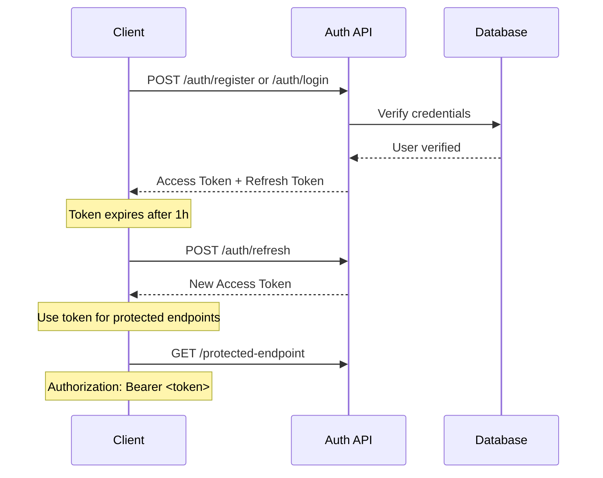

# 🌐 API Documentation - E-commerce Async Resilient System

> **Version**: 1.0.0  
> **Base URL**: `http://localhost:3000/api/v1`  
> **Swagger UI**: `http://localhost:3000/api/docs`  
> **Last Updated**: October 2025

## 📋 Table of Contents

- [Overview](#overview)
- [Authentication](#authentication)
- [Common Patterns](#common-patterns)
- [API Modules](#api-modules)
  - [Authentication](#module-authentication)
  - [Users](#module-users)
  - [Products](#module-products)
  - [Categories](#module-categories)
  - [Orders](#module-orders)
  - [Inventory](#module-inventory)
  - [Health](#module-health)
- [Error Handling](#error-handling)
- [Rate Limiting](#rate-limiting)
- [Testing with Swagger](#testing-with-swagger)

---

## 🎯 Overview

### API Characteristics

| Feature | Implementation | Status |
|---------|---------------|--------|
| **Architecture** | RESTful API | ✅ |
| **Protocol** | HTTP/HTTPS | ✅ |
| **Format** | JSON | ✅ |
| **Authentication** | JWT Bearer Token | ✅ |
| **Documentation** | OpenAPI 3.0 (Swagger) | ✅ |
| **Async Processing** | 202 Accepted pattern | ✅ |
| **Idempotency** | Idempotency keys | ✅ |
| **CORS** | Configurable | ✅ |
| **Versioning** | URI-based (v1) | ✅ |
| **Compression** | gzip enabled | ✅ |
| **Security** | Helmet.js | ✅ |

### Base Configuration

```yaml
Protocol: HTTP
Host: localhost
Port: 3000
Base Path: /api/v1
Content-Type: application/json
Accept: application/json
```

### Response Format

**Success Response**:
```json
{
  "id": "uuid",
  "data": { /* resource data */ },
  "createdAt": "2025-10-09T10:30:00.000Z",
  "updatedAt": "2025-10-09T10:30:00.000Z"
}
```

**Error Response**:
```json
{
  "statusCode": 400,
  "message": "Validation failed",
  "error": "Bad Request",
  "timestamp": "2025-10-09T10:30:00.000Z",
  "path": "/api/v1/orders"
}
```

---

## 🔐 Authentication

### JWT Bearer Token

All protected endpoints require a JWT token in the `Authorization` header:

```http
Authorization: Bearer <your-jwt-token>
```

### Token Lifecycle



### Token Structure

**Access Token**:
- **Type**: JWT
- **Expiration**: 1 hour
- **Payload**: `{ sub: userId, email, iat, exp }`
- **Usage**: All API requests

**Refresh Token**:
- **Type**: JWT
- **Expiration**: 7 days
- **Payload**: `{ sub: userId, tokenId, iat, exp }`
- **Usage**: Token refresh only

---

## 🎨 Common Patterns

### 1. Pagination

```http
GET /api/v1/products?page=1&limit=20
```

**Response**:
```json
{
  "data": [...],
  "meta": {
    "page": 1,
    "limit": 20,
    "total": 150,
    "totalPages": 8,
    "hasNextPage": true,
    "hasPreviousPage": false
  }
}
```

### 2. Filtering & Sorting

```http
GET /api/v1/products?status=active&brand=Apple&sortBy=price&sortOrder=ASC
```

### 3. Search

```http
GET /api/v1/products/search?q=laptop&limit=10
```

### 4. Async Operations (202 Accepted)

```http
POST /api/v1/orders
```

**Response**: `202 Accepted`
```json
{
  "id": "order-uuid",
  "status": "PENDING",
  "message": "Order is being processed asynchronously"
}
```

### 5. Idempotency

Orders use SHA-256 hash of request body as idempotency key:
- Same request → Same order
- Prevents duplicate orders
- Returns existing order if duplicate

---

## 📦 API Modules

<a name="module-authentication"></a>
## 🔒 Module: Authentication

**Base Path**: `/api/v1/auth`  
**Tag**: `Authentication`

### Endpoints

| Method | Endpoint | Auth | Description |
|--------|----------|------|-------------|
| POST | `/auth/register` | ❌ Public | Register new user |
| POST | `/auth/login` | ❌ Public | User login |
| POST | `/auth/refresh` | ❌ Public | Refresh access token |
| GET | `/auth/profile` | ✅ JWT | Get current user profile |
| GET | `/auth/me` | ✅ JWT | Get minimal user info |
| POST | `/auth/logout` | ✅ JWT | User logout |

---

### POST `/auth/register`

Create a new user account.

**Authentication**: None (Public)

**Request Body**:
```json
{
  "email": "john.doe@example.com",
  "password": "SecurePass123!",
  "firstName": "John",
  "lastName": "Doe",
  "phoneNumber": "+1234567890",
  "dateOfBirth": "1990-01-15"
}
```

**Validation Rules**:
- `email`: Valid email format, unique
- `password`: Min 8 chars, 1 uppercase, 1 lowercase, 1 number, 1 special char
- `firstName`: 2-50 chars
- `lastName`: 2-50 chars
- `phoneNumber`: Optional, valid phone format
- `dateOfBirth`: Optional, ISO date, must be 18+

**Success Response**: `201 Created`
```json
{
  "user": {
    "id": "550e8400-e29b-41d4-a716-446655440000",
    "email": "john.doe@example.com",
    "firstName": "John",
    "lastName": "Doe",
    "fullName": "John Doe",
    "isActive": true,
    "createdAt": "2025-10-09T10:30:00.000Z"
  },
  "accessToken": "eyJhbGciOiJIUzI1NiIsInR5cCI6IkpXVCJ9...",
  "refreshToken": "eyJhbGciOiJIUzI1NiIsInR5cCI6IkpXVCJ9...",
  "expiresIn": 3600
}
```

**Error Responses**:

`409 Conflict`:
```json
{
  "statusCode": 409,
  "message": "User with this email already exists",
  "error": "Conflict"
}
```

`400 Bad Request`:
```json
{
  "statusCode": 400,
  "message": [
    "password must be at least 8 characters long",
    "email must be a valid email"
  ],
  "error": "Bad Request"
}
```

**cURL Example**:
```bash
curl -X POST http://localhost:3000/api/v1/auth/register \
  -H "Content-Type: application/json" \
  -d '{
    "email": "john.doe@example.com",
    "password": "SecurePass123!",
    "firstName": "John",
    "lastName": "Doe"
  }'
```

---

### POST `/auth/login`

Authenticate user and receive tokens.

**Authentication**: None (Public)

**Request Body**:
```json
{
  "email": "john.doe@example.com",
  "password": "SecurePass123!"
}
```

**Success Response**: `200 OK`
```json
{
  "user": {
    "id": "550e8400-e29b-41d4-a716-446655440000",
    "email": "john.doe@example.com",
    "firstName": "John",
    "lastName": "Doe",
    "fullName": "John Doe",
    "isActive": true,
    "lastLoginAt": "2025-10-09T10:30:00.000Z"
  },
  "accessToken": "eyJhbGciOiJIUzI1NiIsInR5cCI6IkpXVCJ9...",
  "refreshToken": "eyJhbGciOiJIUzI1NiIsInR5cCI6IkpXVCJ9...",
  "expiresIn": 3600
}
```

**Error Responses**:

`401 Unauthorized`:
```json
{
  "statusCode": 401,
  "message": "Invalid credentials",
  "error": "Unauthorized"
}
```

**cURL Example**:
```bash
curl -X POST http://localhost:3000/api/v1/auth/login \
  -H "Content-Type: application/json" \
  -d '{
    "email": "john.doe@example.com",
    "password": "SecurePass123!"
  }'
```

---

### POST `/auth/refresh`

Generate new access token using refresh token.

**Authentication**: None (Public, requires refresh token)

**Request Body**:
```json
{
  "refreshToken": "eyJhbGciOiJIUzI1NiIsInR5cCI6IkpXVCJ9..."
}
```

**Success Response**: `200 OK`
```json
{
  "accessToken": "eyJhbGciOiJIUzI1NiIsInR5cCI6IkpXVCJ9...",
  "refreshToken": "eyJhbGciOiJIUzI1NiIsInR5cCI6IkpXVCJ9...",
  "expiresIn": 3600
}
```

**Error Response**: `401 Unauthorized`
```json
{
  "statusCode": 401,
  "message": "Invalid or expired refresh token",
  "error": "Unauthorized"
}
```

---

### GET `/auth/profile`

Get detailed profile of authenticated user.

**Authentication**: JWT Bearer Token

**Headers**:
```http
Authorization: Bearer <access-token>
```

**Success Response**: `200 OK`
```json
{
  "id": "550e8400-e29b-41d4-a716-446655440000",
  "email": "john.doe@example.com",
  "firstName": "John",
  "lastName": "Doe",
  "fullName": "John Doe",
  "phoneNumber": "+1234567890",
  "dateOfBirth": "1990-01-15",
  "language": "en",
  "timezone": "UTC",
  "isActive": true,
  "emailVerifiedAt": "2025-10-09T08:00:00.000Z",
  "lastLoginAt": "2025-10-09T10:30:00.000Z",
  "createdAt": "2025-10-01T10:00:00.000Z",
  "updatedAt": "2025-10-09T10:30:00.000Z"
}
```

**Error Response**: `401 Unauthorized`
```json
{
  "statusCode": 401,
  "message": "Unauthorized",
  "error": "Unauthorized"
}
```

---

<a name="module-users"></a>
## 👥 Module: Users

**Base Path**: `/api/v1/users`  
**Tag**: `Users`  
**Auth Required**: ✅ All endpoints

### Endpoints

| Method | Endpoint | Description |
|--------|----------|-------------|
| GET | `/users` | Get paginated user list |
| GET | `/users/profile` | Get current user profile |
| GET | `/users/:id` | Get user by ID |
| POST | `/users` | Create user (admin) |
| PATCH | `/users/:id` | Update user |
| DELETE | `/users/:id` | Soft delete user |
| PATCH | `/users/:id/activate` | Activate user |

---

### GET `/users`

Get paginated list of users with filtering and sorting.

**Authentication**: JWT Bearer Token

**Query Parameters**:

| Parameter | Type | Required | Default | Description |
|-----------|------|----------|---------|-------------|
| `page` | number | No | 1 | Page number (1-based) |
| `limit` | number | No | 20 | Items per page (max 100) |
| `search` | string | No | - | Search in name/email |
| `status` | enum | No | all | `active`, `inactive`, `all` |
| `sortBy` | enum | No | createdAt | Field to sort by |
| `sortOrder` | enum | No | DESC | `ASC` or `DESC` |

**Example Request**:
```http
GET /api/v1/users?page=1&limit=20&status=active&sortBy=firstName&sortOrder=ASC
Authorization: Bearer <token>
```

**Success Response**: `200 OK`
```json
{
  "data": [
    {
      "id": "550e8400-e29b-41d4-a716-446655440000",
      "email": "john.doe@example.com",
      "firstName": "John",
      "lastName": "Doe",
      "fullName": "John Doe",
      "isActive": true,
      "createdAt": "2025-10-01T10:00:00.000Z",
      "updatedAt": "2025-10-09T10:30:00.000Z"
    }
  ],
  "meta": {
    "page": 1,
    "limit": 20,
    "total": 150,
    "totalPages": 8,
    "hasNextPage": true,
    "hasPreviousPage": false
  }
}
```

---

### GET `/users/:id`

Get specific user by UUID.

**Authentication**: JWT Bearer Token

**Path Parameters**:
- `id` (UUID): User ID

**Success Response**: `200 OK`
```json
{
  "id": "550e8400-e29b-41d4-a716-446655440000",
  "email": "john.doe@example.com",
  "firstName": "John",
  "lastName": "Doe",
  "fullName": "John Doe",
  "phoneNumber": "+1234567890",
  "isActive": true,
  "createdAt": "2025-10-01T10:00:00.000Z",
  "updatedAt": "2025-10-09T10:30:00.000Z"
}
```

**Error Response**: `404 Not Found`
```json
{
  "statusCode": 404,
  "message": "User not found",
  "error": "Not Found"
}
```

---

<a name="module-products"></a>
## 🛍️ Module: Products

**Base Path**: `/api/v1/products`  
**Tag**: `Products`

### Endpoints

| Method | Endpoint | Auth | Description |
|--------|----------|------|-------------|
| GET | `/products` | ❌ | Get paginated products |
| GET | `/products/search` | ❌ | Full-text search |
| GET | `/products/:id` | ❌ | Get product by ID |
| POST | `/products` | ✅ JWT | Create product (admin) |
| PATCH | `/products/:id` | ✅ JWT | Update product |
| DELETE | `/products/:id` | ✅ JWT | Soft delete product |
| PATCH | `/products/:id/activate` | ✅ JWT | Activate product |
| PATCH | `/products/:id/deactivate` | ✅ JWT | Deactivate product |

---

### GET `/products`

Get paginated list of products with advanced filtering.

**Authentication**: None (Public)

**Query Parameters**:

| Parameter | Type | Required | Default | Description |
|-----------|------|----------|---------|-------------|
| `page` | number | No | 1 | Page number |
| `limit` | number | No | 20 | Items per page |
| `search` | string | No | - | Search term |
| `brand` | string | No | - | Filter by brand |
| `status` | enum | No | active | `active`, `inactive`, `all` |
| `minPrice` | number | No | - | Min price filter |
| `maxPrice` | number | No | - | Max price filter |
| `onSale` | boolean | No | - | Products on sale only |
| `tags` | string | No | - | Comma-separated tags |
| `sortBy` | enum | No | createdAt | Sort field |
| `sortOrder` | enum | No | DESC | `ASC` or `DESC` |

**Example Request**:
```http
GET /api/v1/products?page=1&limit=20&brand=Apple&minPrice=500&maxPrice=2000&sortBy=price&sortOrder=ASC
```

**Success Response**: `200 OK`
```json
{
  "data": [
    {
      "id": "660e8400-e29b-41d4-a716-446655440000",
      "name": "MacBook Pro 16-inch",
      "description": "Powerful laptop for professionals",
      "price": 1999.99,
      "compareAtPrice": 2499.99,
      "sku": "MBP-16-2023",
      "brand": "Apple",
      "isActive": true,
      "attributes": {
        "processor": "M2 Pro",
        "ram": "16GB",
        "storage": "512GB SSD"
      },
      "images": [
        "https://cdn.example.com/mbp-1.jpg",
        "https://cdn.example.com/mbp-2.jpg"
      ],
      "tags": ["laptop", "professional", "apple"],
      "weight": 2.15,
      "inventory": {
        "currentStock": 45,
        "availableStock": 42,
        "reservedStock": 3
      },
      "createdAt": "2025-09-15T10:00:00.000Z",
      "updatedAt": "2025-10-09T10:30:00.000Z"
    }
  ],
  "meta": {
    "page": 1,
    "limit": 20,
    "total": 85,
    "totalPages": 5,
    "hasNextPage": true,
    "hasPreviousPage": false
  }
}
```

---

### GET `/products/search`

Full-text search across product name, description, and tags.

**Authentication**: None (Public)

**Query Parameters**:

| Parameter | Type | Required | Default | Description |
|-----------|------|----------|---------|-------------|
| `q` | string | ✅ Yes | - | Search term |
| `limit` | number | No | 10 | Max results |

**Example Request**:
```http
GET /api/v1/products/search?q=laptop gaming&limit=10
```

**Success Response**: `200 OK`
```json
[
  {
    "id": "660e8400-e29b-41d4-a716-446655440000",
    "name": "ASUS ROG Gaming Laptop",
    "description": "High-performance gaming laptop with RTX 4080",
    "price": 2499.99,
    "sku": "ASUS-ROG-2023",
    "brand": "ASUS",
    "relevanceScore": 0.95
  }
]
```

---

### POST `/products`

Create a new product (Admin only).

**Authentication**: JWT Bearer Token

**Request Body**:
```json
{
  "name": "Dell XPS 15",
  "description": "Premium laptop for creative professionals",
  "price": 1799.99,
  "compareAtPrice": 1999.99,
  "sku": "DELL-XPS15-2023",
  "brand": "Dell",
  "weight": 1.83,
  "attributes": {
    "processor": "Intel i7-13700H",
    "ram": "32GB",
    "storage": "1TB SSD",
    "display": "15.6\" 4K OLED"
  },
  "images": [
    "https://cdn.example.com/dell-xps-1.jpg",
    "https://cdn.example.com/dell-xps-2.jpg"
  ],
  "tags": ["laptop", "creative", "professional"],
  "costPrice": 1400.00,
  "trackInventory": true,
  "minimumStock": 10
}
```

**Success Response**: `201 Created`
```json
{
  "id": "770e8400-e29b-41d4-a716-446655440000",
  "name": "Dell XPS 15",
  "description": "Premium laptop for creative professionals",
  "price": 1799.99,
  "sku": "DELL-XPS15-2023",
  "isActive": true,
  "createdAt": "2025-10-09T10:30:00.000Z",
  "updatedAt": "2025-10-09T10:30:00.000Z"
}
```

**Error Responses**:

`409 Conflict`:
```json
{
  "statusCode": 409,
  "message": "Product with SKU 'DELL-XPS15-2023' already exists",
  "error": "Conflict"
}
```

---

<a name="module-categories"></a>
## 📂 Module: Categories

**Base Path**: `/api/v1/categories`  
**Tag**: `Categories`

### Endpoints

| Method | Endpoint | Auth | Description |
|--------|----------|------|-------------|
| GET | `/categories` | ❌ | Get paginated categories |
| GET | `/categories/tree` | ❌ | Get category tree |
| GET | `/categories/slug/:slug` | ❌ | Get by slug |
| GET | `/categories/:id` | ❌ | Get by ID |
| GET | `/categories/:id/descendants` | ❌ | Get descendants |
| GET | `/categories/:id/path` | ❌ | Get category path |
| POST | `/categories` | ✅ JWT | Create category |
| PUT | `/categories/:id` | ✅ JWT | Update category |
| PATCH | `/categories/:id/activate` | ✅ JWT | Activate |
| PATCH | `/categories/:id/deactivate` | ✅ JWT | Deactivate |
| DELETE | `/categories/:id` | ✅ JWT | Delete category |

---

### GET `/categories/tree`

Get complete category hierarchy as tree structure.

**Authentication**: None (Public)

**Query Parameters**:
- `includeInactive` (boolean): Include inactive categories (default: false)

**Example Request**:
```http
GET /api/v1/categories/tree?includeInactive=false
```

**Success Response**: `200 OK`
```json
[
  {
    "id": "880e8400-e29b-41d4-a716-446655440000",
    "name": "Electronics",
    "slug": "electronics",
    "description": "Electronic products and gadgets",
    "sortOrder": 10,
    "isActive": true,
    "children": [
      {
        "id": "881e8400-e29b-41d4-a716-446655440000",
        "name": "Computers",
        "slug": "computers",
        "sortOrder": 5,
        "isActive": true,
        "parentId": "880e8400-e29b-41d4-a716-446655440000",
        "children": [
          {
            "id": "882e8400-e29b-41d4-a716-446655440000",
            "name": "Laptops",
            "slug": "laptops",
            "sortOrder": 1,
            "isActive": true,
            "parentId": "881e8400-e29b-41d4-a716-446655440000",
            "children": []
          }
        ]
      }
    ]
  }
]
```

---

### POST `/categories`

Create a new category (Admin only).

**Authentication**: JWT Bearer Token

**Request Body**:
```json
{
  "name": "Gaming Accessories",
  "slug": "gaming-accessories",
  "description": "Accessories for gaming enthusiasts",
  "parentId": "880e8400-e29b-41d4-a716-446655440000",
  "sortOrder": 15,
  "metadata": {
    "color": "#FF5722",
    "icon": "gamepad-icon"
  },
  "imageUrl": "https://cdn.example.com/gaming-accessories.jpg"
}
```

**Success Response**: `201 Created`
```json
{
  "id": "990e8400-e29b-41d4-a716-446655440000",
  "name": "Gaming Accessories",
  "slug": "gaming-accessories",
  "description": "Accessories for gaming enthusiasts",
  "parentId": "880e8400-e29b-41d4-a716-446655440000",
  "sortOrder": 15,
  "isActive": true,
  "createdAt": "2025-10-09T10:30:00.000Z",
  "updatedAt": "2025-10-09T10:30:00.000Z"
}
```

---

<a name="module-orders"></a>
## 🛒 Module: Orders

**Base Path**: `/api/v1/orders`  
**Tag**: `Orders`  
**Auth Required**: ✅ All endpoints

### Endpoints

| Method | Endpoint | Description |
|--------|----------|-------------|
| POST | `/orders` | Create new order (202 Accepted) |
| GET | `/orders` | Get user's orders |
| GET | `/orders/:id` | Get order by ID |
| GET | `/orders/:id/status` | Get order status only |

---

### POST `/orders`

Create a new order (Async processing with 202 Accepted pattern).

**Authentication**: JWT Bearer Token

**Key Features**:
- ✅ **Async Processing**: Returns immediately with 202 Accepted
- ✅ **Idempotent**: Same request won't create duplicate orders
- ✅ **Saga Orchestration**: Multi-step processing with compensation
- ✅ **Event Sourcing**: Publishes OrderCreatedEvent to queue

**Request Body**:
```json
{
  "items": [
    {
      "productId": "660e8400-e29b-41d4-a716-446655440000",
      "quantity": 2
    },
    {
      "productId": "661e8400-e29b-41d4-a716-446655440000",
      "quantity": 1
    }
  ],
  "shippingAddress": {
    "street": "123 Main St",
    "city": "San Francisco",
    "state": "CA",
    "zipCode": "94102",
    "country": "USA"
  },
  "billingAddress": {
    "street": "123 Main St",
    "city": "San Francisco",
    "state": "CA",
    "zipCode": "94102",
    "country": "USA"
  },
  "discountCode": "SUMMER2025"
}
```

**Success Response**: `202 Accepted`
```json
{
  "id": "aa0e8400-e29b-41d4-a716-446655440000",
  "userId": "550e8400-e29b-41d4-a716-446655440000",
  "status": "PENDING",
  "totalAmount": 4799.97,
  "subtotalAmount": 4499.97,
  "taxAmount": 359.98,
  "shippingAmount": 0.00,
  "discountAmount": 59.99,
  "currency": "USD",
  "idempotencyKey": "d5e8a7f4b2c1a9e6d3f4b5c6a7e8f9d0",
  "items": [
    {
      "id": "ab0e8400-e29b-41d4-a716-446655440000",
      "productId": "660e8400-e29b-41d4-a716-446655440000",
      "productName": "MacBook Pro 16-inch",
      "sku": "MBP-16-2023",
      "quantity": 2,
      "unitPrice": 1999.99,
      "totalPrice": 3999.98
    },
    {
      "id": "ac0e8400-e29b-41d4-a716-446655440000",
      "productId": "661e8400-e29b-41d4-a716-446655440000",
      "productName": "Magic Mouse",
      "sku": "MM-2023",
      "quantity": 1,
      "unitPrice": 79.99,
      "totalPrice": 79.99
    }
  ],
  "shippingAddress": {
    "street": "123 Main St",
    "city": "San Francisco",
    "state": "CA",
    "zipCode": "94102",
    "country": "USA"
  },
  "createdAt": "2025-10-09T10:30:00.000Z",
  "updatedAt": "2025-10-09T10:30:00.000Z"
}
```

**Processing Flow**:
```
1. Order created with PENDING status
2. OrderCreatedEvent published to outbox
3. Saga orchestration starts:
   - Verify stock availability
   - Reserve inventory
   - Process payment
   - Confirm reservation
   - Send confirmation email
   - Complete order (CONFIRMED status)
4. If any step fails → Automatic compensation (rollback)
```

**Order Status Lifecycle**:
```
PENDING → PROCESSING → PAYMENT_PENDING → CONFIRMED → SHIPPED → DELIVERED
                    ↓
            PAYMENT_FAILED / CANCELLED
```

**Error Responses**:

`400 Bad Request`:
```json
{
  "statusCode": 400,
  "message": [
    "items must contain at least 1 item",
    "productId must be a valid UUID"
  ],
  "error": "Bad Request"
}
```

`404 Not Found`:
```json
{
  "statusCode": 404,
  "message": "Product with ID '...' not found",
  "error": "Not Found"
}
```

---

### GET `/orders`

Get all orders for authenticated user.

**Authentication**: JWT Bearer Token

**Success Response**: `200 OK`
```json
[
  {
    "id": "aa0e8400-e29b-41d4-a716-446655440000",
    "userId": "550e8400-e29b-41d4-a716-446655440000",
    "status": "CONFIRMED",
    "totalAmount": 4799.97,
    "items": [
      {
        "productName": "MacBook Pro 16-inch",
        "quantity": 2,
        "unitPrice": 1999.99
      }
    ],
    "createdAt": "2025-10-09T10:30:00.000Z",
    "completedAt": "2025-10-09T10:32:15.000Z"
  }
]
```

---

### GET `/orders/:id/status`

Get order status only (lightweight polling endpoint).

**Authentication**: JWT Bearer Token

**Path Parameters**:
- `id` (UUID): Order ID

**Success Response**: `200 OK`
```json
{
  "orderId": "aa0e8400-e29b-41d4-a716-446655440000",
  "status": "PROCESSING",
  "updatedAt": "2025-10-09T10:31:30.000Z"
}
```

**Use Case**: Poll this endpoint every 2-5 seconds to check order status after creation.

---

<a name="module-inventory"></a>
## 📦 Module: Inventory

**Base Path**: `/api/v1/inventory`  
**Tag**: `Inventory`

### Endpoints

| Method | Endpoint | Auth | Description |
|--------|----------|------|-------------|
| POST | `/inventory/check-availability` | ❌ | Check stock availability |
| POST | `/inventory/reserve` | ✅ JWT | Reserve stock |
| PUT | `/inventory/release-reservation` | ✅ JWT | Release reservation |
| PUT | `/inventory/fulfill-reservation` | ✅ JWT | Fulfill reservation |
| POST | `/inventory/add-stock` | ✅ JWT | Add stock (restock) |
| POST | `/inventory/remove-stock` | ✅ JWT | Remove stock |
| GET | `/inventory/product/:productId` | ❌ | Get inventory by product |
| GET | `/inventory` | ❌ | Get inventory list |
| GET | `/inventory/low-stock` | ❌ | Get low stock items |
| GET | `/inventory/out-of-stock` | ❌ | Get out of stock |
| GET | `/inventory/stats` | ❌ | Get inventory statistics |

---

### POST `/inventory/check-availability`

Check if sufficient stock is available.

**Authentication**: None (Public)

**Request Body**:
```json
{
  "productId": "660e8400-e29b-41d4-a716-446655440000",
  "quantity": 5,
  "location": "MAIN_WAREHOUSE"
}
```

**Success Response**: `200 OK`
```json
{
  "productId": "660e8400-e29b-41d4-a716-446655440000",
  "sku": "MBP-16-2023",
  "location": "MAIN_WAREHOUSE",
  "currentStock": 45,
  "reservedStock": 3,
  "availableStock": 42,
  "minimumStock": 10,
  "isAvailable": true,
  "requestedQuantity": 5,
  "canFulfill": true
}
```

---

### POST `/inventory/reserve`

Reserve stock for a specific time period (with TTL auto-release).

**Authentication**: JWT Bearer Token

**Request Body**:
```json
{
  "productId": "660e8400-e29b-41d4-a716-446655440000",
  "quantity": 2,
  "location": "MAIN_WAREHOUSE",
  "reservationTtlMinutes": 15,
  "orderId": "aa0e8400-e29b-41d4-a716-446655440000"
}
```

**Success Response**: `201 Created`
```json
{
  "reservationId": "bb0e8400-e29b-41d4-a716-446655440000",
  "productId": "660e8400-e29b-41d4-a716-446655440000",
  "quantity": 2,
  "location": "MAIN_WAREHOUSE",
  "expiresAt": "2025-10-09T10:45:00.000Z",
  "status": "RESERVED",
  "createdAt": "2025-10-09T10:30:00.000Z"
}
```

**Error Response**: `400 Bad Request`
```json
{
  "statusCode": 400,
  "message": "Insufficient stock. Available: 1, Requested: 2",
  "error": "Bad Request"
}
```

---

### GET `/inventory/low-stock`

Get items below reorder point or minimum stock levels.

**Authentication**: None (Public)

**Query Parameters**:
- `page` (number): Page number (default: 1)
- `limit` (number): Items per page (default: 20)
- `location` (string): Filter by location

**Success Response**: `200 OK`
```json
{
  "data": [
    {
      "id": "cc0e8400-e29b-41d4-a716-446655440000",
      "productId": "670e8400-e29b-41d4-a716-446655440000",
      "productName": "USB-C Cable",
      "sku": "USBC-2023",
      "currentStock": 8,
      "minimumStock": 20,
      "reorderPoint": 15,
      "location": "MAIN_WAREHOUSE",
      "status": "LOW_STOCK"
    }
  ],
  "meta": {
    "page": 1,
    "limit": 20,
    "total": 12,
    "totalPages": 1
  }
}
```

---

### GET `/inventory/stats`

Get overview statistics about inventory.

**Authentication**: None (Public)

**Query Parameters**:
- `location` (string): Filter by location (optional)

**Success Response**: `200 OK`
```json
{
  "totalItems": 450,
  "totalValue": 1250000.00,
  "lowStockCount": 12,
  "outOfStockCount": 5,
  "statusBreakdown": {
    "IN_STOCK": 433,
    "LOW_STOCK": 12,
    "OUT_OF_STOCK": 5
  }
}
```

---

<a name="module-health"></a>
## 🏥 Module: Health

**Base Path**: `/api/v1/health`  
**Tag**: `Health`  
**Auth Required**: ❌ Public

### Endpoints

| Method | Endpoint | Description |
|--------|----------|-------------|
| GET | `/health` | Overall health status |
| GET | `/health/ready` | Readiness check |
| GET | `/health/live` | Liveness check |
| GET | `/health/detailed` | Detailed component health |

---

### GET `/health`

Get overall application health status.

**Authentication**: None (Public)

**Success Response**: `200 OK`
```json
{
  "status": "ok",
  "info": {
    "database": {
      "status": "up"
    },
    "memory_heap": {
      "status": "up"
    },
    "memory_rss": {
      "status": "up"
    }
  },
  "error": {},
  "details": {
    "database": {
      "status": "up"
    },
    "memory_heap": {
      "status": "up",
      "allocated": 125.5,
      "used": 95.2
    }
  }
}
```

**Error Response**: `503 Service Unavailable`
```json
{
  "status": "error",
  "info": {},
  "error": {
    "database": {
      "status": "down",
      "message": "Connection refused"
    }
  },
  "details": {
    "database": {
      "status": "down",
      "message": "Connection refused"
    }
  }
}
```

---

### GET `/health/detailed`

Get comprehensive health status including all components.

**Authentication**: None (Public)

**Success Response**: `200 OK`
```json
{
  "status": "ok",
  "info": {
    "database": {
      "status": "up",
      "responseTime": "5ms"
    },
    "redis": {
      "status": "up",
      "responseTime": "2ms"
    },
    "queues": {
      "status": "up",
      "orderProcessing": {
        "active": 2,
        "waiting": 15,
        "completed": 1250,
        "failed": 3
      },
      "paymentProcessing": {
        "active": 1,
        "waiting": 8,
        "completed": 987,
        "failed": 1
      }
    },
    "memory": {
      "status": "up",
      "heapUsed": "95.2 MB",
      "heapTotal": "125.5 MB",
      "rss": "180.3 MB"
    },
    "disk": {
      "status": "up",
      "usage": "45.2%",
      "available": "120 GB"
    }
  }
}
```

---

## 🚨 Error Handling

### Standard Error Response

All errors follow this structure:

```json
{
  "statusCode": 400,
  "message": "Validation failed",
  "error": "Bad Request",
  "timestamp": "2025-10-09T10:30:00.000Z",
  "path": "/api/v1/orders",
  "details": {
    "field": "items",
    "constraint": "minLength",
    "message": "items must contain at least 1 item"
  }
}
```

### HTTP Status Codes

| Code | Name | Description |
|------|------|-------------|
| **200** | OK | Request successful |
| **201** | Created | Resource created |
| **202** | Accepted | Async processing started |
| **204** | No Content | Deletion successful |
| **400** | Bad Request | Invalid input |
| **401** | Unauthorized | Authentication required |
| **403** | Forbidden | Insufficient permissions |
| **404** | Not Found | Resource not found |
| **409** | Conflict | Duplicate resource |
| **422** | Unprocessable Entity | Business logic error |
| **429** | Too Many Requests | Rate limit exceeded |
| **500** | Internal Server Error | Server error |
| **503** | Service Unavailable | Service down |

### Error Types

**Validation Error**:
```json
{
  "statusCode": 400,
  "message": [
    "email must be a valid email",
    "password must be at least 8 characters"
  ],
  "error": "Bad Request"
}
```

**Authentication Error**:
```json
{
  "statusCode": 401,
  "message": "Invalid or expired token",
  "error": "Unauthorized"
}
```

**Business Logic Error**:
```json
{
  "statusCode": 422,
  "message": "Insufficient stock for product 'MacBook Pro'. Available: 1, Requested: 5",
  "error": "Unprocessable Entity"
}
```

---

## ⏱️ Rate Limiting

### Configuration

```yaml
Window: 15 minutes
Max Requests: 100 per IP
Endpoints: All public endpoints
Headers:
  - X-RateLimit-Limit: 100
  - X-RateLimit-Remaining: 95
  - X-RateLimit-Reset: 1696854000
```

**Response when limit exceeded**: `429 Too Many Requests`
```json
{
  "statusCode": 429,
  "message": "Too many requests. Please try again in 5 minutes.",
  "error": "Too Many Requests"
}
```

---

## 🧪 Testing with Swagger

### Accessing Swagger UI

```
URL: http://localhost:3000/api/docs
```

### Features

✅ Interactive API testing  
✅ Request/response examples  
✅ JWT authentication support  
✅ Try it out functionality  
✅ Schema validation  
✅ Response time display

### How to Use

1. **Navigate** to `http://localhost:3000/api/docs`
2. **Authenticate**:
   - Click "Authorize" button
   - Login via `/auth/login` endpoint
   - Copy `accessToken` from response
   - Paste token in "Authorize" dialog
   - Click "Authorize"
3. **Test Endpoints**:
   - Select endpoint
   - Click "Try it out"
   - Modify request body
   - Click "Execute"
   - View response

### Example: Test Order Creation

```bash
# 1. Register user
POST /api/v1/auth/register
{
  "email": "test@example.com",
  "password": "Test123!",
  "firstName": "Test",
  "lastName": "User"
}

# 2. Copy accessToken from response

# 3. Authorize with token in Swagger UI

# 4. Create order
POST /api/v1/orders
{
  "items": [
    {
      "productId": "660e8400-e29b-41d4-a716-446655440000",
      "quantity": 1
    }
  ]
}

# 5. Poll order status
GET /api/v1/orders/{orderId}/status
```

---

## 📚 Additional Resources

- **Architecture**: [docs/ARCHITECTURE.md](ARCHITECTURE.md)
- **Database Design**: [docs/DATABASE_DESIGN.md](DATABASE_DESIGN.md)
- **Project Setup**: [docs/PROJECT_SETUP.md](PROJECT_SETUP.md)
- **ADRs**: [docs/adr/](adr/README.md)
- **Postman Collection**: `docs/postman/ecommerce-async.postman_collection.json` (TODO)

---

## 🔗 Useful Links

| Resource | URL |
|----------|-----|
| **Swagger UI** | `http://localhost:3000/api/docs` |
| **Health Check** | `http://localhost:3000/health` |
| **Bull Board** | `http://localhost:3000/api/v1/admin/queues` |
| **Metrics** | `http://localhost:3000/metrics` |
| **PgAdmin** | `http://localhost:8080` |
| **Redis Commander** | `http://localhost:8081` |

---

> 💡 **Tip**: Use Swagger UI for interactive testing and documentation. All endpoints are documented with request/response examples and validation rules.

**Last Updated**: October 2025  
**API Version**: 1.0.0  
**Maintained by**: Development Team
