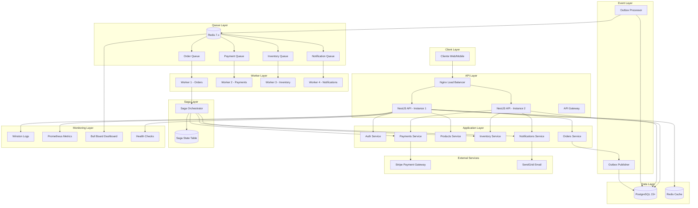
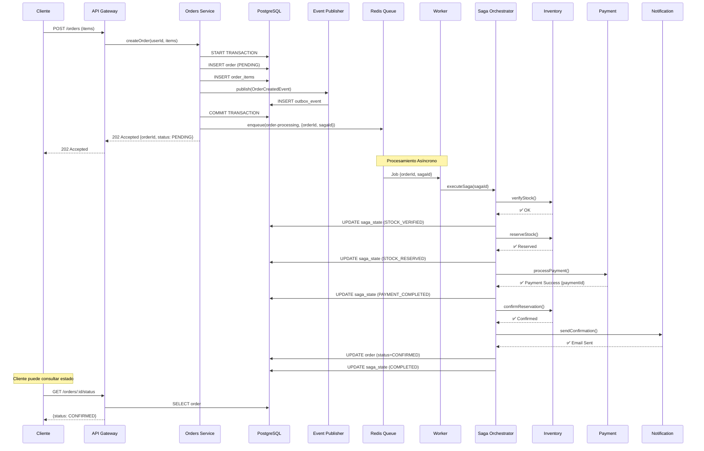
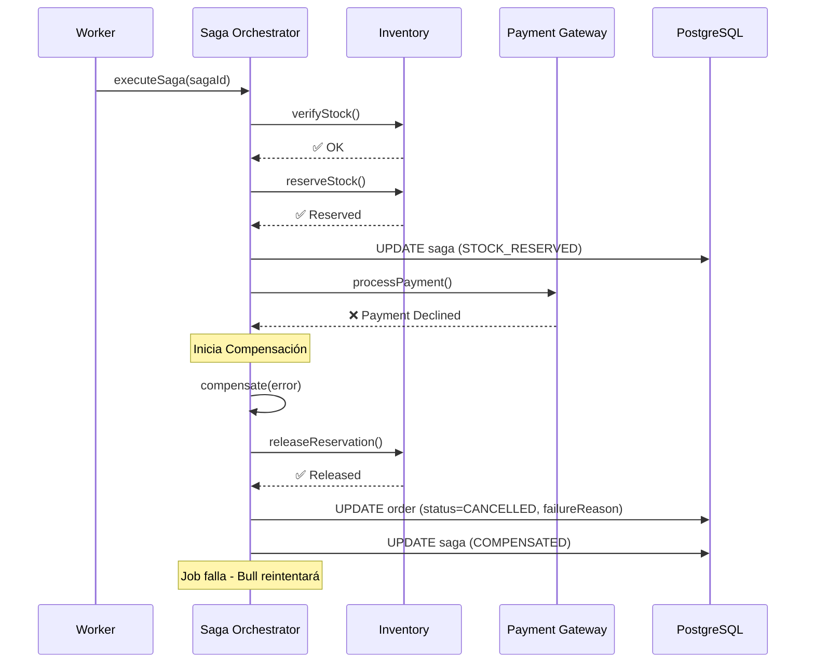

# 🏗️ Architecture Overview - E-commerce Async Resilient System

> **Versión**: 1.0.0  
> **Última actualización**: Octubre 2025  
> **Estado**: ✅ En Producción

## 📋 Tabla de Contenidos

- [Introducción](#introducción)
- [Arquitectura de Alto Nivel](#arquitectura-de-alto-nivel)
- [Componentes Principales](#componentes-principales)
- [Flujos de Datos](#flujos-de-datos)
- [Patrones de Diseño](#patrones-de-diseño)
- [Tecnologías](#tecnologías)
- [Escalabilidad](#escalabilidad)
- [Resiliencia](#resiliencia)
- [Observabilidad](#observabilidad)

---

## 🎯 Introducción

Este sistema implementa una arquitectura **asíncrona, resiliente y escalable** para procesamiento de órdenes de e-commerce. El diseño prioriza:

- ⚡ **Baja Latencia**: Respuestas HTTP <100ms
- 🔄 **Procesamiento Asíncrono**: Jobs en background
- 🛡️ **Resiliencia**: Auto-recuperación de fallos
- 📊 **Observabilidad**: Monitoreo en tiempo real
- 🚀 **Escalabilidad**: Horizontal y vertical

### Problema que Resuelve

**Antes (Síncrono)** ❌:

```
Cliente → [API procesa TODO síncronamente 3-5 segundos] → Respuesta
           ↓
       Bloqueo, timeouts, poor UX
```

**Ahora (Asíncrono)** ✅:

```
Cliente → [API acepta orden <100ms] → Respuesta inmediata
           ↓
       [Workers procesan en background]
           ↓
       Cliente consulta estado o recibe webhook
```

---

## 🏛️ Arquitectura de Alto Nivel

### Diagrama de Arquitectura



### Capas de la Arquitectura

| Capa                  | Responsabilidad                           | Tecnología                 |
| --------------------- | ----------------------------------------- | -------------------------- |
| **Client Layer**      | Aplicaciones cliente (Web, Mobile)        | React, React Native        |
| **API Layer**         | Endpoints HTTP, validación, autenticación | NestJS, Express            |
| **Application Layer** | Lógica de negocio, servicios              | TypeScript, NestJS Modules |
| **Event Layer**       | Publicación de eventos, Outbox Pattern    | TypeORM, PostgreSQL        |
| **Queue Layer**       | Colas de mensajes, job management         | Redis, Bull                |
| **Worker Layer**      | Procesamiento asíncrono background        | Bull Processors            |
| **Saga Layer**        | Orquestación de procesos, compensación    | Custom Saga Service        |
| **Data Layer**        | Persistencia de datos                     | PostgreSQL, Redis          |
| **Monitoring Layer**  | Observabilidad, métricas, logs            | Winston, Prometheus        |

---

## 🔧 Componentes Principales

### 1. **API Gateway (NestJS)**

**Responsabilidad**: Punto de entrada HTTP para todos los clientes

```typescript
// Endpoints principales
POST   /api/v1/orders              // Crear orden (202 Accepted)
GET    /api/v1/orders              // Listar órdenes del usuario
GET    /api/v1/orders/:id          // Detalles de orden
GET    /api/v1/orders/:id/status   // Estado de procesamiento
```

**Características**:

- ⚡ Respuestas <100ms (non-blocking)
- 🔒 JWT Authentication
- ✅ Request validation (class-validator)
- 📊 Request logging y correlation IDs
- 🛡️ Rate limiting y throttling

### 2. **Orders Service**

**Responsabilidad**: Gestión del ciclo de vida de órdenes

```typescript
// Flujo de creación de orden
1. Validar productos existen y están activos
2. Calcular totales automáticamente
3. Crear orden con estado PENDING (transacción DB)
4. Publicar OrderCreatedEvent (Outbox Pattern)
5. Encolar job de procesamiento (Bull Queue)
6. Responder 202 Accepted inmediatamente
```

**Características**:

- 🔑 Idempotencia key (evita duplicados)
- 💾 Transacciones atómicas (TypeORM)
- 📤 Event publishing transaccional
- 🔄 Integración con Saga Orchestrator

### 3. **Event Publisher (Outbox Pattern)**

**Responsabilidad**: Publicación confiable de eventos

```typescript
// Garantiza at-least-once delivery
await queryRunner.transaction(async (manager) => {
  // 1. Guardar orden
  const order = await manager.save(Order, orderData);

  // 2. Guardar evento en outbox (MISMA transacción)
  await manager.save(OutboxEvent, event);

  // 3. Commit atómico - O se guarda TODO o NADA
});

// Background processor publica a colas cada 5 segundos
@Cron('*/5 * * * * *')
async processOutbox() {
  // Lee eventos no procesados
  // Publica a Bull Queue
  // Marca como procesado
}
```

**Características**:

- ✅ Consistencia transaccional
- 🔄 Retry automático de publicación
- 📊 Auditoría completa de eventos
- 🛡️ Dead letter queue para fallos

### 4. **Queue System (Redis + Bull)**

**Responsabilidad**: Gestión de colas de mensajes y jobs

**4 Colas Especializadas**:

| Cola                   | Propósito                | Throughput   | Workers |
| ---------------------- | ------------------------ | ------------ | ------- |
| `order-processing`     | Procesamiento de órdenes | 50 jobs/seg  | 2-4     |
| `payment-processing`   | Transacciones de pago    | 20 jobs/seg  | 1-2     |
| `inventory-management` | Gestión de stock         | 30 jobs/seg  | 2-3     |
| `notification-sending` | Emails/SMS               | 100 jobs/seg | 3-5     |

**Características**:

- ⚡ Performance: 1000+ jobs/seg
- 🔄 Retry con exponential backoff
- 📊 Priority queues
- ⏰ Scheduled/delayed jobs
- 📈 Progress tracking
- 🎛️ Bull Board dashboard

### 5. **Saga Orchestrator**

**Responsabilidad**: Orquestación de procesos largos con compensación

```typescript
// Flujo del Saga
Step 1: Verify Stock        → Si falla: Terminar
Step 2: Reserve Inventory    → Compensate: Release Reservation
Step 3: Process Payment      → Compensate: Refund Payment
Step 4: Confirm Reservation  → Compensate: Restore Inventory
Step 5: Send Confirmation    → Compensate: Send Cancellation
Step 6: Complete Order       → Compensate: Mark as Cancelled
```

**Características**:

- 📝 Estado persistido en cada step
- 🔙 Compensación automática en fallos
- ♻️ Recovery después de crashes
- 🔍 Auditoría completa del proceso

### 6. **Inventory Service**

**Responsabilidad**: Gestión de stock y reservas

```typescript
// Operaciones principales
checkAvailability(productId, quantity); // Verificar stock
reserveStock(productId, quantity); // Reservar temporalmente
releaseReservation(productId, quantity); // Liberar reserva
confirmReservation(productId, quantity); // Confirmar venta
```

**Características**:

- 🔒 Locks optimistas (evita race conditions)
- ⏰ TTL en reservas (auto-release)
- 📊 Tracking de movimientos
- 🔄 Transacciones atómicas

### 7. **Payment Service (Mock)**

**Responsabilidad**: Procesamiento de pagos (simulado)

```typescript
// Simula gateway real con delays realistas
processPayment(order, amount) {
  // Simula latencia de API externa (100-2000ms)
  // 80% success, 15% retry-able, 5% permanent fail
  // Genera payment IDs únicos
  // Soporta refunds
}
```

**Características**:

- 🎭 Simula comportamiento real de gateways
- 🔄 Idempotencia (mismo request = mismo result)
- 💰 Soporte de refunds
- 🛡️ Fraud detection mock

### 8. **Notification Service**

**Responsabilidad**: Envío de notificaciones multi-canal

```typescript
// Tipos de notificaciones
sendOrderConfirmation(orderId, userId);
sendPaymentFailure(orderId, userId, reason);
sendOrderCancellation(orderId, userId);
```

**Características**:

- 📧 Email (mock SendGrid)
- 📱 SMS (mock Twilio)
- 🎨 Templates HTML con variables
- 🌐 Multi-idioma (EN/ES)
- 📊 Delivery tracking

---

## 🌊 Flujos de Datos

### Flujo 1: Creación de Orden (Happy Path)



**Duración Total**: 30-70ms (API) + 1-3 segundos (background processing)

### Flujo 2: Fallo de Pago (Compensación)



---

## 🎨 Patrones de Diseño

### 1. **Async Request-Reply Pattern**

```
Client → [POST /orders] → API
                           ↓
                      202 Accepted {orderId}
                           ↓
Client ← [Polling] ← API ← Background Processing
```

**Beneficio**: API no bloquea, mejor UX

### 2. **Outbox Pattern**

```
DB Transaction {
  INSERT order
  INSERT outbox_event  ← Mismo COMMIT
}

Background Processor:
  SELECT * FROM outbox_events WHERE processed=false
  → Publish to Queue
  → UPDATE processed=true
```

**Beneficio**: Garantiza consistencia evento-dato

### 3. **Saga Pattern (Orchestration)**

```
Saga Orchestrator
  → Step 1 → Compensate 1
  → Step 2 → Compensate 2
  → Step 3 → Compensate 3

Si fallo en Step 3:
  → Ejecuta Compensate 2
  → Ejecuta Compensate 1
```

**Beneficio**: Rollback en procesos distribuidos

### 4. **CQRS (básico)**

```
Commands (Write):
  POST /orders → OrdersService → DB Write

Queries (Read):
  GET /orders → OrdersService → DB Read (optimizado)
```

**Beneficio**: Separación de responsabilidades

### 5. **Retry Pattern con Exponential Backoff**

```
Attempt 1: Fail → Wait 2s
Attempt 2: Fail → Wait 4s
Attempt 3: Fail → Wait 8s
Attempt 4: Success ✅
```

**Beneficio**: Recuperación de fallos transitorios

### 6. **Circuit Breaker (preparado)**

```
Closed → Normal operation
  ↓ (5 fallos consecutivos)
Open → Rechaza requests inmediatamente
  ↓ (timeout)
Half-Open → Prueba 1 request
  ↓ (success)
Closed ← Vuelve a normal
```

**Beneficio**: Evita cascada de fallos

---

## 🚀 Tecnologías

### Backend Framework

```typescript
NestJS 10.x + TypeScript 5.x
├── @nestjs/core, @nestjs/common
├── @nestjs/typeorm (ORM integration)
├── @nestjs/bull (Queue integration)
├── @nestjs/jwt, @nestjs/passport (Auth)
├── @nestjs/swagger (API docs)
├── @nestjs/terminus (Health checks)
└── @nestjs/schedule (Cron jobs)
```

### Base de Datos

```yaml
PostgreSQL 15+:
  - ORM: TypeORM 0.3.x
  - Conexiones: Pool (10-20 connections)
  - Migrations: TypeORM migrations
  - Indexes: Estratégicos para performance

Redis 7.x:
  - Uso: Bull queues + Cache
  - Persistence: AOF (Append-Only File)
  - Clustering: Ready para producción
```

### Message Queue

```yaml
Bull 4.x + Redis:
  - 4 colas especializadas
  - Retry: Exponential backoff
  - Dashboard: Bull Board
  - Rate limiting: Configurable por cola
```

### Observabilidad

```yaml
Logging:
  - Winston (structured JSON logs)
  - Daily rotate files
  - Correlation IDs

Metrics:
  - Prometheus client
  - Custom business metrics
  - Queue metrics

Health Checks:
  - Terminus (DB, Redis, Memory, Disk)
  - Liveness, Readiness, Detailed

Monitoring:
  - Bull Board (queue dashboard)
  - Health endpoints
  - Logs centralizados
```

---

## 📈 Escalabilidad

### Horizontal Scaling

```
┌─────────────────────────────────────┐
│     Load Balancer (Nginx)           │
└────────┬────────┬────────┬──────────┘
         │        │        │
    ┌────▼───┐ ┌──▼────┐ ┌──▼────┐
    │ API 1  │ │ API 2 │ │ API 3 │  ← Stateless, escalables
    └────────┘ └───────┘ └───────┘
         │        │        │
    ┌────▼────────▼────────▼──────┐
    │     PostgreSQL Master        │
    │     + Read Replicas          │
    └──────────────────────────────┘

┌─────────────────────────────────────┐
│           Redis Cluster              │
└────────┬────────┬────────┬──────────┘
         │        │        │
    ┌────▼───┐ ┌──▼────┐ ┌──▼────┐
    │Worker 1│ │Worker2│ │Worker3│  ← Escalables independientemente
    └────────┘ └───────┘ └───────┘
```

**Componentes Stateless**:

- ✅ API instances (NestJS)
- ✅ Workers (Bull processors)
- ✅ Event processors

**Componentes Stateful** (con replicación):

- 📊 PostgreSQL (master + replicas)
- 🔴 Redis (sentinel o cluster)

### Vertical Scaling

```yaml
API Instances:
  CPU: 2-4 cores
  RAM: 4-8 GB
  Concurrent: 1000+ requests

Workers:
  CPU: 1-2 cores
  RAM: 2-4 GB
  Concurrent: 50-100 jobs

PostgreSQL:
  CPU: 8+ cores
  RAM: 16+ GB
  Storage: SSD NVMe

Redis:
  CPU: 2-4 cores
  RAM: 8-16 GB (según job size)
```

---

## 🛡️ Resiliencia

### Failure Modes y Recovery

| Componente          | Fallo | Impacto    | Recovery                           |
| ------------------- | ----- | ---------- | ---------------------------------- |
| **API Instance**    | Crash | 🟡 Parcial | Load balancer redirige             |
| **Worker**          | Crash | 🟢 Mínimo  | Bull reencola job automáticamente  |
| **PostgreSQL**      | Crash | 🔴 Crítico | Failover a replica (30-60s)        |
| **Redis**           | Crash | 🟠 Medio   | Redis Sentinel failover (10-30s)   |
| **Payment Gateway** | Down  | 🟡 Parcial | Circuit breaker, retry exponencial |
| **Email Service**   | Down  | 🟢 Mínimo  | Jobs se encolan, se reintentan     |

### Auto-Recovery Mechanisms

```typescript
1. Retry con Exponential Backoff
   - Transient failures recover automáticamente
   - 3-5 intentos con delays incrementales

2. Dead Letter Queue
   - Jobs fallidos persistentemente → DLQ
   - Alertas para intervención manual

3. Saga Compensation
   - Rollback automático en fallos
   - Restaura estado consistente

4. Graceful Shutdown
   - Espera jobs activos antes de cerrar
   - Previene pérdida de jobs en deployment

5. Health Checks
   - Kubernetes liveness probe (reinicia pods muertos)
   - Readiness probe (controla tráfico)
```

---

## 🔍 Observabilidad

### Logging

```json
{
  "timestamp": "2025-10-09T10:30:00.000Z",
  "level": "info",
  "context": "OrdersService",
  "message": "Order created successfully",
  "correlationId": "abc-123-def",
  "userId": "user-uuid",
  "orderId": "order-uuid",
  "duration": 45
}
```

### Métricas

```prometheus
# Business Metrics
orders_processed_total{status="confirmed"} 1234
order_processing_duration_seconds{quantile="0.95"} 1.2

# Queue Metrics
queue_length{queue="order-processing"} 5
queue_jobs_completed_total{queue="order-processing"} 5678

# System Metrics
http_request_duration_seconds{endpoint="/orders", method="POST"} 0.045
```

### Dashboards

```yaml
Bull Board:
  URL: /admin/queues
  Features:
    - Real-time queue status
    - Job details y logs
    - Manual retry de jobs
    - Métricas por cola

Health Check:
  URL: /api/v1/health/detailed
  Info:
    - Database connection pool
    - Redis connectivity
    - Memory usage
    - Disk space
```

---

## 📚 Referencias

### ADRs (Architecture Decision Records)

- [ADR-001: Async Non-Blocking Architecture](adr/001-async-non-blocking-architecture.md)
- [ADR-002: Outbox Pattern](adr/002-event-driven-outbox-pattern.md)
- [ADR-003: Saga Pattern](adr/003-saga-pattern-orchestration.md)
- [ADR-008: Redis + Bull](adr/008-redis-bull-queue-system.md)

### Documentación Técnica

- [Project Setup](PROJECT_SETUP.md)
- [Database Design](DATABASE_DESIGN.md)
- [API Documentation](API_DOCUMENTATION.md)

### Recursos Externos

- [NestJS Documentation](https://docs.nestjs.com/)
- [Bull Queue Documentation](https://docs.bullmq.io/)
- [Microservices Patterns by Chris Richardson](https://microservices.io/patterns/)

---

> 📝 **Nota**: Esta arquitectura está diseñada para escala media (10k-100k órdenes/día). Para escalas mayores, considerar migración a event streaming (Kafka) y microservicios independientes.

**Última actualización**: Octubre 2025  
**Mantenido por**: Backend Development Team
