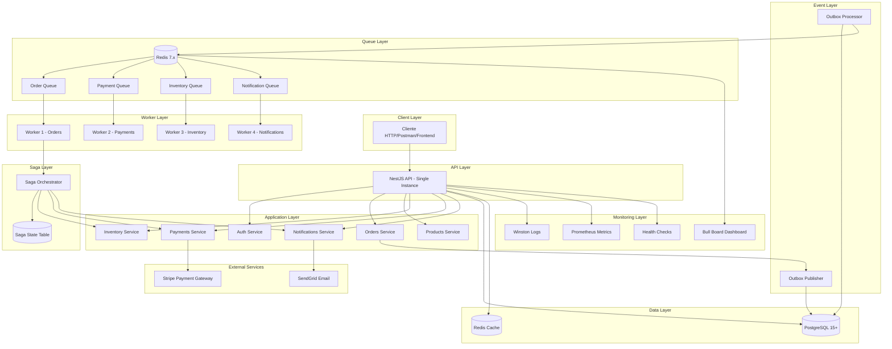

# 🏗️ Architecture Overview - E-commerce Async Resilient System

> **Versión**: 1.0.0  
> **Última actualización**: Octubre 2025  
> **Estado**: 📚 Portfolio/Demo Project

> **⚠️ Disclaimer**: Este documento describe tanto la **arquitectura implementada actualmente** (single-instance) como el **diseño teórico para escalabilidad en producción**. La implementación actual es single-instance para propósitos de demostración y aprendizaje. Las secciones sobre escalabilidad horizontal muestran cómo el sistema está diseñado para crecer.

## 📋 Tabla de Contenidos

- [Introducción](#introducción)
- [Arquitectura de Alto Nivel](#arquitectura-de-alto-nivel)
- [Componentes Principales](#componentes-principales)
- [Flujos de Datos](#flujos-de-datos)
- [Patrones de Diseño](#patrones-de-diseño)
- [Tecnologías](#tecnologías)
- [Escalabilidad](#escalabilidad)
- [Resiliencia](#resiliencia)
- [Observabilidad](#observabilidad)

---

## 🎯 Introducción

Este sistema demuestra una arquitectura **asíncrona, resiliente y diseñada para escalabilidad** en el procesamiento de órdenes de e-commerce. La implementación actual es single-instance (portfolio/demo), pero el diseño y los patrones aplicados permiten escalar a producción con cambios de configuración mínimos.

### Principios de Diseño

- ⚡ **Baja Latencia**: Respuestas HTTP <100ms (implementado)
- 🔄 **Procesamiento Asíncrono**: Jobs en background (implementado)
- 🛡️ **Resiliencia**: Auto-recuperación de fallos con retry patterns (implementado)
- 📊 **Observabilidad**: Monitoreo en tiempo real con Prometheus + Winston (implementado)
- 🚀 **Escalabilidad**: Diseñado para escalar horizontal y verticalmente (preparado, no desplegado)

### Problema que Resuelve

**Antes (Síncrono)** ❌:

```
Cliente → [API procesa TODO síncronamente 3-5 segundos] → Respuesta
           ↓
       Bloqueo, timeouts, poor UX
```

**Ahora (Asíncrono)** ✅:

```
Cliente → [API acepta orden <100ms] → Respuesta inmediata
           ↓
       [Workers procesan en background]
           ↓
       Cliente consulta estado o recibe webhook
```

---

## 🏛️ Arquitectura de Alto Nivel

### Diagrama de Arquitectura - Implementación Actual



### Capas de la Arquitectura

| Capa                  | Responsabilidad                           | Tecnología                 | Implementación Actual  |
| --------------------- | ----------------------------------------- | -------------------------- | ---------------------- |
| **Client Layer**      | Aplicaciones cliente (HTTP requests)      | Postman, cURL, Frontend    | Cualquier HTTP client  |
| **API Layer**         | Endpoints HTTP, validación, autenticación | NestJS, Express            | 1 instancia NestJS     |
| **Application Layer** | Lógica de negocio, servicios              | TypeScript, NestJS Modules | Módulos integrados     |
| **Event Layer**       | Publicación de eventos, Outbox Pattern    | TypeORM, PostgreSQL        | Outbox pattern impl.   |
| **Queue Layer**       | Colas de mensajes, job management         | Redis, Bull                | 4 colas en 1 Redis     |
| **Worker Layer**      | Procesamiento asíncrono background        | Bull Processors            | Mismo proceso Node     |
| **Saga Layer**        | Orquestación de procesos, compensación    | Custom Saga Service        | Saga service integrado |
| **Data Layer**        | Persistencia de datos                     | PostgreSQL, Redis          | 1 PG + 1 Redis         |
| **Monitoring Layer**  | Observabilidad, métricas, logs            | Winston, Prometheus        | Integrado en API       |

---

## 🔧 Componentes Principales

### 1. **NestJS API (REST API)**

**Responsabilidad**: Punto de entrada HTTP para todos los clientes (no es un API Gateway separado, es la aplicación completa)

```typescript
// Endpoints principales
POST   /api/v1/orders              // Crear orden (202 Accepted)
GET    /api/v1/orders              // Listar órdenes del usuario
GET    /api/v1/orders/:id          // Detalles de orden
GET    /api/v1/orders/:id/status   // Estado de procesamiento
```

**Características**:

- ⚡ Respuestas <100ms (non-blocking)
- 🔒 JWT Authentication
- ✅ Request validation (class-validator)
- 📊 Request logging y correlation IDs
- 🛡️ Rate limiting y throttling

### 2. **Orders Service**

**Responsabilidad**: Gestión del ciclo de vida de órdenes

```typescript
// Flujo de creación de orden
1. Validar productos existen y están activos
2. Calcular totales automáticamente
3. Crear orden con estado PENDING (transacción DB)
4. Publicar OrderCreatedEvent (Outbox Pattern)
5. Encolar job de procesamiento (Bull Queue)
6. Responder 202 Accepted inmediatamente
```

**Características**:

- 🔑 Idempotencia key (evita duplicados)
- 💾 Transacciones atómicas (TypeORM)
- 📤 Event publishing transaccional
- 🔄 Integración con Saga Orchestrator

### 3. **Event Publisher (Outbox Pattern)**

**Responsabilidad**: Publicación confiable de eventos

```typescript
// Garantiza at-least-once delivery
await queryRunner.transaction(async (manager) => {
  // 1. Guardar orden
  const order = await manager.save(Order, orderData);

  // 2. Guardar evento en outbox (MISMA transacción)
  await manager.save(OutboxEvent, event);

  // 3. Commit atómico - O se guarda TODO o NADA
});

// Background processor publica a colas cada 5 segundos
@Cron('*/5 * * * * *')
async processOutbox() {
  // Lee eventos no procesados
  // Publica a Bull Queue
  // Marca como procesado
}
```

**Características**:

- ✅ Consistencia transaccional
- 🔄 Retry automático de publicación
- 📊 Auditoría completa de eventos
- 🛡️ Dead letter queue para fallos

### 4. **Queue System (Redis + Bull)**

**Responsabilidad**: Gestión de colas de mensajes y jobs

**4 Colas Especializadas**:

| Cola                   | Propósito                | Throughput Actual | Workers Actual    | Throughput Teórico |
| ---------------------- | ------------------------ | ----------------- | ----------------- | ------------------ |
| `order-processing`     | Procesamiento de órdenes | ~5-10 jobs/seg    | 1 (mismo proceso) | 50 jobs/seg        |
| `payment-processing`   | Transacciones de pago    | ~5-10 jobs/seg    | 1 (mismo proceso) | 20 jobs/seg        |
| `inventory-processing` | Gestión de stock         | ~5-10 jobs/seg    | 1 (mismo proceso) | 30 jobs/seg        |
| `notification-sending` | Emails/SMS               | ~10-20 jobs/seg   | 1 (mismo proceso) | 100 jobs/seg       |

> **Nota**: Workers actuales corren en el mismo proceso Node.js que la API. Para producción se recomienda separar en procesos independientes.

**Características**:

- ⚡ Performance actual: ~50-100 jobs/seg (single instance), teórico: 1000+ jobs/seg (escalado)
- 🔄 Retry con exponential backoff
- 📊 Priority queues
- ⏰ Scheduled/delayed jobs
- 📈 Progress tracking
- 🎛️ Bull Board dashboard

### 5. **Saga Orchestrator**

**Responsabilidad**: Orquestación de procesos largos con compensación

```typescript
// Flujo del Saga
Step 1: Verify Stock        → Si falla: Terminar
Step 2: Reserve Inventory    → Compensate: Release Reservation
Step 3: Process Payment      → Compensate: Refund Payment
Step 4: Confirm Reservation  → Compensate: Restore Inventory
Step 5: Send Confirmation    → Compensate: Send Cancellation
Step 6: Complete Order       → Compensate: Mark as Cancelled
```

**Características**:

- 📝 Estado persistido en cada step
- 🔙 Compensación automática en fallos
- ♻️ Recovery después de crashes
- 🔍 Auditoría completa del proceso

### 6. **Inventory Service**

**Responsabilidad**: Gestión de stock y reservas

```typescript
// Operaciones principales
checkAvailability(productId, quantity); // Verificar stock
reserveStock(productId, quantity); // Reservar temporalmente
releaseReservation(productId, quantity); // Liberar reserva
confirmReservation(productId, quantity); // Confirmar venta
```

**Características**:

- 🔒 Locks optimistas (evita race conditions)
- ⏰ TTL en reservas (auto-release)
- 📊 Tracking de movimientos
- 🔄 Transacciones atómicas

### 7. **Payment Service (Mock)**

**Responsabilidad**: Procesamiento de pagos (simulado)

```typescript
// Simula gateway real con delays realistas
processPayment(order, amount) {
  // Simula latencia de API externa (100-2000ms)
  // 80% success, 15% retry-able, 5% permanent fail
  // Genera payment IDs únicos
  // Soporta refunds
}
```

**Características**:

- 🎭 Simula comportamiento real de gateways
- 🔄 Idempotencia (mismo request = mismo result)
- 💰 Soporte de refunds
- 🛡️ Fraud detection mock

### 8. **Notification Service**

**Responsabilidad**: Envío de notificaciones multi-canal

```typescript
// Tipos de notificaciones
sendOrderConfirmation(orderId, userId);
sendPaymentFailure(orderId, userId, reason);
sendOrderCancellation(orderId, userId);
```

**Características**:

- 📧 Email (mock SendGrid)
- 📱 SMS (mock Twilio)
- 🎨 Templates HTML con variables
- 🌐 Multi-idioma (EN/ES)
- 📊 Delivery tracking

---

## 🌊 Flujos de Datos

### Flujo 1: Creación de Orden (Happy Path)

```mermaid
sequenceDiagram
    participant C as Cliente
    participant API as NestJS API
    participant OS as Orders Service
    participant DB as PostgreSQL
    participant EP as Event Publisher
    participant Q as Redis Queue
    participant W as Worker (mismo proceso)
    participant SAGA as Saga Orchestrator
    participant INV as Inventory
    participant PAY as Payment
    participant NOTIF as Notification

    C->>API: POST /orders (items)
    API->>OS: createOrder(userId, items)

    OS->>DB: START TRANSACTION
    OS->>DB: INSERT order (PENDING)
    OS->>DB: INSERT order_items
    OS->>EP: publish(OrderCreatedEvent)
    EP->>DB: INSERT outbox_event
    OS->>DB: COMMIT TRANSACTION

    OS->>Q: enqueue(order-processing, {orderId, sagaId})
    OS-->>API: 202 Accepted {orderId, status: PENDING}
    API-->>C: 202 Accepted

    Note over Q,W: Procesamiento Asíncrono

    Q->>W: Job {orderId, sagaId}
    W->>SAGA: executeSaga(sagaId)

    SAGA->>INV: verifyStock()
    INV-->>SAGA: ✅ OK
    SAGA->>DB: UPDATE saga_state (STOCK_VERIFIED)

    SAGA->>INV: reserveStock()
    INV-->>SAGA: ✅ Reserved
    SAGA->>DB: UPDATE saga_state (STOCK_RESERVED)

    SAGA->>PAY: processPayment()
    PAY-->>SAGA: ✅ Payment Success {paymentId}
    SAGA->>DB: UPDATE saga_state (PAYMENT_COMPLETED)

    SAGA->>INV: confirmReservation()
    INV-->>SAGA: ✅ Confirmed

    SAGA->>NOTIF: sendConfirmation()
    NOTIF-->>SAGA: ✅ Email Sent

    SAGA->>DB: UPDATE order (status=CONFIRMED)
    SAGA->>DB: UPDATE saga_state (COMPLETED)

    Note over C: Cliente puede consultar estado
    C->>API: GET /orders/:id/status
    API->>DB: SELECT order
    API-->>C: {status: CONFIRMED}
```



**Duración Total**: 30-70ms (API) + 1-3 segundos (background processing)

### Flujo 2: Fallo de Pago (Compensación)


---

## 🎨 Patrones de Diseño

### 1. **Async Request-Reply Pattern**

```
Client → [POST /orders] → API
                           ↓
                      202 Accepted {orderId}
                           ↓
Client ← [Polling] ← API ← Background Processing
```

**Beneficio**: API no bloquea, mejor UX

### 2. **Outbox Pattern**

```
DB Transaction {
  INSERT order
  INSERT outbox_event  ← Mismo COMMIT
}

Background Processor:
  SELECT * FROM outbox_events WHERE processed=false
  → Publish to Queue
  → UPDATE processed=true
```

**Beneficio**: Garantiza consistencia evento-dato

### 3. **Saga Pattern (Orchestration)**

```
Saga Orchestrator
  → Step 1 → Compensate 1
  → Step 2 → Compensate 2
  → Step 3 → Compensate 3

Si fallo en Step 3:
  → Ejecuta Compensate 2
  → Ejecuta Compensate 1
```

**Beneficio**: Rollback en procesos distribuidos

### 4. **CQRS (básico)**

```
Commands (Write):
  POST /orders → OrdersService → DB Write

Queries (Read):
  GET /orders → OrdersService → DB Read (optimizado)
```

**Beneficio**: Separación de responsabilidades

### 5. **Retry Pattern con Exponential Backoff**

```
Attempt 1: Fail → Wait 2s
Attempt 2: Fail → Wait 4s
Attempt 3: Fail → Wait 8s
Attempt 4: Success ✅
```

**Beneficio**: Recuperación de fallos transitorios

### 6. **Circuit Breaker (implementado)**

```
Closed → Normal operation
  ↓ (5 fallos consecutivos)
Open → Rechaza requests inmediatamente
  ↓ (timeout)
Half-Open → Prueba 1 request
  ↓ (success)
Closed ← Vuelve a normal
```

**Implementación**: Circuit breakers activos en OrderProcessingSagaService para Payment, Inventory y Notification services.

**Beneficio**: Evita cascada de fallos

---

## 🚀 Tecnologías

### Backend Framework

```typescript
NestJS 10.x + TypeScript 5.x
├── @nestjs/core, @nestjs/common
├── @nestjs/typeorm (ORM integration)
├── @nestjs/bull (Queue integration)
├── @nestjs/jwt, @nestjs/passport (Auth)
├── @nestjs/swagger (API docs)
├── @nestjs/terminus (Health checks)
└── @nestjs/schedule (Cron jobs)
```

### Base de Datos

```yaml
PostgreSQL 15+:
  - ORM: TypeORM 0.3.x
  - Conexiones: Pool (10-20 connections)
  - Migrations: TypeORM migrations
  - Indexes: Estratégicos para performance

Redis 7.x:
  - Uso: Bull queues + Cache
  - Persistence: AOF (Append-Only File)
  - Clustering: Ready para producción
```

### Message Queue

```yaml
Bull 4.x + Redis:
  - 4 colas especializadas
  - Retry: Exponential backoff
  - Dashboard: Bull Board
  - Rate limiting: Configurable por cola
```

### Observabilidad

```yaml
Logging:
  - Winston (structured JSON logs)
  - Daily rotate files
  - Correlation IDs

Metrics:
  - Prometheus client
  - Custom business metrics
  - Queue metrics

Health Checks:
  - Terminus (DB, Redis, Memory, Disk)
  - Liveness, Readiness, Detailed

Monitoring:
  - Bull Board (queue dashboard)
  - Health endpoints
  - Logs centralizados
```

---

## 📈 Escalabilidad

### 📌 Implementación Actual (Single-Instance)

```yaml
Deployment:
  API: 1 instancia NestJS (Docker container)
  Workers: Bull processors en el mismo proceso Node
  Database: 1 PostgreSQL 15 (sin réplicas)
  Cache: 1 Redis 7 (sin cluster)

Docker Compose:
  - ecommerce-app-dev (NestJS API + Workers)
  - ecommerce-postgres (PostgreSQL single instance)
  - ecommerce-redis (Redis single instance)

Limitaciones actuales:
  - No hay load balancer
  - No hay múltiples instancias API
  - Workers comparten el mismo event loop que la API
  - Single point of failure en cada componente

Adecuado para:
  - Desarrollo local
  - Testing
  - Demos y portfolio
  - Tráfico bajo-medio (<100 req/s)
```

### 🚀 Diseño Teórico para Escalabilidad en Producción

> **⚠️ NOTA**: Lo siguiente describe cómo el sistema está **diseñado** para escalar, NO la implementación actual.

#### Horizontal Scaling (Futuro)

```
┌─────────────────────────────────────┐
│     Load Balancer (Nginx/ALB)       │
└────────┬────────┬────────┬──────────┘
         │        │        │
    ┌────▼───┐ ┌──▼────┐ ┌──▼────┐
    │ API 1  │ │ API 2 │ │ API 3 │  ← Stateless, escalables
    └────────┘ └───────┘ └───────┘
         │        │        │
    ┌────▼────────▼────────▼──────┐
    │     PostgreSQL Master        │
    │     + Read Replicas          │
    └──────────────────────────────┘

┌─────────────────────────────────────┐
│           Redis Cluster              │
└────────┬────────┬────────┬──────────┘
         │        │        │
    ┌────▼───┐ ┌──▼────┐ ┌──▼────┐
    │Worker 1│ │Worker2│ │Worker3│  ← Procesos separados
    └────────┘ └───────┘ └───────┘
```

**Componentes Stateless** (pueden escalar horizontalmente):

- ✅ API instances (NestJS) - actualmente: 1
- ✅ Workers (Bull processors) - actualmente: mismo proceso
- ✅ Event processors - actualmente: integrado

**Componentes Stateful** (requieren replicación):

- 📊 PostgreSQL (master + replicas) - actualmente: single instance
- 🔴 Redis (sentinel o cluster) - actualmente: single instance

#### Vertical Scaling (Actual vs. Recomendado)

```yaml
Implementación Actual (Docker local):
  API + Workers (mismo proceso):
    CPU: 2 cores (host)
    RAM: 512 MB - 1 GB (Docker limit)
    Concurrent: ~50-100 requests

  PostgreSQL:
    CPU: 1 core (host)
    RAM: 256 MB - 512 MB
    Storage: Docker volume (host disk)

  Redis:
    CPU: 1 core (host)
    RAM: 128 MB - 256 MB

Recomendado para Producción:
  API Instances (separados):
    CPU: 2-4 cores
    RAM: 4-8 GB
    Concurrent: 1000+ requests

  Workers (procesos separados):
    CPU: 1-2 cores
    RAM: 2-4 GB
    Concurrent: 50-100 jobs

  PostgreSQL:
    CPU: 8+ cores
    RAM: 16+ GB
    Storage: SSD NVMe

  Redis:
    CPU: 2-4 cores
    RAM: 8-16 GB (según job size)
```

---

## 🛡️ Resiliencia

### Failure Modes y Recovery

| Componente          | Fallo | Impacto Actual | Recovery Actual                       | Recovery en Producción             |
| ------------------- | ----- | -------------- | ------------------------------------- | ---------------------------------- |
| **API Instance**    | Crash | � Total        | Manual restart (Docker)               | Load balancer redirige             |
| **Worker**          | Crash | � Total        | Restart API (mismo proceso)           | Otro worker toma el job            |
| **PostgreSQL**      | Crash | 🔴 Crítico     | Manual restart, data loss posible     | Failover a replica (30-60s)        |
| **Redis**           | Crash | 🟠 Medio       | Manual restart, jobs en cola perdidos | Redis Sentinel failover (10-30s)   |
| **Payment Gateway** | Down  | 🟡 Parcial     | Circuit breaker, retry exponencial    | Circuit breaker, retry exponencial |
| **Email Service**   | Down  | 🟢 Mínimo      | Jobs se encolan, se reintentan        | Jobs se encolan, se reintentan     |

### Auto-Recovery Mechanisms

```typescript
1. Retry con Exponential Backoff
   - Transient failures recover automáticamente
   - 3-5 intentos con delays incrementales

2. Dead Letter Queue
   - Jobs fallidos persistentemente → DLQ
   - Alertas para intervención manual

3. Saga Compensation
   - Rollback automático en fallos
   - Restaura estado consistente

4. Graceful Shutdown
   - Espera jobs activos antes de cerrar
   - Previene pérdida de jobs en deployment

5. Health Checks
   - Kubernetes liveness probe (reinicia pods muertos)
   - Readiness probe (controla tráfico)
```

---

## 🔍 Observabilidad

### Logging

```json
{
  "timestamp": "2025-10-09T10:30:00.000Z",
  "level": "info",
  "context": "OrdersService",
  "message": "Order created successfully",
  "correlationId": "abc-123-def",
  "userId": "user-uuid",
  "orderId": "order-uuid",
  "duration": 45
}
```

### Métricas

```prometheus
# Business Metrics
orders_processed_total{status="confirmed"} 1234
order_processing_duration_seconds{quantile="0.95"} 1.2

# Queue Metrics
queue_length{queue="order-processing"} 5
queue_jobs_completed_total{queue="order-processing"} 5678

# System Metrics
http_request_duration_seconds{endpoint="/orders", method="POST"} 0.045
```

### Dashboards

```yaml
Bull Board:
  URL: /admin/queues
  Features:
    - Real-time queue status
    - Job details y logs
    - Manual retry de jobs
    - Métricas por cola

Health Check:
  URL: /api/v1/health/detailed
  Info:
    - Database connection pool
    - Redis connectivity
    - Memory usage
    - Disk space
```

---

## 🎯 Implementación Actual vs. Diseño Teórico

### Resumen Ejecutivo

| Aspecto                 | Implementación Actual (Portfolio)               | Diseño Teórico (Producción)                                          |
| ----------------------- | ----------------------------------------------- | -------------------------------------------------------------------- |
| **Deployment**          | Docker Compose local, single instance           | Kubernetes/ECS, múltiples instancias, auto-scaling                   |
| **Load Balancer**       | ❌ No existe                                    | ✅ Nginx/ALB con health checks                                       |
| **API Instances**       | 1 instancia NestJS                              | 3+ instancias con load balancing                                     |
| **Workers**             | Mismo proceso Node que API                      | Procesos separados, escalables independientemente                    |
| **PostgreSQL**          | Single instance (Docker)                        | Master + Read Replicas con failover automático                       |
| **Redis**               | Single instance (Docker)                        | Redis Cluster o Sentinel para alta disponibilidad                    |
| **Monitoring**          | ✅ Prometheus metrics, Winston logs, Bull Board | Prometheus + Grafana dashboards + AlertManager + Distributed Tracing |
| **CI/CD**               | GitHub Actions (test + build)                   | GitHub Actions + ArgoCD/Flux + Blue-Green/Canary deployments         |
| **Alta Disponibilidad** | ❌ Single point of failure                      | ✅ Redundancia en todos los componentes                              |
| **Throughput**          | ~50-100 req/s, ~100 jobs/s                      | 1000+ req/s, 1000+ jobs/s                                            |
| **Adecuado para**       | Desarrollo, testing, demos, portfolio           | Producción, tráfico real, usuarios concurrentes                      |

### Por Qué Esta Arquitectura es Valiosa Aunque Sea Single-Instance

✅ **Patrones Implementados**: Todos los patrones (Outbox, Saga, CQRS, Circuit Breaker) están completamente implementados y funcionando

✅ **Diseño Escalable**: El código está estructurado para escalar horizontalmente sin refactoring mayor

✅ **Producción-Ready**: Con ajustes de configuración (no código), puede desplegarse en producción

✅ **Aprendizaje Real**: Demuestra comprensión de arquitecturas distribuidas y microservicios

✅ **Testing Exhaustivo**: 262 E2E + 1212 unit tests prueban todos los flujos críticos

### Cómo Llevar a Producción (Roadmap)

```yaml
Fase 1: Infraestructura (Semana 1-2)
  - Deploy a AWS ECS/Fargate o GCP Cloud Run
  - Configurar RDS PostgreSQL con Multi-AZ
  - Configurar ElastiCache Redis con replicación
  - Setup ALB/NLB con health checks

Fase 2: Separación de Workers (Semana 2-3)
  - Crear Dockerfile específico para workers
  - Deploy workers como servicios separados
  - Configurar auto-scaling basado en queue length

Fase 3: Observabilidad (Semana 3-4)
  - Deploy Prometheus + Grafana stack
  - Configurar alertas críticas (Slack/PagerDuty)
  - Implementar distributed tracing (Jaeger/DataDog)

Fase 4: Alta Disponibilidad (Semana 4-5)
  - Configurar múltiples instancias API (min 3)
  - Setup database failover automático
  - Implementar Redis Sentinel
  - Configurar backups automáticos

Fase 5: CI/CD Avanzado (Semana 5-6)
  - Blue-green deployments
  - Canary releases con métricas
  - Automated rollback en caso de errores
```

---

## 📚 Referencias

### ADRs (Architecture Decision Records)

- [ADR-001: Async Non-Blocking Architecture](adr/001-async-non-blocking-architecture.md)
- [ADR-002: Outbox Pattern](adr/002-event-driven-outbox-pattern.md)
- [ADR-003: Saga Pattern](adr/003-saga-pattern-orchestration.md)
- [ADR-008: Redis + Bull](adr/008-redis-bull-queue-system.md)

### Documentación Técnica

- [Project Setup](PROJECT_SETUP.md)
- [Database Design](DATABASE_DESIGN.md)
- [API Documentation](API_DOCUMENTATION.md)

### Recursos Externos

- [NestJS Documentation](https://docs.nestjs.com/)
- [Bull Queue Documentation](https://docs.bullmq.io/)
- [Microservices Patterns by Chris Richardson](https://microservices.io/patterns/)

---

> 📝 **Nota**: Esta arquitectura está diseñada para escala media (10k-100k órdenes/día). Para escalas mayores, considerar migración a event streaming (Kafka) y microservicios independientes.

**Última actualización**: Octubre 2025  
**Mantenido por**: Backend Development Team
