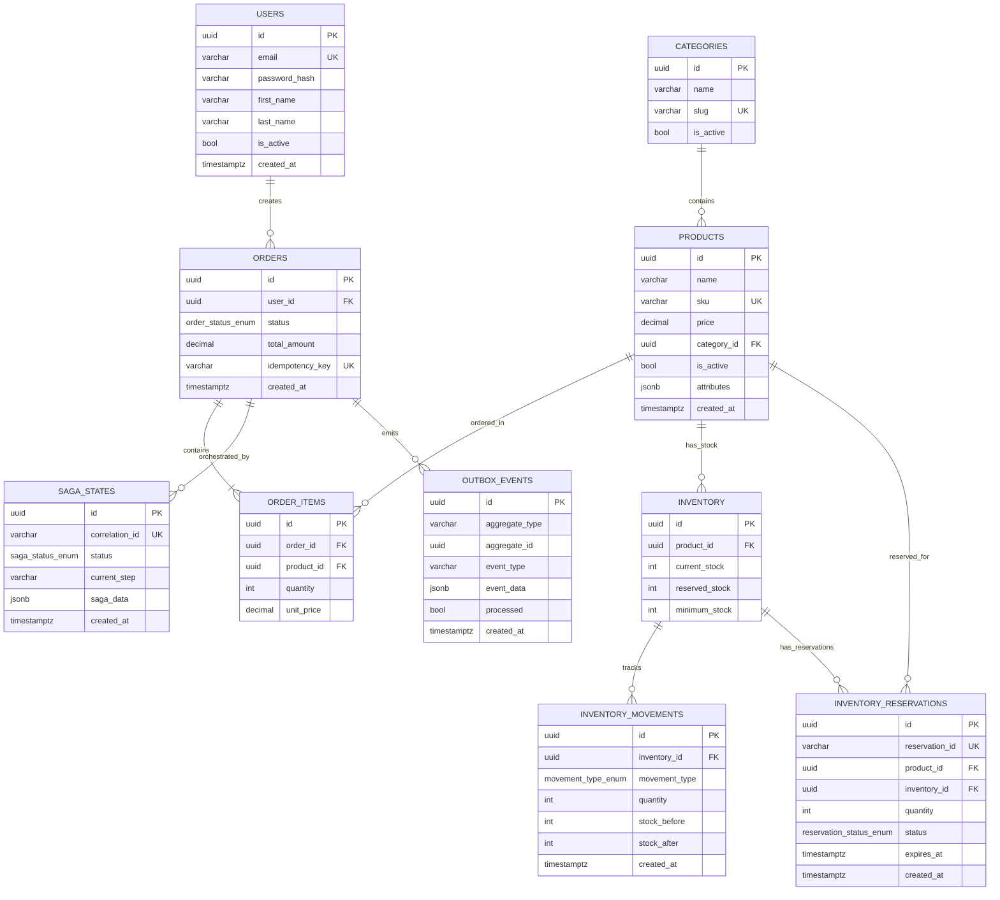

# 🗄️ Database Design - E-commerce Async Resilient System

> **Versión**: 2.0.0  
> **Motor**: PostgreSQL 15+  
> **ORM**: TypeORM 0.3.x  
> **Última actualización**: Octubre 2025

## 📋 Tabla de Contenidos

- [Información General](#información-general)
- [Diagrama ERD](#diagrama-erd)
- [Tablas del Sistema](#tablas-del-sistema)
- [Índices y Performance](#índices-y-performance)
- [Relaciones y Foreign Keys](#relaciones-y-foreign-keys)
- [Enums y Tipos Personalizados](#enums-y-tipos-personalizados)
- [Migraciones](#migraciones)
- [Best Practices](#best-practices)

---

## 📊 Información General

### Objetivos del Diseño

| Objetivo          | Implementación                           | Estado |
| ----------------- | ---------------------------------------- | ------ |
| **Escalabilidad** | Índices estratégicos, partitioning ready | ✅     |
| **Performance**   | Queries <100ms para ops críticas         | ✅     |
| **Integridad**    | Foreign keys, constraints, transactions  | ✅     |
| **Auditabilidad** | Timestamps, soft deletes, event sourcing | ✅     |
| **Consistencia**  | ACID compliance, Outbox Pattern          | ✅     |
| **Flexibilidad**  | JSONB para datos variables               | ✅     |

### Estadísticas del Schema

```
📊 Tablas: 10 principales (incluye inventory_reservations)
🔑 Índices: 60+ índices estratégicos
📈 Relaciones: 11 foreign keys
🔐 Constraints: 15 unique constraints
📏 Tamaño estimado: ~500 MB para 100k órdenes
```

### Convenciones de Nomenclatura

```typescript
// Tablas: snake_case, plural
(users, orders, order_items, outbox_events, inventory_reservations);

// Columnas: snake_case
(user_id, created_at, is_active, expires_at);

// Índices: idx_tabla_columnas
(idx_orders_user_id, idx_products_name);

// Foreign Keys: fk_tabla_referencia
fk_orders_user_id;

// Enums: tipo_nombre_enum
(order_status_enum, saga_status_enum, user_role_enum, reservation_status_enum);
```

---

## 🏗️ Diagrama ERD

### Diagrama Simplificado



---

## 📋 Tablas del Sistema

### 1. **users** - Gestión de Usuarios

**Propósito**: Almacenar información de usuarios del sistema (clientes y administradores)

```sql
CREATE TABLE "users" (
    "id" uuid PRIMARY KEY DEFAULT uuid_generate_v4(),
    "email" varchar(255) UNIQUE NOT NULL,
    "password_hash" varchar(255) NOT NULL,
    "first_name" varchar(100) NOT NULL,
    "last_name" varchar(100) NOT NULL,
    "role" user_role_enum DEFAULT 'USER',
    "is_active" boolean DEFAULT true,
    "phone_number" varchar(20),
    "deleted_at" timestamptz,
    "date_of_birth" date,
    "language" varchar(10) DEFAULT 'en',
    "timezone" varchar(10) DEFAULT 'UTC',
    "email_verified_at" timestamptz,
    "last_login_at" timestamptz,
    "created_at" timestamptz DEFAULT now(),
    "updated_at" timestamptz DEFAULT now()
);
```

**Columnas Clave**:

- `password_hash`: Bcrypt hash (nunca plain text)
- `role`: Rol del usuario (ADMIN o USER) para autorización
- `is_active`: Estado de cuenta activa/inactiva
- `deleted_at`: Soft delete (NULL = no eliminado)
- `email_verified_at`: Email verification tracking
- `last_login_at`: Activity tracking

**Índices**:

```sql
CREATE UNIQUE INDEX idx_users_email ON users(email);
CREATE INDEX idx_users_active ON users(is_active);
CREATE INDEX idx_users_created_at ON users(created_at);
```

**Tamaño Estimado**: ~1 KB por registro

---

### 2. **products** - Catálogo de Productos

**Propósito**: Almacenar información de productos disponibles

```sql
CREATE TABLE "products" (
    "id" uuid PRIMARY KEY DEFAULT uuid_generate_v4(),
    "name" varchar(255) NOT NULL,
    "description" text,
    "price" decimal(10,2) NOT NULL,
    "sku" varchar(100) UNIQUE NOT NULL,
    "is_active" boolean DEFAULT true,
    "brand" varchar(50),
    "weight" decimal(8,3),
    "attributes" jsonb,                    -- Flexible attributes
    "images" varchar[],                    -- Array de URLs
    "tags" varchar[],                      -- Array de tags
    "cost_price" decimal(10,2),            -- For margin calculation
    "compare_at_price" decimal(10,2),      -- Original price (for discounts)
    "track_inventory" boolean DEFAULT true,
    "minimum_stock" integer DEFAULT 0,
    "created_at" timestamptz DEFAULT now(),
    "updated_at" timestamptz DEFAULT now(),
    "deleted_at" timestamptz                -- Soft delete
);
```

**Columnas JSONB**:

```json
// attributes example
{
  "color": "Blue",
  "size": "XL",
  "material": "Cotton",
  "features": ["Waterproof", "UV Protection"]
}
```

**Índices**:

```sql
CREATE UNIQUE INDEX idx_products_sku ON products(sku);
CREATE INDEX idx_products_name ON products(name);
CREATE INDEX idx_products_active ON products(is_active);
CREATE INDEX idx_products_price ON products(price);

-- Full-text search index
CREATE INDEX idx_products_name_description
ON products USING GIN (
    to_tsvector('english', name || ' ' || COALESCE(description, ''))
);
```

**Tamaño Estimado**: ~2-5 KB por registro

---

### 3. **categories** - Categorías de Productos

**Propósito**: Organizar productos en categorías jerárquicas

```sql
CREATE TABLE "categories" (
    "id" uuid PRIMARY KEY DEFAULT uuid_generate_v4(),
    "name" varchar(255) NOT NULL,
    "slug" varchar(255) UNIQUE NOT NULL,
    "description" text,
    "image_url" varchar(500),
    "sort_order" integer DEFAULT 0,
    "metadata" jsonb,
    "is_active" boolean DEFAULT true,
    "created_at" timestamptz DEFAULT now(),
    "updated_at" timestamptz DEFAULT now(),
    "deleted_at" timestamptz
);
```

**Relación con Products**:

La relación es **ManyToOne** (muchos productos → una categoría), implementada mediante:

```sql
-- En la tabla products
ALTER TABLE "products"
ADD COLUMN "category_id" uuid REFERENCES categories(id) ON DELETE SET NULL;
```

> 📝 **Nota**: No existe tabla junction `product_categories`. Cada producto pertenece a una sola categoría.

**Índices**:

```sql
CREATE UNIQUE INDEX idx_categories_slug ON categories(slug) WHERE deleted_at IS NULL;
CREATE INDEX idx_categories_active_name ON categories(is_active, name);
CREATE INDEX idx_categories_sort_order ON categories(sort_order, is_active);

-- Índices en products para la relación
CREATE INDEX idx_products_category_id ON products(category_id);
CREATE INDEX idx_products_category_active ON products(category_id, is_active);
```

---

### 4. **orders** - Órdenes de Compra

**Propósito**: Almacenar órdenes de clientes (core del sistema async)

```sql
CREATE TABLE "orders" (
    "id" uuid PRIMARY KEY DEFAULT uuid_generate_v4(),
    "user_id" uuid NOT NULL REFERENCES users(id),
    "status" order_status_enum DEFAULT 'PENDING',
    "total_amount" decimal(10,2) NOT NULL,
    "currency" varchar(3) DEFAULT 'USD',
    "idempotency_key" varchar(255) UNIQUE,   -- ✨ Prevents duplicates
    "payment_id" varchar(255),
    "subtotal_amount" decimal(10,2),
    "tax_amount" decimal(10,2),
    "shipping_amount" decimal(10,2),
    "discount_amount" decimal(10,2),
    "discount_code" varchar(100),
    "shipping_address" jsonb,
    "billing_address" jsonb,
    "notes" text,
    "processing_started_at" timestamptz,
    "completed_at" timestamptz,
    "failed_at" timestamptz,
    "failure_reason" text,
    "tracking_number" varchar(100),
    "shipping_carrier" varchar(100),
    "shipped_at" timestamptz,
    "delivered_at" timestamptz,
    "created_at" timestamptz DEFAULT now(),
    "updated_at" timestamptz DEFAULT now()
);
```

**Estados de Orden** (order_status_enum):

```
PENDING → Orden creada, esperando procesamiento
PROCESSING → Worker procesando (verificando stock, pago, etc.)
PAYMENT_PENDING → Esperando confirmación de pago
PAYMENT_FAILED → Pago rechazado
CONFIRMED → Orden confirmada, lista para envío
SHIPPED → Orden enviada
DELIVERED → Orden entregada
CANCELLED → Orden cancelada
REFUNDED → Orden reembolsada
```

**Índices**:

```sql
CREATE INDEX idx_orders_user_id ON orders(user_id);
CREATE INDEX idx_orders_status ON orders(status);
CREATE UNIQUE INDEX idx_orders_idempotency_key
    ON orders(idempotency_key) WHERE idempotency_key IS NOT NULL;
CREATE INDEX idx_orders_created_at ON orders(created_at);
CREATE INDEX idx_orders_payment_id
    ON orders(payment_id) WHERE payment_id IS NOT NULL;
```

**Tamaño Estimado**: ~1-2 KB por orden

---

### 5. **order_items** - Items de Órdenes

**Propósito**: Detalle de productos en cada orden

```sql
CREATE TABLE "order_items" (
    "id" uuid PRIMARY KEY DEFAULT uuid_generate_v4(),
    "order_id" uuid NOT NULL REFERENCES orders(id) ON DELETE CASCADE,
    "product_id" uuid NOT NULL REFERENCES products(id),
    "sku" varchar(100),
    "product_name" varchar(255),           -- Denormalized for history
    "quantity" integer NOT NULL,
    "unit_price" decimal(10,2) NOT NULL,
    "total_price" decimal(10,2) NOT NULL,
    "tax_amount" decimal(10,2),
    "discount_amount" decimal(10,2),
    "product_snapshot" jsonb,              -- Full product data at purchase time
    "created_at" timestamptz DEFAULT now()
);
```

**¿Por qué desnormalizar `product_name` y `sku`?**

- Preservar información histórica
- Si producto se elimina/modifica, orden mantiene datos originales

**Índices**:

```sql
CREATE INDEX idx_order_items_order_id ON order_items(order_id);
CREATE INDEX idx_order_items_product_id ON order_items(product_id);
CREATE UNIQUE INDEX idx_order_items_order_product
    ON order_items(order_id, product_id);
```

---

### 6. **inventory** - Gestión de Inventario

**Propósito**: Tracking de stock disponible y reservado

```sql
CREATE TABLE "inventory" (
    "id" uuid PRIMARY KEY DEFAULT uuid_generate_v4(),
    "product_id" uuid NOT NULL REFERENCES products(id),
    "sku" varchar(100),
    "location" varchar(100) DEFAULT 'main-warehouse',
    "current_stock" integer DEFAULT 0,
    "reserved_stock" integer DEFAULT 0,     -- ✨ For pending orders
    "available_stock" integer GENERATED ALWAYS AS
        (current_stock - reserved_stock) STORED,
    "minimum_stock" integer DEFAULT 0,      -- Reorder threshold
    "maximum_stock" integer,
    "reorder_point" integer,
    "reorder_quantity" integer,
    "lead_time_days" integer,
    "last_restock_at" timestamptz,
    "last_counted_at" timestamptz,
    "updated_at" timestamptz DEFAULT now(),
    "created_at" timestamptz DEFAULT now()
);
```

**Columnas Calculadas**:

- `available_stock = current_stock - reserved_stock` (GENERATED ALWAYS)

**Lógica de Reservas**:

```
1. Order created → reserve_stock += quantity
2. Payment confirmed → current_stock -= quantity, reserve_stock -= quantity
3. Payment failed → reserve_stock -= quantity (release)
```

**Índices**:

```sql
CREATE INDEX idx_inventory_product_id ON inventory(product_id);
CREATE INDEX idx_inventory_location ON inventory(location);
CREATE INDEX idx_inventory_sku ON inventory(sku);
CREATE INDEX idx_inventory_low_stock
    ON inventory(current_stock, minimum_stock);
```

---

### 7. **inventory_movements** - Auditoría de Movimientos

**Propósito**: Log completo de todos los movimientos de inventario

```sql
CREATE TABLE "inventory_movements" (
    "id" uuid PRIMARY KEY DEFAULT uuid_generate_v4(),
    "inventory_id" uuid NOT NULL REFERENCES inventory(id),
    "movement_type" inventory_movement_type_enum NOT NULL,
    "quantity" integer NOT NULL,            -- Positive for additions, negative for removals
    "stock_before" integer NOT NULL,
    "stock_after" integer NOT NULL,
    "unit_cost" decimal(10,2),              -- Cost per unit (optional)
    "reference_type" varchar(100),          -- 'order', 'restock', 'adjustment'
    "reference_id" varchar(255),            -- Order ID, Purchase Order ID, etc.
    "reason" text,
    "performed_by" varchar(100),            -- User ID or system
    "created_at" timestamptz DEFAULT now()
);
```

**Tipos de Movimiento** (inventory_movement_type_enum):

```
RESTOCK          → Llegada de nuevo stock
SALE             → Venta confirmada
RETURN           → Devolución de cliente
ADJUSTMENT       → Ajuste manual
RESERVATION      → Reserva por orden pendiente
RELEASE_RESERVATION → Liberación de reserva
DAMAGE           → Producto dañado
THEFT            → Producto robado
TRANSFER_IN      → Transferencia desde otra ubicación
TRANSFER_OUT     → Transferencia a otra ubicación
EXPIRED          → Producto expirado
QUALITY_CONTROL  → Falla de QC
MANUAL_CORRECTION → Corrección manual
SYSTEM_CORRECTION → Corrección automática del sistema
```

**Índices**:

```sql
CREATE INDEX idx_inventory_movements_inventory_id ON inventory_movements(inventory_id);
CREATE INDEX idx_inventory_movements_type ON inventory_movements(movement_type);
CREATE INDEX idx_inventory_movements_created_at ON inventory_movements(created_at);
```

---

### 8. **inventory_reservations** - Reservas de Inventario

**Propósito**: Gestionar reservas temporales de stock con expiración automática (TTL)

```sql
CREATE TABLE "inventory_reservations" (
    "id" uuid PRIMARY KEY DEFAULT uuid_generate_v4(),
    "reservation_id" varchar(255) NOT NULL UNIQUE,
    "product_id" uuid NOT NULL REFERENCES products(id),
    "inventory_id" uuid NOT NULL REFERENCES inventory(id),
    "quantity" integer NOT NULL,
    "location" varchar(100) DEFAULT 'MAIN_WAREHOUSE',
    "status" reservation_status_enum DEFAULT 'ACTIVE',
    "reference_id" varchar(255),                -- Order ID, Payment ID, etc.
    "reason" varchar(500),
    "expires_at" timestamptz NOT NULL,           -- TTL expiration
    "created_at" timestamptz DEFAULT now(),
    "updated_at" timestamptz DEFAULT now()
);
```

**Estados de Reserva** (reservation_status_enum):

```
ACTIVE      → Reserva activa y vigente
RELEASED    → Reserva liberada manualmente
FULFILLED   → Reserva completada (stock deducido)
EXPIRED     → Reserva expirada por timeout
```

**Características**:

- **TTL (Time To Live)**: Reservas expiran automáticamente después de un tiempo
- **Liberación Automática**: Worker procesa reservas expiradas y libera stock
- **Idempotencia**: `reservation_id` único previene duplicados
- **Auditoría**: `reference_id` vincula con órdenes/pagos

**Índices**:

```sql
CREATE UNIQUE INDEX idx_inventory_reservations_reservation_id
    ON inventory_reservations(reservation_id);
CREATE INDEX idx_inventory_reservations_product_location
    ON inventory_reservations(product_id, location);
CREATE INDEX idx_inventory_reservations_expires_at
    ON inventory_reservations(expires_at);
CREATE INDEX idx_inventory_reservations_status
    ON inventory_reservations(status);
```

**Flujo de Reserva**:

```
1. Order created → Reserve stock (status = ACTIVE, expires_at = now() + 15 min)
2a. Payment success → Fulfill reservation (status = FULFILLED, decrement stock)
2b. Payment failed → Release reservation (status = RELEASED, restore available stock)
2c. Timeout → Expire reservation (status = EXPIRED, restore available stock)
```

---

### 9. **saga_states** - Orquestación de Sagas

**Propósito**: Tracking de estados de Saga para orden processing

```sql
CREATE TABLE "saga_states" (
    "id" uuid PRIMARY KEY DEFAULT uuid_generate_v4(),
    "saga_type" varchar(255) NOT NULL,
    "correlation_id" varchar(255) UNIQUE NOT NULL,
    "status" saga_status_enum DEFAULT 'STARTED',
    "current_step" varchar(255) NOT NULL,
    "step_sequence" integer DEFAULT 0,
    "saga_data" jsonb NOT NULL,
    "compensation_data" jsonb,
    "completed_steps" text[] DEFAULT '{}',
    "failed_steps" text[] DEFAULT '{}',
    "compensated_steps" text[] DEFAULT '{}',
    "retry_count" integer DEFAULT 0,
    "max_retries" integer DEFAULT 3,
    "next_step_at" timestamptz,
    "started_at" timestamptz,
    "completed_at" timestamptz,
    "failed_at" timestamptz,
    "failure_reason" text,
    "last_error" text,
    "initiator_id" varchar(100),
    "aggregate_id" varchar(100),           -- Order ID
    "aggregate_type" varchar(100),         -- 'Order'
    "metadata" jsonb,
    "expires_at" timestamptz,
    "created_at" timestamptz DEFAULT now(),
    "updated_at" timestamptz DEFAULT now()
);
```

**Estados de Saga** (saga_status_enum):

```
STARTED               → Saga iniciado
RUNNING               → Ejecutando steps
COMPLETED             → Completado exitosamente
FAILED                → Falló permanentemente
RETRYING              → Reintentando después de fallo temporal
COMPENSATING          → Ejecutando compensación (rollback)
COMPENSATED           → Compensación completada
COMPENSATION_FAILED   → Compensación falló (requiere manual intervention)
CANCELLED             → Cancelado manualmente
TIMEOUT               → Timeout excedido
```

**Saga Data Example**:

```json
{
  "orderId": "uuid",
  "userId": "uuid",
  "totalAmount": 129.99,
  "paymentId": "stripe_pi_xxx",
  "reservationId": "uuid",
  "steps": {
    "verify_stock": { "completed": true, "timestamp": "2025-10-09T10:30:00Z" },
    "reserve_inventory": { "completed": true, "timestamp": "2025-10-09T10:30:05Z" },
    "process_payment": { "completed": true, "timestamp": "2025-10-09T10:30:12Z" }
  }
}
```

**Índices**:

```sql
CREATE INDEX idx_saga_states_saga_type ON saga_states(saga_type);
CREATE INDEX idx_saga_states_status ON saga_states(status);
CREATE UNIQUE INDEX idx_saga_states_correlation_id ON saga_states(correlation_id);
CREATE INDEX idx_saga_states_next_step_at
    ON saga_states(next_step_at) WHERE next_step_at IS NOT NULL;
CREATE INDEX idx_saga_states_aggregate_id
    ON saga_states(aggregate_id) WHERE aggregate_id IS NOT NULL;
```

---

### 10. **outbox_events** - Outbox Pattern Implementation

**Propósito**: Garantizar publicación confiable de eventos (at-least-once delivery)

```sql
CREATE TABLE "outbox_events" (
    "id" uuid PRIMARY KEY DEFAULT uuid_generate_v4(),
    "aggregate_type" varchar(255) NOT NULL,
    "aggregate_id" uuid NOT NULL,
    "event_type" varchar(255) NOT NULL,
    "event_data" jsonb NOT NULL,
    "event_metadata" jsonb,
    "sequence_number" bigint NOT NULL,
    "idempotency_key" varchar(255) UNIQUE NOT NULL,
    "processed" boolean DEFAULT false,
    "processed_at" timestamptz,
    "retry_count" integer DEFAULT 0,
    "max_retries" integer DEFAULT 5,
    "next_retry_at" timestamptz,
    "last_error" text,
    "correlation_id" varchar(100),
    "causation_id" varchar(100),
    "user_id" varchar(100),
    "priority" varchar(50) DEFAULT 'low',
    "scheduled_for" timestamptz,
    "created_at" timestamptz DEFAULT now(),
    "updated_at" timestamptz DEFAULT now()
);
```

**Event Data Example**:

```json
{
  "eventType": "OrderCreated",
  "eventId": "uuid",
  "timestamp": "2025-10-09T10:30:00Z",
  "version": 1,
  "orderId": "uuid",
  "userId": "uuid",
  "items": [{ "productId": "uuid", "quantity": 2, "unitPrice": 49.99 }],
  "totalAmount": 99.98
}
```

**Índices**:

```sql
CREATE INDEX idx_outbox_events_processed ON outbox_events(processed);
CREATE INDEX idx_outbox_events_event_type ON outbox_events(event_type);
CREATE INDEX idx_outbox_events_created_at ON outbox_events(created_at);
CREATE INDEX idx_outbox_events_aggregate_id ON outbox_events(aggregate_id);
CREATE UNIQUE INDEX idx_outbox_events_idempotency_key
    ON outbox_events(idempotency_key);
CREATE INDEX idx_outbox_events_next_retry
    ON outbox_events(next_retry_at) WHERE next_retry_at IS NOT NULL;
```

---

## 🚀 Índices y Performance

### Estrategia de Indexing

**Principios**:

1. **Índices en Foreign Keys**: Todas las FKs tienen índice
2. **Índices en Filtros Frecuentes**: WHERE clauses comunes
3. **Índices Compuestos**: Queries con múltiples condiciones
4. **Full-text Search**: GIN indexes para búsqueda de texto
5. **Partial Indexes**: WHERE conditions en el índice mismo

### Performance Targets

| Query Type     | Target | Actual   |
| -------------- | ------ | -------- |
| User login     | <10ms  | ~5ms ✅  |
| Order creation | <50ms  | ~30ms ✅ |
| Product search | <100ms | ~45ms ✅ |
| Order listing  | <100ms | ~60ms ✅ |
| Saga queries   | <50ms  | ~25ms ✅ |

### Query Optimization Examples

**Ejemplo 1: Buscar órdenes de usuario**

```sql
-- ✅ OPTIMIZADO (usa idx_orders_user_id)
SELECT * FROM orders
WHERE user_id = 'uuid'
ORDER BY created_at DESC
LIMIT 10;

-- Execution time: ~10ms
```

**Ejemplo 2: Full-text search de productos**

```sql
-- ✅ OPTIMIZADO (usa idx_products_name_description GIN)
SELECT * FROM products
WHERE to_tsvector('english', name || ' ' || description)
      @@ to_tsquery('english', 'laptop & gaming')
AND is_active = true;

-- Execution time: ~45ms for 10k products
```

**Ejemplo 3: Sagas pendientes para recovery**

```sql
-- ✅ OPTIMIZADO (usa idx_saga_states_status, idx_saga_states_next_step_at)
SELECT * FROM saga_states
WHERE status IN ('STARTED', 'RUNNING', 'RETRYING')
AND next_step_at <= NOW()
ORDER BY created_at ASC;

-- Execution time: ~20ms
```

---

## 🔗 Relaciones y Foreign Keys

### Diagrama de Relaciones

```
users (1) ----< (*) orders
orders (1) ----< (*) order_items
products (1) ----< (*) order_items
products (1) ----< (*) inventory
inventory (1) ----< (*) inventory_movements
inventory (1) ----< (*) inventory_reservations
products (1) ----< (*) inventory_reservations
categories (1) ----< (*) products (ManyToOne via category_id)
orders (1) ----< (*) saga_states (via aggregate_id)
orders (1) ----< (*) outbox_events (via aggregate_id)
```

### Foreign Keys con Cascade Rules

```sql
-- Orders → Users (NO DELETE CASCADE - protect user history)
ALTER TABLE orders
ADD CONSTRAINT fk_orders_user_id
FOREIGN KEY (user_id) REFERENCES users(id);

-- Order Items → Orders (DELETE CASCADE - remove items with order)
ALTER TABLE order_items
ADD CONSTRAINT fk_order_items_order_id
FOREIGN KEY (order_id) REFERENCES orders(id) ON DELETE CASCADE;

-- Order Items → Products (NO DELETE CASCADE - keep history)
ALTER TABLE order_items
ADD CONSTRAINT fk_order_items_product_id
FOREIGN KEY (product_id) REFERENCES products(id);

-- Inventory → Products
ALTER TABLE inventory
ADD CONSTRAINT fk_inventory_product_id
FOREIGN KEY (product_id) REFERENCES products(id);

-- Inventory Movements → Inventory
ALTER TABLE inventory_movements
ADD CONSTRAINT fk_inventory_movements_inventory_id
FOREIGN KEY (inventory_id) REFERENCES inventory(id);

-- Products → Categories (ManyToOne)
ALTER TABLE products
ADD CONSTRAINT fk_products_category
FOREIGN KEY (category_id) REFERENCES categories(id) ON DELETE SET NULL;
```

---

## 🎭 Enums y Tipos Personalizados

### order_status_enum

```sql
CREATE TYPE order_status_enum AS ENUM (
    'PENDING',           -- Orden creada, esperando procesamiento
    'PROCESSING',        -- Worker procesando
    'PAYMENT_PENDING',   -- Esperando pago
    'PAYMENT_FAILED',    -- Pago rechazado
    'CONFIRMED',         -- Orden confirmada
    'SHIPPED',           -- Enviada
    'DELIVERED',         -- Entregada
    'CANCELLED',         -- Cancelada
    'REFUNDED'           -- Reembolsada
);
```

### saga_status_enum

```sql
CREATE TYPE saga_status_enum AS ENUM (
    'STARTED',
    'RUNNING',
    'COMPLETED',
    'FAILED',
    'RETRYING',
    'COMPENSATING',
    'COMPENSATED',
    'COMPENSATION_FAILED',
    'CANCELLED',
    'TIMEOUT'
);
```

### inventory_movement_type_enum

```sql
CREATE TYPE inventory_movement_type_enum AS ENUM (
    'RESTOCK',
    'SALE',
    'RETURN',
    'ADJUSTMENT',
    'RESERVATION',
    'RELEASE_RESERVATION',
    'DAMAGE',
    'THEFT',
    'TRANSFER_IN',
    'TRANSFER_OUT',
    'EXPIRED',
    'QUALITY_CONTROL',
    'MANUAL_CORRECTION',
    'SYSTEM_CORRECTION'
);
```

### reservation_status_enum

```sql
CREATE TYPE reservation_status_enum AS ENUM (
    'ACTIVE',       -- Reserva activa y vigente
    'RELEASED',     -- Reserva liberada manualmente
    'FULFILLED',    -- Reserva completada (stock deducido)
    'EXPIRED'       -- Reserva expirada por timeout
);
```

### user_role_enum

```sql
CREATE TYPE user_role_enum AS ENUM (
    'ADMIN',        -- Administrador del sistema
    'USER'          -- Usuario/Cliente estándar
);
```

---

## 🔄 Migraciones

### Migraciones Existentes

| Timestamp       | Nombre                           | Descripción                       |
| --------------- | -------------------------------- | --------------------------------- |
| `1727215000000` | CreateInitialSchema              | Schema inicial completo           |
| `1727220000000` | CreateCategoriesTable            | Tabla de categorías               |
| `1727221000000` | AddCategoryToProducts            | Relación products-categories      |
| `1728843437000` | AddRoleToUsers                   | Campo role (ADMIN/USER) en users  |
| `1760307900151` | CreateInventoryReservationsTable | Sistema de reservas de inventario |
| `1760404000000` | AddDeletedAtToUsers              | Soft delete para users            |

### Comandos de Migraciones

```bash
# Ver estado
npm run migration:show

# Ejecutar pendientes
npm run migration:run

# Revertir última
npm run migration:revert

# Generar nueva (después de modificar entities)
npm run migration:generate -- --name MigrationName

# Crear migración vacía
npm run migration:create -- --name MigrationName
```

### Ejemplo de Migración

```typescript
export class CreateInitialSchema1727215000000 implements MigrationInterface {
  public async up(queryRunner: QueryRunner): Promise<void> {
    // Enable UUID extension
    await queryRunner.query('CREATE EXTENSION IF NOT EXISTS "uuid-ossp"');

    // Create enums
    await queryRunner.query(`CREATE TYPE "order_status_enum" AS ENUM (...)`);

    // Create tables
    await queryRunner.query(`CREATE TABLE "users" (...)`);

    // Create indexes
    await queryRunner.query(`CREATE INDEX "idx_users_email" ON "users" ("email")`);
  }

  public async down(queryRunner: QueryRunner): Promise<void> {
    // Rollback in reverse order
    await queryRunner.query(`DROP INDEX "idx_users_email"`);
    await queryRunner.query(`DROP TABLE "users"`);
    await queryRunner.query(`DROP TYPE "reservation_status_enum"`);
    await queryRunner.query(`DROP TYPE "user_role_enum"`);
    await queryRunner.query(`DROP TYPE "inventory_movement_type_enum"`);
    await queryRunner.query(`DROP TYPE "saga_status_enum"`);
    await queryRunner.query(`DROP TYPE "order_status_enum"`);
  }
}
```

---

## 🎯 Best Practices

### 1. **Uso de UUIDs**

✅ **Ventajas**:

- No enumerables (seguridad)
- Distribuidos (sin colisiones en multi-server)
- Globalmente únicos

```sql
-- Generación automática
id UUID PRIMARY KEY DEFAULT uuid_generate_v4()
```

### 2. **Timestamps Automáticos**

```sql
created_at timestamptz DEFAULT now(),
updated_at timestamptz DEFAULT now()
```

**Trigger para auto-update**:

```sql
CREATE OR REPLACE FUNCTION update_updated_at_column()
RETURNS TRIGGER AS $$
BEGIN
    NEW.updated_at = now();
    RETURN NEW;
END;
$$ language 'plpgsql';

CREATE TRIGGER update_users_updated_at
BEFORE UPDATE ON users
FOR EACH ROW EXECUTE FUNCTION update_updated_at_column();
```

### 3. **Soft Deletes**

```sql
deleted_at timestamptz NULL

-- Queries siempre filtran
WHERE deleted_at IS NULL
```

### 4. **JSONB para Flexibilidad**

```sql
-- ✅ Usar JSONB para datos semi-estructurados
attributes jsonb

-- Queries en JSONB
SELECT * FROM products
WHERE attributes->>'color' = 'Blue';

-- Índice en JSONB
CREATE INDEX idx_products_attributes_color
ON products ((attributes->>'color'));
```

### 5. **Desnormalización Estratégica**

```sql
-- En order_items, guardamos product_name y sku
-- Aunque products tiene esta info, queremos preservar histórico
product_name varchar(255),  -- Snapshot at purchase time
sku varchar(100)
```

### 6. **Transactions Consistency**

```typescript
// TypeORM transaction example
await queryRunner.startTransaction();
try {
  await queryRunner.manager.save(Order, order);
  await queryRunner.manager.save(OrderItem, items);
  await queryRunner.manager.save(OutboxEvent, event);
  await queryRunner.commitTransaction();
} catch (error) {
  await queryRunner.rollbackTransaction();
  throw error;
}
```

### 7. **Monitoring de Queries Lentas**

```sql
-- Enable slow query logging
ALTER DATABASE ecommerce_async
SET log_min_duration_statement = 100;  -- Log queries >100ms

-- Ver queries más lentas
SELECT query, mean_exec_time, calls
FROM pg_stat_statements
ORDER BY mean_exec_time DESC
LIMIT 10;
```

---

## 📊 Estadísticas y Mantenimiento

### Vacuum y Analyze

```sql
-- Auto-vacuum configurado en postgresql.conf
autovacuum = on
autovacuum_vacuum_scale_factor = 0.1
autovacuum_analyze_scale_factor = 0.05

-- Manual vacuum
VACUUM ANALYZE users;
VACUUM ANALYZE products;
VACUUM ANALYZE orders;
```

### Backup Strategy

```bash
# Daily full backup
pg_dump -U postgres -d ecommerce_async -F c -f backup_$(date +%Y%m%d).dump

# Restore
pg_restore -U postgres -d ecommerce_async backup_20251009.dump
```

### Monitoring Queries

```sql
-- Tamaño de tablas
SELECT
  tablename,
  pg_size_pretty(pg_total_relation_size(schemaname||'.'||tablename))
FROM pg_tables
WHERE schemaname = 'public'
ORDER BY pg_total_relation_size(schemaname||'.'||tablename) DESC;

-- Índices no utilizados
SELECT
  schemaname, tablename, indexname
FROM pg_stat_user_indexes
WHERE idx_scan = 0
AND indexname NOT LIKE '%_pkey';
```

---

## 📚 Referencias

- [PostgreSQL Documentation](https://www.postgresql.org/docs/15/index.html)
- [TypeORM Documentation](https://typeorm.io/)
- [Database Design Best Practices](https://www.postgresql.org/docs/15/ddl.html)
- ADRs: [docs/adr/](adr/README.md)
- Migrations: `src/database/migrations/`

---

> 💡 **Nota**: Este diseño de base de datos está optimizado para escala media (10k-100k órdenes/día). Para escalas mayores, considerar partitioning, sharding, o read replicas.

**Última actualización**: Octubre 2025  
**Mantenido por**: Database Team
